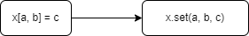

> 해당 글은 [Kotlin in Action](http://www.yes24.com/Product/Goods/55148593?Acode=101)을 정리한 내용입니다.

# 목차
1. [코틀린이란 무엇이며, 왜 필요한가?](#01장-코틀린이란-무엇이며-왜-필요한가)
    1. [코틀린의 주요 특성](#1-코틀린의-주요-특성)
        1. [정적 타입 지원 언어](#정적-타입-지원-언어)
        2. [함수형 프로그래밍과 객체지향 프로그래밍](#함수형-프로그래밍과-객체지향-프로그래밍)
    2. [코틀린의 철학](#2-코틀린의-철학)
    3. [코틀린 도구 사용](#3-코틀린-도구-사용)
        1. [코틀린 코드 컴파일](#코틀린-코드-컴파일)
        2. [인텔리J 아이디어와 안드로이드 스튜디오의 코틀린 플러그인](#인텔리j-아이디어와-안드로이드-스튜디오의-코틀린-플러그인)
        3. [대화형 셸(REPL)](#대화형-셸repl)
        4. [온라인 놀이터](#온라인-놀이터)
2. [코틀린 기초](#02장-코틀린-기초)
    1. [함수와 변수](#1-함수와-변수)
        1. [함수](#함수)
        2. [변수](#변수)
        3. [문자열 템플릿](#문자열-템플릿)
    2. [클래스와 프로퍼티](#2-클래스와-프로퍼티)
        1. [프로퍼티](#프로퍼티)
        2. [커스텀 접근자](#커스텀-접근자)
        3. [디렉터리와 패키지](#디렉터리와-패키지)
    3. [enum과 when](#3-enum과-when)
        1. [enum 클래스 정의](#enum-클래스-정의)
        2. [when으로 enum 클래스 다루기](#when으로-enum-클래스-다루기)
        3. [when과 임의의 객체를 함께 사용](#when과-임의의-객체를-함께-사용)
        4. [인자 없는 when 사용](#인자-없는-when-사용)
        5. [스마트 캐스트](#스마트-캐스트)
      4. [while과 for 루프](#3-while과-for-루프)
         1. [수에 대한 이터레이션: 범위와 수열](#수에-대한-이터레이션-범위와-수열)
         2. [맵에 대한 이터레이션](#맵에-대한-이터레이션)
         3. [in으로 컬렉션이나 범위의 원소 검사](#in으로-컬렉션이나-범위의-원소-검사)
      5. [코틀린의 예외 처리](#4-코틀린의-예외-처리)
         1. [try, catch, finally](#try-catch-finally)
         2. [try를 식으로 사용](#try를-식으로-사용)
3. [함수 정의와 호출](#03장-함수-정의와-호출)
   1. [코틀린에서 컬렉션 만들기](#1-코틀린에서-컬렉션-만들기)
   2. [함수를 호출하기 쉽게 만들기](#2-함수를-호출하기-쉽게-만들기)
      1. [이름 붙인 인자](#이름-붙인-인자)
      2. [디폴트 파라미터 값](#디폴트-파라미터-값)
      3. [정적인 유틸리티 클래스 없애기: 최상위 함수와 프로퍼티](#정적인-유틸리티-클래스-없애기-최상위-함수와-프로퍼티)
   3. [메서드를 다른 클래스에 추가: 확장 함수와 확장 프로퍼티](#3-메서드를-다른-클래스에-추가-확장-함수와-확장-프로퍼티)
      1. [임포트와 확장 함수](#임포트와-확장-함수)
      2. [자바에서 확장 함수 호출](#자바에서-확장-함수-호출)
      3. [확장 함수로 유틸리티 함수 정의](#확장-함수로-유틸리티-함수-정의)
      4. [확장 프로퍼티](#확장-프로퍼티)
   4. [컬렉션 처리: 가변 길이 인자, 중위 함수 호출, 라이브러리 지원](#4-컬렉션-처리-가변-길이-인자-중위-함수-호출-라이브러리-지원)
      1. [자바 컬렉션 API 확장](#자바-컬렉션-api-확장)
      2. [가변 인자 함수: 인자의 개수가 달라질 수 있는 함수 정의](#가변-인자-함수-인자의-개수가-달라질-수-있는-함수-정의)
      3. [값의 쌍 다루기: 중위 호출과 구조 분해 선언](#값의-쌍-다루기-중위-호출과-구조-분해-선언)
   5. [문자열과 정규식 다루기](#5-문자열과-정규식-다루기)
      1. [문자열 나누기](#문자열-나누기)
      2. [정규식과 3중 따옴표로 묶은 문자열](#정규식과-3중-따옴표로-묶은-문자열)
      3. [여러 줄 3중 따옴표 문자열](#여러-줄-3중-따옴표-문자열)
   6. [코드 다듬기: 로컬 함수와 확장](#6-코드-다듬기-로컬-함수와-확장)
4. [클래스, 객체, 인터페이스](#04장-클래스-객체-인터페이스)
   1. [클래스 계층 정의](#1-클래스-계층-정의)
      1. [코틀린 인터페이스](#코틀린-인터페이스)
      2. [open, final, abstract 변경자: 기본적으로 final](#open-final-abstract-변경자-기본적으로-final)
      3. [가시성 변경자: 기본적으로 공개](#가시성-변경자-기본적으로-공개)
      4. [내부 클래스와 중첩된 클래스: 기본적으로 중첩 클래스](#내부-클래스와-중첩된-클래스-기본적으로-중첩-클래스)
      5. [봉인된 클래스: 클래스 계층 정의 시 계층 확장 제한](#봉인된-클래스-클래스-계층-정의-시-계층-확장-제한)
   2. [뻔하지 않은 생성자와 프로퍼티를 갖는 클래스 선언](#2-뻔하지-않은-생성자와-프로퍼티를-갖는-클래스-선언)
      1. [클래스 초기화: 주 생성자와 초기화 블록](#클래스-초기화-주-생성자와-초기화-블록)
      2. [부 생성자: 상위 클래스를 다른 방식으로 초기화](#부-생성자-상위-클래스를-다른-방식으로-초기화)
      3. [인터페이스에 선언된 프로퍼티 구현](#인터페이스에-선언된-프로퍼티-구현)
      4. [게터와 세터에서 뒷받침하는 필드에 접근](#게터와-세터에서-뒷받침하는-필드에-접근)
      5. [접근자의 가시성 변경](#접근자의-가시성-변경)
    3. [컴파일러가 생성한 메서드: 데이터 클래스와 클래스 위임](#3-컴파일러가-생성한-메서드-데이터-클래스와-클래스-위임)
        1. [모든 클래스가 정의해야 하는 메서드](#모든-클래스가-정의해야-하는-메서드)
        2. [데이터 클래스: 모든 클래스가 정의해야 하는 메서드 자동 생성](#데이터-클래스-모든-클래스가-정의해야-하는-메서드-자동-생성)
        3. [클래스 위임: by 키워드 사용](#클래스-위임-by-키워드-사용)
    4. [object 키워드: 클래스 선언과 인스턴스 생성](#4-object-키워드-클래스-선언과-인스턴스-생성)
        1. [객체 선언: 싱글턴을 쉽게 만들기](#객체-선언-싱글턴을-쉽게-만들기)
        2. [동반 객체: 팩토리 메서드와 정적 멤버가 들어갈 장소](#동반-객체-팩토리-메서드와-정적-멤버가-들어갈-장소)
        3. [동반 객체를 일반 객체처럼 사용](#동반-객체를-일반-객체처럼-사용)
        4. [객체 식: 무명 내부 클래스를 다른 방식으로 작성](#객체-식-무명-내부-클래스를-다른-방식으로-작성)
  5. [람다로 프로그래밍](#05장-람다로-프로그래밍)
      1. [람다 식과 멤버 참조](#1-람다-식과-멤버-참조)
          1. [람다 소개: 코드 블록을 함수 인자로 넘기기](#람다-소개-코드-블록을-함수-인자로-넘기기)
          2. [람다와 컬렉션](#람다와-컬렉션)
          3. [람다 식의 문법](#람다식의-문법)
          4. [현재 영역에 있는 변수에 접근](#현재-영역에-있는-변수에-접근)
          5. [멤버 참조](#멤버-참조)
      2. [컬렉션 함수형 API](#2-컬렉션-함수형-api)
          1. [필수적인 함수: filter와 map](#필수적인-함수-filter와-map)
          2. [all, any, count, find: 컬렉션에 술어 적용](#all-any-count-find-컬렉션에-술어-적용)
          3. [groupBy: 리스트를 여러 그룹으로 이뤄진 맵으로 변경](#groupby-리스트를-여러-그룹으로-이뤄진-맵으로-변경)
          4. [flatMap과 flatten: 중첩된 컬렉션 안의 원소 처리](#flatmap과-flatten-중첩된-컬렉션-안의-원소-처리)
      3. [지연 계산(lazy) 컬렉션 연산](#3-지연-계산lazy-컬렉션-연산)
          1. [시퀸스 연산 실행: 중간 연산과 최종 연산](#시퀸스-연산-실행-중간-연산과-최종-연산)
          2. [시퀸스 만들기](#시퀸스-만들기)
      4. [자바 함수형 인터페이스 활용](#4-자바-함수형-인터페이스-활용)
          1. [자바 메서드에 람다를 인자로 전달](#자바-메서드에-람다를-인자로-전달)
          2. [SAM 생성자: 람다를 함수형 인터페이스로 명시적으로 변경](#sam-생성자-람다를-함수형-인터페이스로-명시적으로-변경)
      5. [수신 객체 지정 람다: with와 apply](#5-수신-객체-지정-람다-with와-apply)
          1. [with 함수](#with-함수)
          2. [apply 함수](#apply-함수)
  6. [코틀린 타입 시스템](#06장-코틀린-타입-시스템)
      1. [널 가능성](#1-널-가능성)
          1. [널이 될 수 있는 타입](#널이-될-수-있는-타입)
          2. [타입의 의미](#타입의-의미)
          3. [안전한 호출 연산자: ?.](#안전한-호출-연산자)
          4. [엘비스 연산자: ?:](#엘비스-연산자)
          5. [안전한 캐스트: as?](#안전한-캐스트-as)
          6. [널 아님 단언: !!](#널-아님-단언)
          7. [let 함수](#let-함수)
          8. [나중에 초기화할 프로퍼티](#나중에-초기화할-프로퍼티)
          9. [널이 될 수 있는 타입 확장](#널이-될-수-있는-타입-확장)
          10. [타입 파라미터의 널 가능성](#타입-파라미터의-널-가능성)
          11. [널 가능성과 자바](#널-가능성과-자바)
      2. [코틀린의 원시 타입](#2-코틀린의-원시-타입)
          1. [원시 타입: Int, Boolean 등](#원시-타입-int-boolean-등)
          2. [널이 될 수 있는 원시 타입: Int?, Boolean? 등](#널이-될-수-있는-원시-타입-int-boolean-등)
          3. [숫자 변환](#숫자-변환)
          4. [Any, Any?: 최상위 타입](#any-any-최상위-타입)
          5. [Unit 타입: 코틀린의 Void](#unit-타입-코틀린의-void)
          6. [Nothing 타입: 이 함수는 결코 정상적으로 끝나지 않는다](#nothing-타입-이-함수는-결코-정상적으로-끝나지-않는다)
      3. [컬렉션과 배열](#3-컬렉션과-배열)
          1. [널 가능성과 컬렉션](#널-가능성과-컬렉션)
          2. [읽기 전용과 변경 가능한 컬렉션](#읽기-전용과-변경-가능한-컬렉션)
          3. [코틀린 컬렉션과 자바](#코틀린-컬렉션과-자바)
          4. [컬렉션을 플랫폼 타입으로 다루기](#컬렉션을-플랫폼-타입으로-다루기)
          5. [객체의 배열과 원시 타입의 배열](#객체의-배열과-원시-타입의-배열)
  7. [연산자 오버로딩과 기타 관례](#07장-연산자-오버로딩과-기타-관례)
      1. [산술 연산자 오버로딩](#1-산술-연산자-오버로딩)
          1. [이항 산술 연산 오버로딩](#이항-산술-연산-오버로딩)
          2. [복합 대입 연산자 오버로딩](#복합-대입-연산자-오버로딩)
          3. [단항 연산자 오버로딩](#단항-연산자-오버로딩)
      2. [비교 연산자 오버로딩](#2-비교-연산자-오버로딩)
          1. [동등성 연산자: equals](#동등성-연산자-equals)
          2. [순서 연산자: compareTo](#순서-연산자-compareto)
      3. [컬렉션과 범위에 대해 쓸 수 있는 관례](#3-컬렉션과-범위에-대해-쓸-수-있는-관례)
          1. [인덱스로 원소에 접근: get과 set](#인덱스로-원소에-접근-get과-set)
          2. [in 관례](#in-관례)
          3. [rangeTo 관례](#rangeto-관례)
          4. [for 루프를 위한 iterator 관례](#for-루프를-위한-iterator-관례)

# 01장 코틀린이란 무엇이며 왜 필요한가?

* 코틀린은 자바 플랫폼에서 돌아가는 새로운 프로그래밍 언어
* 간결하고 실용적이며, 자바 코드와의 상호운용성을 중시
* 서버 개발, 안드로이드 앱 개발 등의 분야에서 활용
* 기존 자바 라이브러리나 프레임워크와 함께 잘 작동, 성능도 자바와 같은 수준

## 1. 코틀린의 주요 특성

### 정적 타입 지원 언어
: 정적 타입 지정이라는 말은 모든 프로그램 구성 요소의 타입을 컴파일 시점에 알 수 있고 프로그램 안에서 객체의 필드나 메서드를 사용할 때마다 컴파일러가 타입을 검증해준다는 뜻이다. 자바와 달리 코틀린에서는 모든 변수의 타입을 프로그래머가 직접 명시할 필요가 없다. 대부분의 경우 코틀린 컴파일러가 문맥으로부터 변수 타입을 자동으로 유추할 수 있기 때문에 프로그래머는 타입 선언을 생략해도 된다. 이런 기능을 타입 추론이라고 부른다.

정적 타입 지정의 장점
* 성능 - 실행 시점에 어떤 메서드를 호출할지 알아내는 과정이 필요 없으므로 메서드 호출이 더 빠르다.
* 신뢰성 - 컴파일러가 프로그램의 정확성을 검증하기 때문에 실행 시 프로그램이 오류로 중단될 가능성이 더 적어진다.
* 유지 보수성 - 코드에서 다루는 객체가 어떤 타입에 속하는지 알 수 있기 때문에 처음 보는 코드를 다룰 때도 더 쉽다.
* 도구 지원 - 정적 타입 지정을 활용하면 더 안전하게 리팩토링 할 수 있고, 도구는 더 정확한 코드 완성 기능을 제공할 수 있으며, IDE의 다른 지원 기능도 더 잘 만들 수 있다.

### 함수형 프로그래밍과 객체지향 프로그래밍
함수형 프로그래밍의 핵심 개념
* 일급 시민인 함수 - 함수를 일반 값처럼 다룰 수 있다. 함수를 변수에 저장할 수 있고, 함수를 인자로 다른 함수에 전달할 수 있으며, 함수에서 새로운 함수를 만들어서 반환할 수 있다.
* 불변성 - 함수형 프로그래밍에서는 일단 만들어지고 나면 내부 상태가 절대로 바뀌지 않는 불변 객체를 사용해 프로그램을 작성한다.
* 부수 효과 없음 - 함수형 프로그래밍에서는 입력이 같으면 항상 같은 출력을 내놓고 다른 객체의 상태를 변경하지 않으며, 함수 외부나 다른 바깥 환경과 상호작용하지 않는 순수 함수를 사용한다.

## 2. 코틀린의 철학
* 간결성 - getter,setter,생성자 파라미터를 필드에 대입하기 위한 로직 등 자바에 존재하는 여러 가지 번거로운 준비 코드를 코틀린은 묵시적으로 제공한다. 컬렉션에서 원소를 찾는 것과 같은 일반적인 작업을 수행하기 위해 명시적으로 작성해야만 하는 코드의 양을 라이브러리 함수 호출로 대치할 수 있다.
* 상호운용성 - 기존 라이브러리를 그대로 사용할 수 있다.
* 안전성 - 코틀린을 JVM에서 실행한다는 사실은 이미 상당한 안전성을 보장할 수 있다는 뜻이다. 코틀린의 타입 시스템은 null이 될 수 없는 값을 추적하며, 실행 시점에 NullPointerException이 발생할 수 있는 연산을 사용하는 코드를 금지한다.
```kotlin
val s: String? = null // 널이 될 수 있음
val s2: String = "" // 널이 될 수 없음
```
코틀린이 방지해주는 다른 예외로는 ClassCastException이 있다. 자바에서는 타입 검사와 그 직후 이뤄지는 타입 캐스트에서 같은 타입 이름을 반복 사용하는 것이 귀찮아서 타입 검사를 생략하는 개발자가 많다. 반면 코틀린에서는 타입 검사와 캐스트가 한 연산자에 의해 이뤄진다. 어떤 객체의 타입을 검사했고 그 객체가 그 타입에 속한다면 해당 타입의 메서드나 필드 등의 멤버를 별도의 캐스트 없이 사용할 수 있다.
```kotlin
if(value is String) // 타입을 검사한다.
    println(value.toUpperCase()) // 해당 타입의 메서드를 사용한다.
```
## 3. 코틀린 도구 사용
### 코틀린 코드 컴파일


코틀린 컴파일러로 컴파일한 코드는 코틀린 런타임 라이브러리에 의존한다.

### 인텔리J 아이디어와 안드로이드 스튜디오의 코틀린 플러그인
* 인텔리J 아이디어 15나 그 이후의 버전 - 코틀린 플러그인이 기본 포함돼 있다.
* 안드로이드 스튜디오 - 플러그인 관리자를 통해 코틀린 플러그인을 설치해야한다.

### 대화형 셸(REPL)
 : 코틀린 코드를 빨리 시험해보고 싶을 때 사용하는 도구(한 줄 실행)

 * kotlinc 명령을 아무 인자 없이 실행
 * 인텔리J 아이디어 플러그인의 메뉴(Tool > 코틀린 > 코틀린 REPL)를 사용

### 온라인 놀이터
 : [프로그램을 설치하거나 설정할 필요 없이 코틀린을 써볼 수 있는 아주 쉬운 방법](http://try.kotl.in/)

# 02장 코틀린 기초
 * 함수를 최상위 수준에 정의할 수 있다. 꼭 클래스 안에 함수를 넣어야 할 필요가 없다.
 * `System.out.println` 대신에 `println` 이라고 쓴다. 코틀린 표준 라이브러리는 여러 가지 표준 자바 라이브러리 함수를 간결하게 사용할 수 있게 감싼 래퍼를 제공한다. `println`도 그런 함수 중 하나다.

 ## 1. 함수와 변수
 
 ### 함수
 * 문(statement)과 식(expression)의 구분 - 코틀린에서 if는 식이지 문이 아니다. 식은 값을 만들어 내며 다른 식의 하위 요소로 계산에 참여할 수 있는 반면 문은 자신을 둘러싸고 있는 가장 안쪽 블록의 최상위 요소로 존재하며 아무런 값을 만들어내지 않는다는 차이가 있다. 코틀린에서는 루프를 제외한 대부분의 제어 구조가 식이다.
 * 블록이 본문인 함수 - 본문이 중괄호로 둘러싸인 함수
 ```kotlin
 fun max(a: Int, b: Int): Int {
    return if (a > b) a else b
 }
 ```
 식이 본문인 함수 - 등호와 식으로 이뤄진 함수
 ```kotlin
 fun max(a: Int, b: Int): Int = if(a > b) a else b
 ```
 반환 타입을 생략 - 컴파일러가 타입을 분석해 프로그램 구성 요소의 타입을 정해줌 (타입 추론), 식이 본문인 함수의 반환 타입만 생략 가능
 ```kotlin
 fun max(a: Int, b: Int) = if(a > b) a else b
 ```

 ### 변수
 ```kotlin
 val answer = 42 // 1.타입을 생략한 경우
 val answer: Int = 42 // 2.타입을 명시한 경우
 val answer: Int // 3.초기화 식을 사용하지 않고 변수를 선언하려면
 answer = 42 // 변수 타입을 반드시 명시해야 한다.
 ```
 변경 가능한 변수와 변경 불가능한 변수
 * val - 변경 불가능한 참조를 저장하는 변수, val로 선언된 변수는 일단 초기화하고 나면 재대입이 불가능하다. 자바로 final 변수에 해당
 * var - 변경 가능한 참조를 저장하는 변수, 이런 변수의 값은 바뀔 수 있다. 자바의 일반 변수에 해당
 * 기본적으로는 모든 변수를 val 키워드를 사용해 불변 변수로 선언하고, 나중에 꼭 필요할 때에만 var로 변경한다.

 val 참조 자체는 불변일지라도 그 참조가 가리키는 객체의 내부 값은 변경될 수 있다.
 ```kotlin
 val languages = arrayListOf("Java") // 불변 참조를 선언
 languages.add("Kotlin") // 참조가 가리키는 객체 내부를 변경
 ```
 
 ### 문자열 템플릿
 ```kotlin
 fun main(args: Array<String>) {
    val name = if(args.size > 0) args[0] else "Kotlin"
    println("Hello, $name!")
 } // 간단한 변수
 
 fun main(args: Array<String>) {
    if(args.size > 0) {
        println("Hello, ${args[0]}!")
    }
 } // 복잡한 식 {}

 fun main(args: Array<String>) {
    println("Hello, ${if (args.size > 0) args[0] else "someone"}!")
 } // 중괄호로 둘러싼 식 안에서 큰 따옴표 사용
 ```

 ## 2. 클래스와 프로퍼티
 클래스라는 개념의 목적은 데이터를 캡슐화하고 캡슐화한 데이터를 다루는 코드를 한 주체 아래 가두는 것이다. 자바에서는 필드(보통 private)와 접근자(보통 getter, 필드를 변경하게 허용해야 할 경우 setter를 추가 제공)를 한데 묶어 프로퍼티라고 부른다.

 ### 프로퍼티
 * `코틀린 프로퍼티는 자바의 필드와 접근자 메서드를 완전히 대신한다.`
 ```kotlin
 class Person (
    val name: String, // 읽기 전용 프로퍼티로, 코틀린은 (비공개) 필드와 필드를 읽는 단순한 (공개) 게터를 만들어낸다.
    var isMarried: Boolean // 쓸 수 있는 프로퍼티로, 코틀린은 (비공개) 필드, (공개) 게터, (공개) 세터를 만들어낸다.
 )
 ```

 ### 커스텀 접근자
 ```kotlin
 class Rectangle(val height: Int, val width: Int) {
     val isSquare: Boolean
         get() { // 프로퍼티 게터 선언, 자체 값을 저장하는 필드x, 자체 구현을 제공하는 게터만 존재, 접근할 때마다 게터가 프로퍼티 값을 매번 다시 계산한다.
             return height == width
         }
 }
 ```
 ```kotlin
 class Rectangle(val height: Int, val width: Int) {
    val isSquare: Boolean
        get() = height == width // 블록을 본문으로 하는 복잡한 구문을 꼭 사용하지 않아도 된다.
 }
 ```

 ### 디렉터리와 패키지
 * 모든 코틀린 파일의 맨 앞에 package문을 넣을 수 있다. 그러면 그 파일 안에 있는 모든 선언(클래스, 함수, 프로퍼티 등)이 해당 패키지에 들어간다.
 * 같은 패키지에 속해 있다면 다른 파일에서 정의한 선언일지라도 직접 사용할 수 있다.
 * 다른 패키지에 정의한 선언을 사용하려면 임포트를 통해 선언을 불러와야 한다.
 * 코틀린에서는 클래스 임포트와 함수 임포트에 차이가 없으며, 모든 선언을 import 키워드로 가져올 수 있다.(최상위 함수는 그 이름을 써서 임포트할 수 있다.)
 * 패키지 이름 뒤에.*를 추가하면 패키지 안의 모든 선언을 임포트할 수 있다.(패키지안에 있는 모든 클래스뿐 아니라 최상위에 정의된 함수나 프로퍼티까지 모두 불러온다.)

 ## 3. enum과 when
 * 소프트 키워드 - enum은 class앞에 있을 때는 특별한 의미를 지니지만 다른 곳에서는 이름에 사용할 수 있다.
 * 키워드 - class라는 이름을 사용할 수 없으므로 클래스를 표현하는 변수등을 정의할 때는 clazz나 aClass와 같은 이름을 사용해야 한다.

 ### enum 클래스 정의
 ```kotlin
 enum class Color {
    RED, ORANGE, YELLOW, GREEN, BLUE, INDIGO, VIOLET
 } // 간단한 enum 클래스
 ```
 ```kotlin
 enum class Color (
    val r: Int, val g: Int, val b: Int // 상수의 프로퍼티를 정의한다.
 ) {
    RED(255,0,0), ORANGE(255,165,0), // 각 상수를 생성할 때 그에 대한 프로퍼티 값을 지정한다.
    YELLOW(255,255,0), GREEN(0,255,0), BLUE(0,0,255),
    INDIGO(75,0,130), VIOLET(238,130,238); // 여기 반드시 세미콜론을 사용해야 한다.

    fun rgb() = (r * 256 + g) * 256 + b // enum 클래스 안에서 메서드를 정의한다.
 }
 >>> println(Color.BLUE.rgb())
 255
 ```

 ### when으로 enum 클래스 다루기
 ```kotlin
 fun getMnemonic(color: Color) = 
    when(color) {
        Color.RED -> "Richard"
        Color.ORANGE -> "Of"
        Color.YELLOW -> "York"
        Color.GREEN -> "Gave"
        Color.BLUE, Color.INDIGO, Color.VIOLET -> "Battle"
    }
 >>> println(getMnemonic(Color.BLUE))
 Battle
 ```

 ### when과 임의의 객체를 함께 사용
 코틀린에서 when은 자바의 switch보다 훨씬 더 강력하다. 분기 조건에 상수(enum 상수나 숫자 리터럴)만을 사용할 수 있는 자바 switch와 달리 코틀린 when의 분기 조건은 임의의 객체를 허용한다.
 ```kotlin
 fun mix(c1: Color, c2: Color) =
    when (setOf(c1, c2)) {
        setOf(RED, YELLOW) -> ORANGE
        setOf(YELLOW, BLUE) -> GREEN
        setOf(BLUE, VIOLET) -> INDIGO
        else -> throw Exception("Dirty color")
    }
 >>> println(mix(BLUE, YELLOW))
 GREEN
 ```
 
 ### 인자 없는 when 사용
 when에 아무 인자도 없으려면 각 분기의 조건이 불리언 결과를 계산하는 식이어야 한다.
 ```kotlin
 fun mixOptimized(c1: Color, c2: Color) =
    when {
        (c1 == RED && c2 == YELLOW) || (c1 == YELLOW && c2 == RED) -> ORANGE
        (c1 == YELLOW && c2 == BLUE) || (c1 == BLUE && c2 == YELLOW) -> GREEN
        (c1 == BLUE && c2 == VIOLET) || (c1 == VIOLET && c2 == BLUE) -> INDIGO
        else -> throw Exception("Dirty color")
    }
 >> println(mixOptimized(BLUE, YELLOW))
 GREEN
 ```
 
 ### 스마트 캐스트
 * 어떤 변수가 원하는 타입인지 일단 is로 검사하고 나면 굳이 변수를 원하는 타입으로 캐스팅하지 않아도 마치 처음부터 그 변수가 원하는 타입으로 선언된 것처럼 사용할 수 있다. 하지만 실제로는 컴파일러가 캐스팅을 수행해준다. 이를 스마트 캐스트라고 부른다.
 * if와 when의 분기에서 블록을 사용 할 경우 블록의 마지막 문장이 블록 전체의 결과가 된다.
 ```kotlin
 fun eval(e: Expr): Int =
    when (e) {
        is Num -> e.value
        is Sum -> eval(e.right) + eval(e.left)
        else -> throw IllegalArgumentException("Unknown expression")
    }
 ```

 ## 3. while과 for 루프
 * 코틀린 while 루프는 자바와 동일
 * for는 자바의 for-each 루프에 해당하는 형태만 존재

 ### 수에 대한 이터레이션: 범위와 수열
 for 루프의 가장 흔한 용례인 초깃값, 증가 값, 최종 값을 사용한 루프를 대신하기 위해 코틀린에서는 범위를 사용한다. 범위는 기본적으로 두 값으로 이뤄진 구간이다. 보통은 그 두 값은 정수 등의 숫자 타입의 값이며, `.. 연산자`로 시작 값과 끝 값을 연결해서 범위를 만든다. `downTo,step,until 등이 있다.`

 ```kotlin
 fun fizzBuzz(i: Int) = when {
    i % 15 == 0 -> "FizzBuzz "
    i % 3 == 0 -> "Fizz "
    i % 5 == 0 -> "Buzz "
    else -> "$i "
 }

 for (i in 1..100) { // 1부터 100까지 정수에 대해 이터레이션
    print(fizzBuzz(i))
 }
 >>> 1 2 Fizz 4 Buzz Fizz 7 ...

 for (i in 100 downTo 1 step 2) {
    print(fizzBuzz(i))
 }
 >>> Buzz 98 Fizz 94 92 FizzBuzz 88 ...
 ```

 ### 맵에 대한 이터레이션
 .. 연산자를 숫자 타입의 값뿐 아니라 문자 타입의 값에도 적용할 수 있다. 키를 사용해 맵의 값을 가져오거나 키에 해당하는 값을 설정하는 get과 put을 사용하는 대신 map[key]나 map[key] = value를 사용해 값을 가져오고 설정할 수 있다.
 ```kotlin
 val binaryReps = TreeMap<Char, String>() // 키를 정렬하기 위해 TreeMap 사용

 for(c in 'A' .. 'F') { // A ~ F까지 문자의 범위를 사용해 이터레이션
   val binary = Integer.toBinaryString(c.toInt())
   binaryReps[c] = binary // c를 키로 c의 2진 표현을 맵에 넣는다.
 }

 for((letter, binary) in binaryReps) { // 맵에 대해 이터레이션한다. 맵의 키와 값을 두 변수에 각각 대입한다.
   println("$letter = $binary")
 }
 ```

 맵에 사용했던 구조 분해 구문을 맵이 아닌 컬렉션에도 활용할 수 있다.
 ```kotlin
 val list = arrayListOf("10", "11", "1001")
 for ((index, element), in list.withIndex()) {
   println("$index: $element")
 }
 ```

 ### in으로 컬렉션이나 범위의 원소 검사
 in 연산자를 사용해 어떤 값이 범위에 속하는지 검사할 수 있다. 반대로 !in을 사용하면 어떤 값이 범위에 속하지 않는지 검사할 수 있다.
 ```kotlin
 fun isLetter(c: Char) = c in 'a'..'z' || c in 'A'..'Z'
 fun isNotDigit(c: Char) = c !in '0'..'9'
 >> println(isLetter('q'))
 true
 >> println(isNotDigit('x'))
 true
 ```

 ```kotlin
 fun recognize(c: Char) = when (C) {
   in '0'..'9' -> "It's a digit!"
   in 'a'..'z', in 'A'..'Z' -> "It's a letter!"
   else -> "I don't know..."
 }
 >>> println(recognize('8'))
 It's a digit!
 ```

 ## 4. 코틀린의 예외 처리
 코틀린의 예외 처리는 자바나 다른 언어의 예외 처리와 비슷하다. 발생한 예외를 함수 호출단에서 처리하지 않으면 함수 호출 스택을 거슬러 올라가면서 예외를 처리하는 부분이 나올 때까지 예외를 다시 던진다.
 
 ```kotlin
 if (percentage !in 0..100) {
   throw IllegalArgumentException ( // 코틀린의 throw는 식이다.
      "A percentage value must be between 0 and 100: $percentage")
 }
 ```

 ### try, catch, finally
 자바 코드와 가장 큰 차이는 throws 절이 코드에 없다는 점이다. 자바에서는 함수를 작성할 때 함수 선언 뒤에 throws IOException을 붙어야 한다. 이유는 IOException이 체크 예외이기 때문이고 자바에서는 체크 예외를 명시적으로 처리해야 한다. 어떤 함수가 던질 가능성이 있는 예외나 그 함수가 호출한 다른 함수에서 발생할 수 있는 예외를 모두 catch로 처리해야 하며, 처리하지 않은 예외는 throws 절에 명시해야 한다.

 코틀린은 체크 예외와 언체크 예외를 구별하지 않는다. 코틀린에서는 함수가 던지는 예외를 지정하지 않고 발생한 예외를 잡아내도 되고 잡아내지 않아도 된다.
 ```kotlin
 fun readNumber(reader: BufferedReader): Int? {
   try {
      val line = reader.readLine()
      return Integer.parseInt(line)
   } catch(e: NumberFormatException) {
      return null
   } finally {
      reader.close()
   }
 }
 ```

 ### try를 식으로 사용
 * 코틀린의 try 키워드는 if나 when과 마찬가지로 식이다.
 * if와 달리 try의 본문을 반드시 중괄호 {}로 둘러싸야 한다.
 * try의 본문도 내부에 여러 문장이 있으면 마지막 식의 값이 전체 결과 값이다.
 * 이 예제는 catch 블록 안에서 return 문을 사용하기 때문에 예외가 발생한 경우 catch 블록 다음의 코드는 실행되지 않는다.
 ```kotlin
 fun readNumber(reader: BufferedReader) {
   val number = try {
      Integer.parseInt(reader.readLine())
   } catch(e: NumberFormatException) {
      return
   }
   println(number)
 }
 ```

# 03장 함수 정의와 호출

 * 여기서 to는 언어가 제공하는 특별한 키워드가 아니라 일반 함수
 * 코틀린의 javaClass = 자바의 getClass()

 ## 1. 코틀린에서 컬렉션 만들기
 ```kotlin
 val set = hashSetOf(1,7,53)
 val list = arrayListOf(1,7,53)
 val map = hashMapOf(1 to "one", 7 to "seven", 53 to "fifty-three")

 >>> println(set.javaClass) // class java.util.HashSet
 >>> println(list.javaClass) // class java.util.ArrayList
 >>> println(map.javaClass) // class java.util.HashMap
 ```
 위의 결과는 코틀린이 자신만의 컬렉션 기능을 제공하지 않는다는 뜻이다. 표준 자바 컬렉션을 활용하면 자바 코드와 상호작용하기가 훨씬 더 쉽다. 자바에서 코틀린 함수를 호출하거나 코틀린에서 자바 함수를 호출할 때 자바와 코틀린 컬렉션을 서로 변환할 필요가 없다. 코틀린 컬렉션은 자바 컬렉션과 똑같은 클래스다. 하지만 코틀린에서는 자바보다 더 많은 기능을 쓸 수 있다.

 ```kotlin
 val strings = listOf("first", "second", "fourteenth")
 >>> println(strings.last()) // fourteenth
 
 val numbers = setOf(1, 14, 2)
 >>> println(numbers.max()) // 14
 ```

 ## 2. 함수를 호출하기 쉽게 만들기
 * 어떻게 하면 이 함수를 호출하는 문장을 덜 번잡하게 만들 수 있을까?
 * 함수를 호출할 때 마다 매번 네 인자를 모두 전달하지 않을 수는 없을까?
 ```kotlin
 fun <T> joinToString(
   collection: Collection<T>,
   separator: String,
   prefix: String,
   postfix: String
 ): String {
   val result = StringBuilder(prefix)
   for((index, element) in collection.withIndex()) {
      if (index > 0) result.append(separator)
      result.append(element)
   }
   result.append(postfix)
   return result.toString()
 }

 val list = listOf(1,2,3)
 >>> println(joinToString(list, "; ", "(", ")")) // (1; 2; 3)
 ```

 ### 이름 붙인 인자
 코틀린으로 작성한 함수를 호출할 때는 함수에 전달하는 인자 중 일부(또는 전부)의 이름을 명시할 수 있다. 호출 시 인자 중 어느 하나라도 이름을 명시하고 나면 혼동을 막기 위해 그 뒤에 오는 모든 인자는 이름을 꼭 명시해야 한다.
 ```kotlin
 joinToString(collection, " ", " ", ".")
 joinToString(collection, separator = " ", prefix = " ", postfix = ".") // 개선
 ```

 ### 디폴트 파라미터 값
 코틀린에서는 함수 선언에서 파라미터의 디폴트 값을 지정할 수 있으므로 이런 오버로드 중 상당수를 피할 수 있다.
 ```kotlin
 fun <T> joinToString (
   collection: Collection<T>,
   separator: String = ", ", // 디
   prefix: String = "", // 폴
   postfix: String = "" // 트 값이 지정된 파라미터들
 ): String

 >>> joinToString(list, ", ", "", "") // 1, 2, 3
 >>> joinToString(list) // 1, 2, 3
 >>> joinToString(list, "; ") // 1; 2; 3
 ```

 이름 붙인 인자를 사용하는 경우에는 인자 목록의 중간에 있는 인자를 생략하고, 지정하고 싶은 인자를 이름을 붙여서 순서와 관계없이 지정할 수 있다.
 ```kotlin
 >>> joinToString(list, postfix = ";", prefix = "# ") // # 1, 2, 3;
 ```

 ### 정적인 유틸리티 클래스 없애기: 최상위 함수와 프로퍼티
 실전에서 어느 한 클래스에 포함시키기 어려운 코드가 많이 생긴다. 그 결과 다양한 정적 메서드를 모아두는 역할만 담당하며, 특별한 상태나 인스턴스 메서드는 없는 클래스가 생겨난다. JDK의 Collections 클래스가 전형적인 예이다. 코틀린에서는 이런 무의미한 클래스가 필요 없다. 대신 함수를 직접 소스 파일의 최상위 수준, 모든 다른 클래스의 밖에 위치시키면 된다. 그런 함수들은 여전히 그 파일의 맨 앞에 정의된 패키지의 멤버 함수이므로 다른 패키지에서 그 함수를 사용하고 싶을 때는 그 함수가 정의된 패키지를 임포트해야만 한다. 하지만 임포트 시 유틸리티 클래스 이름이 추가로 들어갈 필요는 없다.

 JVM이 클래스 안에 들어있는 코드만을 실행할 수 있기 때문에 컴파일러는 이 파일을 컴파일할 때 새로운 클래스를 정의해준다. 하지만 이 함수를 자바 등의 다른 JVM 언어에서 호출하고 싶다면 코드가 어떻게 컴파일되는지 알아야 joinToString과 같은 최상위 함수를 사용할 수 있다. 어떻게 코틀린이 join.kt를 컴파일하는지 보여주기 위해 join.kt를 컴파일한 결과와 같은 클래스를 자바 코드로 써보면 다음과 같다.
 ```kotlin
 /* 코틀린 */
 package strings
 fun joinToString(...): String { ... }

 /* 자바 */
 package strings;
 public class JoinKt {
   public static String joinToString(...) { ... }
 }
 ```

 코틀린 컴파일러가 생성하는 클래스의 이름은 최상위 함수가 들어있던 코틀린 소스 파일의 이름과 대응한다. 코틀린 파일의 모든 최상위 함수는 이 클래스의 정적인 메서드가 된다. 따라서 자바에서 joinToString을 호출하기는 쉽다.
 ```java
 import strings.JoinKt;
 ...
 JoinKt.joinToString(list, ", ", "", "");
 ```

 함수와 마찬가지로 프로퍼티도 파일의 최상위 수준에 놓을 수 있다. 이런 프로퍼티의 값은 정적 필드에 저장된다. 
 ```kotlin
 var opCount = 0
 
 fun performOperation() {
   opCount++
 }

 fun reportOperationCount() {
   println("Operation performed $opCount times")
 }
 ```

 최상위 프로퍼티를 활용해 코드에 상수를 추가할 수 있다.
 ```kotlin
 val UNIX_LINE_SEPARATOR = "\n"
 ```

 기본적으로 최상위 프로퍼티도 다른 모든 프로퍼티처럼 접근자 메서드를 통해 자바 코드에 노출된다.(val의 경우 게터, var의 경우 게터와 세터가 생긴다.) 겉으론 상수처럼 보이는데, 실제로는 게터를 사용해야 한다면 자연스럽지 못하다. 더 자연스럽게 사용하려면 이 상수를 public static final 필드로 컴파일해야 한다. const 변경자를 추가하면 프로퍼티를 public static final 필드로 컴파일하게 만들 수 있다.(단, 원시 타입과 String 타입의 프로퍼티만 const로 지정할 수 있다)
 ```kotlin
 const val UNIX_LINE_SEPARATOR = "\n"
 ```

 앞의 코드는 다음 자바 코드와 동등한 바이트코드를 만들어낸다.
 ```java
 public static final String UNIX_LINE_SEPARATOR = "\n";
 ```

 ## 3. 메서드를 다른 클래스에 추가: 확장 함수와 확장 프로퍼티
 확장 함수는 어떤 클래스의 멤버 메서드인 것처럼 호출할 수 있지만 그 클래스의 밖에 선언된 함수다. 확장 함수를 만들려면 추가하려는 함수 이름 앞에 그 함수가 확장할 클래스의 이름을 덧붙이기만 하면 된다. 클래스 이름을 수신 객체 타입이라 부르며, 확장 함수가 호출되는 대상이 되는 값을 수신 객체라고 부른다.
 ```kotlin
 package strings
 fun String.lastChar(): Char = this.get(this.length - 1)
 >> println("Kotlin".lastChar()) // n
 ```
 
 일반 메서드의 본문에서 this를 사용할 때와 마찬가지로 확장 함수 본문에도 this를 쓸 수 있다. 그리고 일반 메서드와 마찬가지로 확장 함수 본문에서도 this를 생략할 수 있다.
 ```kotlin
 package strings
 fun String.lastChar(): Char = get(length - 1)
 ```

 확장 함수 내부에서는 일반적인 인스턴스 메서드의 내부에서와 마찬가지로 수신 객체의 메서드나 프로퍼티를 바로 사용할 수 있다. 하지만 확장 함수가 캡슐화를 깨지는 않는다. 클래스 안에서 정의한 메서드와 달리 확장 함수 안에서는 클래스 내부에서만 사용할 수 있는 비공개(private) 멤버나 보호된(protected) 멤버를 사용할 수 없다.

 ### 임포트와 확장 함수
 확장 함수를 사용하기 위해서는 그 함수를 다른 클래스나 함수와 마찬가지로 임포트해야만 한다.
 ```kotlin
 import strings.lastChar
 import strings.* // *를 사용한 임포트

 val c = "Kotlin".lastChar()

 import strings.lastChar as last // as 키워드를 사용하면 임포트한 클래스나 함수를 다른 이름으로 부를 수 있다.

 val c = "Kotlin".last()
 ```

 ### 자바에서 확장 함수 호출
 내부적으로 확장 함수는 수신 객체를 첫 번째 인자로 받는 정적 메서드다. 확장 함수를 호출하면서 첫 번째 인자로 수신 객체를 넘기기만 하면 된다.
 ```java
 char c = StringUtilKt.lastChar("Java"); // 확장 함수를 StringUtil.kt 파일에 정의
 ```

 ### 확장 함수로 유틸리티 함수 정의
 ```kotlin
 fun <T> Collection<T>.joinToString (
   separator: String = ", ",
   prefix: String = "",
   postfix: String = ""
 ) : String {
   val result = StringBuilder(prefix)

   for((index, element) in this.withIndex()) {
      if(index > 0) result.append(separator)
      result.append(element)
   }
   result.append(postfix)
   return result.toString()
 }
 >>> val list = listOf(1,2,3)
 >>> println(list.joinToString(separator = "; ", prefix = "(", postfix = ")")) // (1; 2; 3)
 ```

 확장 함수는 클래스가 아닌 더 구체적인 타입을 수신 객체 타입으로 지정할 수도 있다.
 ```kotlin
 fun Collection<String>.join(
   separator: String = ", ",
   prefix: String = "",
   postfix: String = ""
 ) = joinToString(separator, prefix, postfix)

 >>> println(listOf("one", "two", "eight").join(" ")) // one two eight
 ```

 확장 함수가 정적 메서드와 같은 특징을 가지므로, 확장 함수를 하위 클래스에서 오버라이드할 수는 없다.

 ### 확장 프로퍼티
 확장 프로퍼티를 사용하면 기존 클래스 객체에 대한 프로퍼티 형식의 구문으로 사용할 수 있는 API를 추가할 수 있다. 프로퍼티라는 이름으로 불리기는 하지만 상태를 저장할 적절한 방법이 없기 때문에(기존 클래스의 인스턴스 객체에 필드를 추가할 방법은 없다) 실제로 확장 프로퍼티는 아무 상태도 가질 수 없다. 하지만 프로퍼티 문법으로 더 짧게 코드를 작성할 수 있어서 편한 경우가 있다.
 ```kotlin
 val String.lastChar: Char
   get() = get(length - 1)
 ```

 확장 함수의 경우와 마찬가지로 확장 프로퍼티도 일반적인 프로퍼티와 같은데, 단지 수신 객체 클래스가 추가됐을 뿐이다. 뒷받침하는 필드(프로퍼티의 값을 저장하기 위한 필드)가 없어서 기본 게터 구현을 제공할 수 없으므로 최소한 게터는 꼭 정의를 해야 한다. 마찬가지로 초기화 코드에서 계산한 값을 담을 장소가 전혀 없으므로 초기화 코드도 쓸 수 없다.

 StringBuilder에 같은 프로퍼티를 정의한다면 StringBuilder의 맨 마지막 문자는 변경 가능하므로 프로퍼티를 var로 만들 수 있다.
 ```kotlin
 var Stringbuilder.lastChar: Char
   get() = get(length - 1) // 프로퍼티 게터
   set(value: Char) {
      this.setCharAt(length - 1, value) // 프로퍼티 세터
   }
 >>> println("Kotlin".lastChar) // n

 >>> val sb = StringBuilder("Kotlin?")
 >>> sb.lastChar = '!'
 >>> println(sb) // Kotlin!
 ```

 ## 4. 컬렉션 처리: 가변 길이 인자, 중위 함수 호출, 라이브러리 지원

 * vararg 키워드를 사용하면 호출 시 인자 개수가 달라질 수 있는 함수를 정의할 수 있다.
 * 중위(infix) 함수 호출 구문을 사용하면 인자가 하나뿐인 메서드를 간편하게 호출할 수 있다.
 * 구조 분해 선언을 사용하면 복합적인 값을 분해해서 여러 변수에 나눠 담을 수 있다.
 
 ### 자바 컬렉션 API 확장
 코틀린의 컬렉션은 자바와 같은 클래스를 사용하지만 더 확장된 API를 제공한다. [리스트의 마지막 원소를 가져오는 예제와 숫자로 이뤄진 컬렉션의 최댓값을 찾는 예제](#1-코틀린에서-컬렉션-만들기)의 last와 max는 모두 확장 함수이다. 코틀린 표준 라이브러리는 수많은 확장 함수를 포함하는데 궁금할 때마다 IDE의 코드 완성 기능을 통해 그런 메서드나 함수를 살펴볼 수 있다.

 ### 가변 인자 함수: 인자의 개수가 달라질 수 있는 함수 정의
 자바의 가변 길이 인자는 타입 뒤에 ...를 붙이지만 코틀린에서는 파라미터 앞에 vararg 변경자를 붙인다.
 ```kotlin
 fun listOf<T> (vararg values: T): List<T> { ... }

 val list = listOf(2, 3, 5, 7, 11)
 ```

 이미 배열에 들어있는 원소를 가변 길이 인자로 넘길 때 자바에서는 배열을 그냥 넘기면 되지만 코틀린에서는 배열을 명시적으로 풀어서 배열의 각 원소가 인자로 전달되게 해야 한다. 기술적으로는 스프레드 연산자가 그런 작업을 해준다. 하지만 실제로는 전달하려는 배열 앞에 *를 붙이기만 하면 된다.
 ```kotlin
 fun main(args: Array<String>) {
   val list = listOf("args: ", *args) // 스프레드 연산자가 배열의 내용을 펼쳐준다.
   println(list)
 }
 ```

 ### 값의 쌍 다루기: 중위 호출과 구조 분해 선언
 맵을 만들려면 mapOf 함수를 사용한다. 여기서 to라는 단어는 코틀린 키워드가 아니다. 이 코드는 **중위 호출이라는 특별한 방식으로 to라는 일반 메서드를 호출**한 것이다.
 ```kotlin
 fun <K, V> mapOf(vararg values: Pair<K, V>): Map<K, V>

 val map = mapOf(1 to "one", 7 to "seven", 53 to "fifty-three")
 ```

 중위 호출 시에는 수신 객체와 유일한 메서드 인자 사이에 메서드 이름을 넣는다.(이때 객체, 메서드 이름, 유일한 인자 사이에는 공백이 들어가야 한다) 다음 두 호출은 동일하다.
 ```kotlin
 1.to("one") // "to" 메서드를 일반적인 방식으로 호출함
 1 to "one" // "to" 메서드를 중위 호출 방식으로 호출함
 ```

 **인자가 하나뿐인 일반 메서드나 인자가 하나뿐인 확장 함수에 중위 호출을 사용**할 수 있다. 함수를 중위 호출에 사용하게 허용하고 싶으면 `infix` 변경자를 함수 선언 앞에 추가해야 한다.
 ```kotlin
 infix fun Any.to(other: Any) = Pair(this, other) // to 함수의 정의를 간략하게 줄인 코드
 ```

 Pair의 내용으로 두 변수를 즉시 초기화할 수 있다. 이런 기능을 **구조 분해 선언**이라고 부른다. to 함수는 확장 함수다.
 ```kotlin
 val (number, name) = 1 to "one"
 ```
 
 그림은 Pair에 대해 구조 분해가 어떻게 작동하는지 보여준다. to 함수를 사용해 순서쌍을 만든 다음 구조 분해를 통해 그 순서쌍을 풀기

 

 루프에서도 구조 분해 선언을 활용할 수 있다.
 ```kotlin
 for((index, element) in collection.withIndex()) {
   println("$index: $element")
 }
 ```

 ## 5. 문자열과 정규식 다루기

 ### 문자열 나누기
 자바의 split 메서드는 점(.)을 사용해 문자열을 분리할 수 없다.(빈 배열을 반환한다.) split의 구분 문자열은 실제로는 정규식이기 때문이다. 코틀린에서는 자바의 split 대신에 여러 가지 다른 조합의 파라미터를 받는 split 확장 함수를 제공함으로써 혼동을 야기하는 메서드를 감춘다. 정규식을 파라미터로 받는 함수는 String이 아닌 Regex 타입의 값을 받는다. 따라서 **코틀린에서는 split 함수에 전달하는 값의 타입에 따라 정규식이나 일반 텍스트 중 어느 것으로 문자열을 분리하는지 쉽게 알 수 있다.**

 정규식을 처리하는 API는 표준 자바 라이브러리 API와 비슷하지만 좀 더 코틀린답게 변경됐다. 예를 들어 코틀린에서는 toRegex 확장 함수를 사용해 문자열을 정규식으로 변환할 수 있다.
 ```kotlin
 >>> println("12.345-6.A".split("\\.|-".toRegex())) // 정규식을 명시적으로 만든다.
 [12, 345, 6, A]
 ```

 간단한 경우에는 꼭 정규식을 쓸 필요가 없다. split 확장 함수를 오버로딩한 버전 중에는 구분 문자열을 하나 이상 인자로 받는 함수가 있다. 문자열 대신 문자를 인자로 넘겨도 결과는 동일하다.
 ```kotlin
 >>> println("12.345-6.A".split(".", "-")) // 여러 구분 문자열을 지정한다.
 [12, 345, 6, A]
 ```

 ### 정규식과 3중 따옴표로 묶은 문자열
 String을 확장한 함수를 사용하여 경로 파싱을 구현한 버전
 ```kotlin
 fun parsePath(path: String) {
   val directory = path.substringBeforeLast("/")
   val fullName = path.substringAfterLast("/")

   val fileName = fullName.substringBeforeLast(".")
   val extension = fullName.substringAfterLast(".")

   println("Dir: $directory, name: $fileName, ext: $extension")
 }
 >>> parsePath("/Users/yole/kotlin-book/chapter.adoc")
 Dir: /Users/yole/kotlin-book, name: chapter, ext: adoc
 ```

 정규식이 필요할 때는 코틀린 라이브러리를 사용하면 더 편하다. 다음은 같은 작업을 정규식을 활용해 구현한 프로그램이다.
 ```kotlin
 fun parsePath(path: String) {
   val regex = """(.+)/(.+)\.(.+)""".toRegex()
   val matchResult = regex.matchEntire(path)

   if(matchResult != null) {
      val(directory, filename, extension) = matchResult.destructured
      println("Dir: $directory, name: $filename, ext: $extension")
   }
 }
 ```

 3중 따옴표 문자열을 사용해 정규식을 썼다. 3중 따옴표 문자열에서는 역슬래시를 포함한 어떤 문자도 이스케이프할 필요가 없다. 예를들어 일반 문자열을 사용해 정규식을 작성하는 경우 마침표 기호를 이스케이프하려면 `\\.`라고 써야 하지만, 3중 따옴표 문자열에서는 `\.`라고 쓰면 된다.

 ### 여러 줄 3중 따옴표 문자열
 3중 따옴표 문자열에는 줄 바꿈을 표현하는 아무 문자열이나(이스케이프 없이) 그대로 들어간다. 따라서 3중 따옴표를 쓰면 줄 바꿈이 들어있는 프로그램 텍스트를 쉽게 문자열로 만들 수 있다.

 여러 줄 문자열에는 들여쓰기나 줄 바꿈을 포함한 모든 문자가 들어간다. 여러 줄 문자열을 코드에서 더 보기 좋게 표현하고 싶다면 들여쓰기를 하되 들여쓰기의 끝 부분을 특별한 문자열로 표시하고, trimMargin을 사용해 그 문자열과 그 직전의 공백을 제거한다.
 ```kotlin
 val kotlinLogo = """|  //
                    .| //
                    .|/ \"""
 >>> println(kotlinLogo.trimMargin("."))
 ```

 여러 줄 문자열에는 줄 바꿈이 들어가지만 줄 바꿈을 \n과 같은 특수 문자를 사용해 넣을 수는 없다. 반면에 \를 문자열에 넣고 싶으면 이스케이프할 필요가 없다.
 ```kotlin
 "C:\\Users\\yole\\kotlin-book" // 일반 문자열로 작성
 """C:\Users\yole\kotlin-book""" // 3중 따옴표 문자열로 작성
 ```

 3중 따옴표 문자열 안에 문자열 템플릿을 사용할 수도 있다. 그러나 3중 따옴표 문자열 안에서는 이스케이프를 할 수 없기 때문에 문자열 템플릿의 시작을 표현하는 \$를 3중 따옴표 안에 넣을 수 없다. 넣어야 한다면 문자열 템플릿 안에 '\$' 문자를 넣어야 한다.
 ```kotlin
 val price = """${'$'}99.9"""
 ```

 ## 6. 코드 다듬기: 로컬 함수와 확장
 코틀린에서는 함수에서 추출한 함수를 원 함수 내부에 중첩시킬 수 있다. 그렇게 하면 문법적인 부가 비용을 들이지 않고도 깔끔하게 코드를 조직할 수 있다.

 흔히 발생하는 코드 중복
 ```kotlin
 fun saveUser(user: User) {
   if(user.name.isEmpty()) {
      throw IllegalArgumentException ("Can't save user ${user.id}: empty Name")
   }

   if(user.address.isEmpty()) {
      throw IllegalArgumentException ("Can't save user ${user.id}: empty Address")
   }

   // user를 데이터베이스에 저장한다.
 }
 ```

 로컬 함수를 사용해 코드 중복 줄이기
 ```kotlin
 fun saveUser(user: User) {
   fun validate(user: User, value: String, fieldName: String) {
      if(value.isEmpty()) {
         throw IllegalArgumentException("Can't save user ${user.id}: empty $fieldName")
      }
   }

   validate(user, user.name, "Name") // 로컬 함수를 호출해서
   validate(user, user.address, "Address") // 각 필드를 검증한다.
   // user를 데이터베이스에 저장한다.
 }
 ```

 **로컬 함수는 자신이 속한 바깥 함수의 모든 파라미터와 변수를 사용할 수 있다.** 이 경우 검증 로직은 User를 사용하는 다른 곳에서는 쓰이지 않는 기능이기 때문에 User에 포함시키고 싶지는 않고 간결하게 유지시키기 위해 **검증 로직을 User 클래스를 확장한 함수**로 만들 수도 있다.
 ```kotlin
 fun saveUser(user: User) {
   fun validate(value: String, fieldName: String) { // 이제 saveUser 함수의 user 파라미터를 중복 사용하지 않는다.
      if(value.isEmpty()) {
         throw IllegalArgumentException("Can't save user ${user.id}: empty $fieldName")
      }
   }

   validate(user, user.name, "Name") // 로컬 함수를 호출해서
   validate(user, user.address, "Address") // 각 필드를 검증한다.
   // user를 데이터베이스에 저장한다.
 }
 ```

 반면 한 객체만을 다루면서 객체의 비공개 데이터를 다룰 필요는 없는 함수는 확장 함수로 만들면 객체.멤버처럼 수신 객체를 지정하지 않고도 공개된 멤버 프로퍼티나 메서드에 접근할 수 있다.

 확장 함수를 로컬 함수로 정의할 수도 있다. 즉 User.validateBeforeSave를 saveUser 내부에 로컬 함수로 넣을 수 있다. 하지만 일반적으로는 한 단계만 함수를 중첩시키라고 권장한다.

# 04장 클래스, 객체, 인터페이스

 ## 1. 클래스 계층 정의

 ### 코틀린 인터페이스
 코틀린 인터페이스 안에는 추상 메서드뿐 아니라 구현이 있는 메서드도 정의할 수 있다.(이는 자바 8의 디폴트 메서드와 비슷하다) 다만 인터페이스에는 아무런 상태(필드)도 들어갈 수 없다.

 click이라는 추상 메서드가 있는 인터페이스를 정의하고 구현
 ```kotlin
 interface Clickable {
   fun click()
 }

 class Button : Clickable {
   override fun click() = println("I was clicked")
 }
 >>> Button().click() // I was clicked
 ```

 * 자바에서는 extends와 implements 키워드를 사용하지만, **코틀린에서는 클래스 이름 뒤에 콜론(:)을 붙이고 인터페이스와 클래스 이름을 적는 것으로 클래스 확장과 인터페이스 구현을 모두 처리한다.**
 * 자바와 마찬가지로 클래스는 인터페이스를 원하는 만큼 개수 제한 없이 마음대로 구현할 수 있지만, 클래스는 오직 하나만 확장할 수 있다.
 * 자바의 `@Override` 애노테이션과 비슷한 `override` 변경자는 상위 클래스나 상위 인터페이스에 있는 프로퍼티나 메서드를 오버라이드 한다는 표시다. 하지만 코틀린에서는 **override 변경자를 꼭 사용해야 한다.**

 인터페이스 메서드도 디폴트 구현을 제공할 수 있다. 그런 경우 메서드 앞에 `default`를 붙여야 하는 자바 8와 달리 코틀린에서는 메서드를 특별한 키워드로 꾸밀 필요가 없다. 그냥 메서드 본문을 메서드 시그니처 뒤에 추가하면 된다. 이 인터페이스를 구현하는 클래스는 click에 대한 구현을 제공해야 한다. 반면 showOff 메서드의 경우 새로운 동작을 정의할 수도 있고, 그냥 정의를 생략해서 디폴트 구현을 사용할 수도 있다.
 ```kotlin
 interface Clickable {
   fun click() // 일반 메서드 선언
   fun showOff() = println("I'm clickable!") // 디폴트 구현이 있는 메서드
 }
 ```

 showOff 메서드를 정의하는 다른 인터페이스가 있고, 한 클래스에서 이 두 인터페이스를 함께 구현할 때 **두 상위 인터페이스에 정의된 showOff 구현을 대체할 오버라이딩 메서드를 직접 제공하지 않으면 컴파일러 오류가 발생**한다. 그래서 코틀린 컴파일러는 두 메서드를 아우르는 구현을 하위 클래스에 직접 구현하게 강제한다.
 ```kotlin
 class Button : Clickable, Focusable {
   override fun click() = println("I was clicked")

   override fun showOff() { // 인터페이스를 구현하는 하위클래스에서 명시적으로 새로운 구현을 제공해야 한다.
      super<Clickable>.showOff() // 상위 타입의 이름을 꺾쇠 괄호(<>) 사이에 넣어서 "super"를 지정하면
      super<Focusable>.showOff() // 어떤 상위 타입의 멤버 메서드를 호출할지 지정할 수 있다.
   }
 }
 ```

 ### open, final, abstract 변경자: 기본적으로 final
 자바는 final로 명시적으로 상속을 금지하지 않는 모든 클래스를 다른 클래스가 상속할 수 있다. 이것은 많은 문제가 생긴다. 취약한 기반 클래스라는 문제는 하위 클래스가 기반 클래스에 대해 가졌던 가정이 기반 클래스를 변경함으로써 깨져버린 경우에 생긴다. 어떤 클래스가 자신을 상속하는 방법에 대해 정확한 규칙(어떤 메서드를 어떻게 오버라이드해야 하는지 등)을 제공하지 않는다면 그 클래스의 클라이언트는 기반 클래스를 작성한 사람의 의도와 다른 방식으로 메서드를 오버라이드할 위험이 있다.

 Effective Java에서는 "상속을 위한 설계와 문서를 갖추거나, 그럴 수 없다면 상속을 금지하라"라는 조언을 한다. 이는 특별히 하위 클래스에서 오버라이드하게 의도된 클래스와 메서드가 아니라면 모두 final로 만들라는 뜻이다.

 **자바의 클래스와 메서드는 기본적으로 상속에 대해 열려있지만 코틀린의 클래스와 메서드는 기본적으로 final이다.** 어떤 클래스의 상속을 허용하려면 클래스 앞에 open 변경자를 붙어야 한다. 그와 더불어 오버라이드를 허용하고 싶은 메서드나 프로퍼티의 앞에도 open 변경자를 붙여야 한다.
 ```kotlin
 open class RichButton : Clickable { // 다른 클래스가 상속할 수 있다.

   fun disable() { } // 하위 클래스가 이 메서드를 오버라이드 할 수 없다.

   open fun animate() { } // 하위 클래스에서 이 메서드를 오버라이드해도 된다.

   override fun click() { } // 이 함수는 (상위 클래스에서 선언된) 열려있는 메서드를 오버라이드한다. 오버라이드한 메서드는 기본적으로 열려있다.
 }
 ```

 기반 클래스나 인터페이스의 멤버를 오버라이드하는 경우 그 메서드는 기본적으로 열려있다. 오버라이드하는 메서드의 구현을 하위 클래스에서 오버라이드하지 못하게 금지하려면 오버라이드하는 메서드 앞에 final을 명시해야 한다.
 ```kotlin
 open class RichButton : Cliclable {
   final override fun Click() { } // "final"이 없는 "override" 메서드나 프로퍼티는 기본적으로 열려있다.
 }
 ```

 코틀린에서도 클래스를 abstract로 선언할 수 있다.
 * abstract로 선언한 추상 클래스는 인스턴스화할 수 없다.
 * 추상클래스에는 구현이 없는 추상 멤버가 있기 때문에 하위 클래스에서 그 추상 멤버를 오버라이드해야만 하는 게 보통이다.
 * 추상 멤버는 항상 열려있다. 따라서 추상 멤버 앞에 open 변경자를 명시할 필요가 없다.
 ```kotlin
 abstract class Animated { // 추상클래스이다. 이 클래스의 인스턴스는 만들 수 없다.
   abstract fun animate() // 추상함수다. 이 함수에는 구현이 없다. 하위 클래스에서는 이 함수를 반드시 오버라이드해야 한다.

   open fun stopAnimating() { } // 추상 클래스에 속했더라도 비추상 함수는 기본적으로 파이널이지만

   fun animateTwice() { } // open으로 오버라이드를 허용할 수 있다.
 }
 ```

 인터페이스 멤버의 경우 final, open, abstract를 사용하지 않는다. 인터페이스 멤버는 항상 열려 있으며 final로 변경할 수 없다. 인터페이스 멤버에게 본문이 없으면 자동으로 추상 멤버가 되지만, 그렇더라도 따로 멤버 선언 앞에 abstract 키워드를 덧붙일 필요가 없다.

 변경자 | 이 변경자가 붙은 멤버는... | 설명
 ---|---|---
 final | 오버라이드할 수 없음 | 클래스 멤버의 기본 변경자다.
 open | 오버라이드할 수 있음 | 반드시 open을 명시해야 오버라이드할 수 있다.
 abstract | 반드시 오버라이드해야 함 | 추상 클래스의 멤버에만 이 변경자를 붙일 수 있다. 추상 멤버에는 구현이 있으면 안 된다.
 override | 상위 클래스나 상위 인스턴스의 멤버를 오버라이드하는 중 | 오버라이드하는 멤버는 기본적으로 열려있다. 하위 클래스의 오버라이드를 금지하려면 final을 명시해야 한다.

 ### 가시성 변경자: 기본적으로 공개
 기본적으로 코틀린 가시성 변경자는 자바와 비슷하다. 자바와 같은 public, protected, private 변경자가 있다. 하지만 코틀린의 기본 가시성은 자바와 다르다. 아무 변경자도 없는 경우 선언은 모두 공개(public)된다.

 자바의 기본 가시성인 패키지 전용(package-private)은 코틀린에 없다. 코틀린은 패키지를 네임스페이스를 관리하기 위한 용도로만 사용한다. 그래서 패키지를 가시성 제어에 사용하지 않는다.

 모듈은 한 번에 한꺼번에 컴파일되는 코틀린 파일들을 의미한다. 인텔리J나 이클립스, 메이븐, 그레이들 등의 프로젝트가 모듈이 될 수 있고, 앤트 태스크가 한 번 실행될 때 함께 컴파일되는 파일의 집합도 모듈이 될 수 있다.

 변경자 | 클래스 멤버 | 최상위 선언
 ---|---|---
 public | 모든 곳에서 볼 수 있다. | 모든 곳에서 볼 수 있다.
 internal | 같은 모듈 안에서만 볼 수 있다. | 같은 모듈 안에서만 볼 수 있다.
 protected | 하위 클래스 안에서만 볼 수 있다. | (최상위 선언에 적용할 수 없음)
 private | 같은 클래스 안에서만 볼 수 있다. | 같은 파일 안에서만 볼 수 있다.

 코틀린은 public 함수인 giveSpeech 안에서 그보다 가시성이 더 낮은(이 경우 internal) 타입인 TalkativeButton을 참조하지 못하게 하낟. 이는 어떤 클래스의 기반 타입 목록에 들어있는 타입이나 제네릭 클래스의 타입 파라미터에 들어있는 타입의 가시성은 그 클래스 자신의 가시성과 같거나 더 높아야 하고, 메서드의 시그니처에 사용된 모든 타입의 가시성은 그 메서드의 가시성과 같거나 더 높아야 한다는 더 일반적인 규칙에 해당한다.
 ```kotlin
 internal open class TalkativeButton : Focusable {
   private fun yell() = println("Hey!")
   protected fun whisper() = println("Let's talk!")
 }

 fun TalkativeButton.giveSpeech() { // 오류: "public" 멤버가 자신의 "internal" 수신 타입인 "TalkativeButton"을 노출함
   yell() // 오류: "yell"에 접근할 수 없음: "yell"은 "TalkativeButton"의 "private" 멤버임
   whisper() // 오류: "whisper"에 접근할 수 없음: "whisper"는 "TalkativeButton"의 "protected" 멤버임
 }
 ```

 ### 내부 클래스와 중첩된 클래스: 기본적으로 중첩 클래스
 자바처럼 코틀린에서도 클래스 안에 다른 클래스를 선언할 수 있다. 클래스 안에 다른 클래스를 선언하면 도우미 클래스를 캡슐화하거나 코드 정의를 그 코드를 사용하는 곳 가까이에 두고 싶을 때 유용하다. 자바와의 차이는 코틀린의 중첩 클래스는 명시적으로 요청하지 않는 한 바깥쪽 클래스 인스턴스에 대한 접근 권한이 없다는 점이다.

 ```kotlin
 interface State: Serializable
 
 interface View {
   fun getCurrentState() : State
   fun restoreState(state: State) { }
 }
 ```
 
 Button 클래스의 상태를 저장하는 클래스는 Button 클래스 내부에 선언하면 편하다. 자바에서 그런 선언하는 코드는 아래와 같다.
 ```java
 public class Button implements View {
   @Override
   public State getCurrentState() {
      return new ButtonState();
   }

   @Override
   public void restoreState(State state) { ... }

   public class ButtonState implements State { ... }
 }
 ```
 선언한 버튼의 상태를 직렬화하면 java.io.NotSerializableException: Button이라는 오류가 발생한다. 자바에서 다른 클래스 안에 정의한 클래스는 자동으로 내부 클래스가 된다. 이 예제의 ButtonState 클래스는 바깥쪽 Button 클래스에 대한 참조를 묵시적으로 포함한다. 그 참조로 인해 ButtonState를 직렬화할 수 없다. Button을 직렬화할 수 없으므로 버튼에 대한 참조가 ButtonState의 직렬화를 방해한다.

 이 문제를 해결하려면 ButtonState를 static 클래스로 선언해야 한다. 자바에서 중첩 클래스를 static으로 선언하면 그 클래스를 둘러싼 바깥쪽 클래스에 대한 묵시적인 참조가 사라진다.

 코틀린에서 중첩된 클래스가 기본적으로 동작하는 방식은 방금 설명한 것과 정반대다.
 ```kotlin
 class Button : View {
   override fun getCurrentState() : State = ButtonState()

   override fun restoreState(state: State) { ... }

   class ButtonState : State { ... } // 이 클래스는 자바의 정적 중첩 클래스와 대응한다.
 }
 ```
 
 클래스 B 안에 정의된 클래스 A | 자바에서는 | 코틀린에서는
 ---|---|---
 중첩 클래스(바깥쪽 클래스에 대한 참조를 저장하지 않음) | static class A | class A
 내부 클래스(바깥쪽 클래스에 대한 참조를 저장함) | class A | inner class A

 코틀린에서 바깥쪽 클래스의 인스턴스를 가리키는 참조를 표기하는 방법도 자바와 다르다. 내부 클래스 Inner 안에서 바깥쪽 클래스 Outer의 참조에 접근하려면 this@Outer라고 써야 한다.
 ```kotlin
 class Outer {
   inner class Inner {
      fun getOuterReference() : Outer = this@Outer
   }
 }
 ```

 ### 봉인된 클래스: 클래스 계층 정의 시 계층 확장 제한
 코틀린 컴파일러는 when을 사용해 Expr 타입의 값을 검사할 때 꼭 디폴트 분기인 else분기를 덧붙이게 강제한다. 
 
 이 예제의 else 분기에서는 반환할 만한 의미 있는 값이 없으므로 예외를 던진다. 항상 디폴트 분기를 추가하는 게 편하지도 않고 이런 클래스 계층에 새로운 하위클래스를 추가하더라도 컴파일러가 when이 모든 경우를 처리하는지 제대로 검사할 수 없기 때문에 경우에 따라서 심각한 버그가 발생할 수 있다.
 ```kotlin
 interface Expr
 class Num(val value: Int) : Expr
 class Sum(val left: Expr, val right: Expr) : Expr

 fun eval(e: Expr) : Int =
   when(e) {
      is Num -> e.value
      is Sum -> eval(e.right) + eval(e.left)
      else -> // "else" 분기가 꼭 있어야 한다.
         throw IllegalArgumentException("Unknown expression")
   }
 ```
 
 코틀린은 이런 문제에 대한 해법으로 sealed 클래스를 제공한다. 상위 클래스에 sealed 변경자를 붙이면 그 상위 클래스를 상속한 하위 클래스 정의를 제한할 수 있다. sealed 클래스의 하위 클래스를 정의할 때는 반드시 상위 클래스 안에 중첩시켜야 한다.
 ```kotlin
 sealed class Expr { // 기반 클래스를 sealed로 봉인한다.
   class Num(val value: Int) : Expr() // 기반 클래스의 모든 하위 클래스를
   class Sum(val left: Expr, val right: Expr) : Expr() // 중첩 클래스로 나열한다.
 }

 fun eval(e: Expr): Int =
   when(e) {
      is Expr.Num -> e.value
      is Expr.Sum -> eval(e.right) + eval(e.left)
   }
 ```
 * when 식에서 sealed 클래스의 모든 하위 클래스를 처리한다면 디폴트 분기(else 분기)가 필요 없다.
 * sealed로 표시된 클래스는 자동으로 open이다.
 * 내부적으로 Expr 클래스는 private 생성자를 가진다.

 ## 2. 뻔하지 않은 생성자와 프로퍼티를 갖는 클래스 선언
 자바에서는 생성자를 하나 이상 선언할 수 있다. 코틀린은 주(primary) 생성자(보통 주 생성자는 클래스를 초기화할 때 주로 사용하는 간략한 생성자로, 클래스 본문 밖에서 정의한다)와 부(secondary) 생성자(클래스 본문 안에서 정의한다)를 구분한다. 또한 코틀린에서는 초기화 블록을 통해 초기화 로직을 추가할 수 있다. 

 ### 클래스 초기화: 주 생성자와 초기화 블록
 클래스 이름 뒤에 오는 괄호로 둘러싸인 코드를 **주 생성자**라고 부른다.

 * constructor 키워드는 주 생성자나 부 생성자 정의를 시작할 때 사용한다.
 * init 키워드는 초기화 블록을 시작한다. 초기화 블록에는 클래스의 객체가 만들어질 때(인스턴스화될 때) 실행될 초기화 코드가 들어간다. 초기화 블록은 주 생성자와 함께 사용된다. 주 생성자는 제한적이기 때문에 별도의 코드를 포함할 수 없으므로 초기화 블록이 필요하다. 필요하다면 클래스 안에 여러 초기화 블록을 선언할 수 있다.
 ```kotlin
 // 가장 묵시적인 선언
 class User(val nickname: String)

 // 가장 명시적인 선언
 class User constructor(_nickname: String) { // 파라미터가 하나만 있는 주 생성자
   val nickname: String

   init { // 초기화 블록
      nickname = _nickname
   }
 }
 ```

 이 예제에서는 nickname 프로퍼티를 초기화하는 코드를 nickname 프로퍼티 선언에 포함시킬 수 있어서 초기화 코드를 초기화 블록에 넣을 필요가 없다. 또 주 생성자 앞에 별다른 애노테이션이나 가시성 변경자가 없다면 constructor를 생략해도 된다.
 ```kotlin
 class User(_nickname: String) { // 파라미터가 하나뿐인 주 생성자
   val nickname = _nickname // 프로퍼티를 주 생성자의 파라미터로 초기화한다.
 }
 ```

 하지만 주 생성자의 파라미터로 프로퍼티를 초기화한다면 그 주 생성자 파라미터 이름 앞에 val을 추가하는 방식으로 프로퍼티 정의와 초기화를 간략히 쓸 수 있다.
 ```kotlin
 class User(val nickname: String) // "val"은 이 파라미터에 상응하는 프로퍼티가 생성된다는 뜻이다.

 class User(val nickname: String, val isSubscribed: Boolean = true) // 생성자 파라미터에 대한 디폴트 값을 제공한다.

 >>> val hyun = User("현석") // isSubscribed 파라미터에는 디폴드 값이 쓰인다.
 >>> println(hyun.isSubscribed) // true

 >>> val gye = User("계영", false) // 모든 인자를 파라미터 선언 순서대로 지정할 수도 있다.
 >>> println(gye.isSubscribed) // false

 >>> val hey = User("혜원", isSubscribed = false) // 생성자 인자 중 일부에 대해 이름을 지정할 수도 있다.
 >>> println(hey.isSubscribed) // false
 ```

 클래스에 기반 클래스가 있다면 주 생성자에서 기반 클래스의 생성자를 호출해야 할 필요가 있다. 기반 클래스를 초기화하려면 기반 클래스 이름 뒤에 괄호를 치고 생성자 인자를 넘긴다.
 ```kotlin
 open class User(val nickname: String) { ... }
 class TwitterUser(nickname: String) : User(nickname) { ... }
 ```

 클래스를 정의할 때 별도로 생성자를 정의하지 않으면 컴파일러가 자동으로 아무 일도 하지 않는 인자가 없는 디폴트 생성자를 만들어준다.
 ```kotlin
 open class Button // 인자가 없는 디폴트 생성자가 만들어진다.
 ```

 Button의 생성자는 아무 인자도 받지 않지만, Button 클래스를 상속한 하위 클래스는 반드시 Button 클래스의 생성자를 호출해야 한다.
 ```kotlin
 class RadioButton : Button()
 ```

 이 규칙으로 인해 기반 클래스의 이름 뒤에는 꼭 빈 괄호가 들어간다. 반면 인터페이스는 생성자가 없기 때문에 어떤 클래스가 인터페이스를 구현하는 경우 그 클래스의 상위 클래스 목록에 있는 인터페이스 이름 뒤에는 아무 괄호도 없다. 클래스 정의에 있는 상위 클래스 및 인터페이스 목록에서 이름 뒤에 괄호가 붙었는지 살펴보면 쉽게 기반 클래스와 인터페이스를 구별할 수 있다.

 어떤 클래스를 클래스 외부에서 인스턴스화하지 못하게 막고 싶다면 모든 생성자를 private으로 만들면 된다. Secretive 클래스 안에는 주 생성자밖에 없고 그 주 생성자는 비공개이므로 외부에서는 Secretive를 인스턴스화할 수 없다.
 ```kotlin
 class Secretive private constructor() { } // 이 클래스의 (유일한) 주 생성자는 비공개다.
 ```

 ### 부 생성자: 상위 클래스를 다른 방식으로 초기화
 자바에서 선언된 생성자가 2개인 View 클래스가 있다고 할 때, 그 클래스를 코틀린으로는 다음과 비슷하게 정의할 수 있다. 이 클래스는 주 생성자를 선언하지 않고(클래스 헤더에 있는 클래스 이름 뒤에 괄호가 없다), 부 생성자만 2가지 선언한다. 부 생성자는 constructor 키워드로 시작한다.
 ```kotlin
 open class View {
   constructor(ctx: Context) { ... } // 부 생성자
   constructor(ctx: Context, attr: AttributeSet) { ... } // 부 생성자
 }
 ```

 클래스를 확장하면서 똑같이 부 생성자를 정의할 수 있다. 여기서 두 부 생성자는 super() 키워드를 통해 자신에 대응하는 상위 클래스 생성자를 호출한다.
 ```kotlin
 class MyButton : View {
   constructor(ctx: Context) : super(ctx) { ... } // 상위 클래스의
   constructor(ctx: Context, attr: AttributeSet) : super(ctx, attr) { ... } // 생성자를 호출한다.
 }
 ```

 자바와 마찬가지로 생성자에서 this()를 통해 클래스 자신의 다른 생성자를 호출할 수 있다.
 ```kotlin
 class MyButton : View {
   constructor(ctx: Context) : this(ctx, MY_STYLE) { ... }
   constructor(ctx: Context, attr: AttributeSet) : super(ctx, attr) { ... }
 }
 ```

 클래스에 주 생성자가 없다면 모든 부 생성자는 반드시 상위 클래스를 초기화하거나 다른 생성자에게 생성을 위임해야 한다. 각 부 생성자에서 객체 생성을 위임하는 화살표를 따라가면 그 끝에서는 상위 클래스 생성자를 호출해야 한다.

 ### 인터페이스에 선언된 프로퍼티 구현
 코틀린에서는 인터페이스에 추상 프로퍼티 선언을 넣을 수 있다.
 ```kotlin
 interface User {
  val nickname: String
 }
 ```

 이는 User 인터페이스를 구현하는 클래스가 nickname의 값을 얻을 수 있는 방법을 제공해야 한다는 뜻이다. 인터페이스에 있는 프로퍼티 선언에는 뒷받침하는 필드나 게터 등의 정보가 들어있지 않다. 인터페이스는 아무 상태도 포함할 수 없으므로 상태를 저장할 필요가 있다면 인터페이스를 구현한 하위 클래스에서 상태 저장을 위한 프로퍼티 등을 만들어야 한다.
 ```kotlin
 class PrivateUser(override val nickname: String) : User // 주 생성자에 있는 프로퍼티

 class SubscribingUser(val email: String) : User {
  override val nickname: String
    get() = email.substringBefore('@') // 커스텀 게터
 }

 class FacebookUser(val accountId: Int) : User {
  override val nickname = getFacebookName(accountId) // 프로퍼티 초기화 식
 }

 >>> println(PrivateUser("test@kotlinlang.org").nickname) // test@kotlinlang.org
 >>> println(SubscribingUser("test@kotlinlang.org").nickname) // test
 ```
 
 인터페이스에는 추상 프로퍼티뿐 아니라 게터와 세터가 있는 프로퍼티를 선언할 수도 있다. 물론 그런 게터와 세터는 뒷받침하는 필드를 참조할 수 없다. 추상 프로퍼티인 email을 반드시 오버라이드해야 한다. 반면 nickname은 오버라이드 하지 않고 상속할 수 있다.
 ```kotlin
 interface User {
  val email: String
  val nickname: String
    get() = email.substringBefore('@') // 프로퍼티에 뒷받침하는 필드가 없다. 대신 매번 결과를 계산해 돌려준다.(커스텀 게터)
 }
 ```

 ### 게터와 세터에서 뒷받침하는 필드에 접근
 프로퍼티의 두 가지 유형(값을 저장하는 프로퍼티와 커스텀 접근자에서 매번 값을 계산 하는 프로퍼티)를 조합해서 어떤 값을 저장하되 그 값을 변경하거나 읽을 때마다 정해진 로직을 실행하는 유형의 프로퍼티를 만드는 방법에 대한 예시 코드이다. 커스텀 세터를 정의해서 추가 로직을 실행한다.
 ```kotlin
 class User(val name: String) {
  var address: String = "unspecified"
    set(value: String) {
      println("""
        Address was changed for $name:
        "$field" -> "$value".""".trimIndent()) // 뒷받침하는 필드 값 읽기
      field = value // 뒷받침하는 필드 값 변경하기
    }
 }
 >>> val user = User("Alice")
 >>> user.address = "Elsenheimerstrasse 47, 80687 Muenchen"
 Address was changed for Alice: "unspecified" -> "Elsenheimerstrasse 47, 80687 Muenchen"
 ```
 접근자의 본문에서는 field라는 특별한 식별자를 통해 뒷받침하는 필드에 접근할 수 있다.

 뒷받침하는 필드가 있는 프로퍼티와 그런 필드가 없는 프로퍼티는 클래스의 프로퍼티를 사용하는 쪽에서 프로퍼티를 읽는 방법이나 쓰는 방법은 뒷받침하는 필드의 유무와는 관계가 없다. 컴파일러는 디폴드 접근자 구현을 사용하건 직접 게터나 세터를 정의하건 관계없이 게터나 세터에서 field를 사용하는 프로퍼티에 대해 뒷받침하는 필드를 생성해준다. 다만 field를 사용하지 않는 커스텀 접근자 구현을 정의한다면 뒷받침하는 필드는 존재하지 않는다.

 ### 접근자의 가시성 변경
 접근자의 가시성은 기본적으로는 프로퍼티의 가시성과 같다. 하지만 원한다면 get이나 set 앞에 가시성 변경자를 추가해서 접근자의 가시성을 변경할 수 있다.
 ```kotlin
 class LengthCounter {
  var counter: Int = 0
    private set // 이 클래스 밖에서 이 프로퍼티의 값을 바꿀 수 없다.

  fun addWord(word: String) {
    counter += word.length
  }
 }
 >>> val lengthCounter = LengthCounter()
 >>> lengthCounter.addWord("Hi!")
 >>> println(lengthCounter.counter) // 3
 ```

 ## 3. 컴파일러가 생성한 메서드: 데이터 클래스와 클래스 위임
 
 ### 모든 클래스가 정의해야 하는 메서드
 자바와 마찬가지로 코틀린 클래스도 toString, equals, hashCode 등을 오버라이드 할 수 있다. 코틀린은 이런 메서드 구현을 자동으로 생성해줄 수 있다.

 #### 문자열 표현: toString()

 : 기본 제공되는 객체의 문자열 표현은 Client@5e9f23b4 같은 방식인데, 이는 그다지 유용하지 않다. 이 기본 구현을 바꾸려면 toString 메서드를 오버라이드해야 한다.

 #### 객체의 동등성: equals()

 : 자바에서의 ==는 원시 타입일 경우 두 피연산자의 값이 같은지 비교한다(동등성). 반면 참조 타입일 경우 두 피연산자의 주소가 같은지를 비교한다. 따라서 자바에서는 두 객체의 동등성을 알려면 equals를 호출해야 한다. 코틀린에서는 == 연산자가 두 객체를 비교하는 기본적인 방법이다. == 는 내부적으로 equals를 호출해서 객체를 비교한다. 따라서 클래스가 equals를 오버라이드하면 == 를 통해 안전하게 그 클래스의 인스턴스를 비교할 수 있다. 참조 비교를 위해서는 === 연산자를 사용할 수 있다.

 #### 해시 컨테이너: hashCode()

 : 자바에서는 equals를 오버라이드할 때 반드시 hashCode도 함께 오버라이드해야 한다. JVM 언어에서는 hashCode가 지켜야 하는 "equals()가 true를 반환하는 두 객체는 반드시 같은 hashCode()를 반환해야 한다."라는 제약이 있다.
 
 ```kotlin
 class Client(val name: String, val postalCode: Int) {
  override fun toString() = "Client(name=$name, postalCode=$postalCode)"

  override fun equals(other: Any?) : Boolean {
    if (other == null || other !is Client)
      return false
    return name == other.name && postalCode == other.postalCode
  }

  override fun hashCode() : Int = name.hashCode() * 31 + postalCode
 }
 >>> val client1 = Client("오현석", 4122)
 >>> println(client1) // Client(name=오현석, postalCode=4122)
 ```

 코틀린 컴파일러는 이 모든 메서드를 자동으로 생성해줄 수 있다.

 ### 데이터 클래스: 모든 클래스가 정의해야 하는 메서드 자동 생성
 어떤 클래스가 데이터를 저장하는 역할만을 수행한다면 toString, equals, hashCode를 반드시 오버라이드해야 한다. 다행이 IDE는 자동으로 그런 메서드를 정의해준다. 코틀린에서는 data라는 변경자를 클래스 앞에 붙이면 필요한 메서드를 컴파일러가 자동으로 만들어준다. data 변경자가 붙은 클래스를 데이터 클래스라고 부른다.
 ```kotlin
 data class Client(val name: String, val postalCode: Int)
 ```
 data class는 자바에서 요구하는 모든 메서드를 포함한다.
 * 인스턴스 간 비교를 위한 equals
 * HashMap과 같은 해시 기반 컨테이너에서 키로 사용할 수 있는 hashCode
 * 클래스의 각 필드를 선언 순서대로 표시하는 문자열 표현을 만들어주는 toString

 코틀린 컴파일러는 data 클래스에게 방금 말한 세 메서드뿐 아니라 몇 가지 유용한 메서드를 더 생성해준다. 하나는 바로 밑에서 설명하고 나머지 하나는 구조 분해 선언인데 이것은 뒤에서 설명한다.

 #### 데이터 클래스와 불변성: copy() 메서드
 데이터 클래스의 프로퍼티가 꼭 val일 필요는 없다. 원한다면 var 프로퍼티를 써도 된다. 하지만 데이터 클래스의 모든 프로퍼티를 읽기 전용으로 만들어서 데이터 클래스를 불변 클래스로 만들라고 권장한다.

 데이터 클래스 인스턴스를 불변 객체로 더 쉽게 활용할 수 있게 코틀린 컴파일러는 객체를 복사하면서 일부 프로퍼티를 바꿀 수 있게 해주는 copy 메서드를 제공한다.

 ### 클래스 위임: by 키워드 사용
 하위 클래스가 상위 클래스의 메서드 중 일부를 오버라이드 하면 하위 클래스는 상위 클래스의 세부 구현 사항에 의존하게 된다. 시스템이 변함에 따라 상위 클래스의 구현이 바뀌거나 상위 클래스에 새로운 메서드가 추가된다. 그 과정에서 하위 클래스가 상위 클래스에 대해 갖고 있던 가정이 깨져서 코드가 정상적으로 작동하지 못하는 경우가 생길 수 있다. 그래서 코틀린을 설계할 때 기본적으로 클래스를 final로 취급하기로 설계했다.
 
 하지만 종종 상속을 허용하지 않는 클래스에 새로운 동작을 추가해야 할 때가 있다. 이럴 때 사용하는 일반적인 방법이 **데코레이터(Decorator) 패턴**이다. 이 패턴의 핵심은 **상속을 허용하지 않는 클래스(기존 클래스) 대신 사용할 수 있는 새로운 클래스(데코레이터)를 만들되 기존 클래스와 같은 인터페이스를 데코레이터가 제공하게 만들고, 기존 클래스를 데코레이터 내부에 필드로 유지하는 것이다. 이때 새로 정의해야 하는 기능은 데코레이터의 메서드에 새로 정의하고(물론 이때 기존 클래스의 메서드나 필드를 활용할 수도 있다) 기존 기능이 그대로 필요한 부분은 데코레이터의 메서드가 기존 클래스의 메서드에게 요청을 전달한다.**

 이런 접근 방법의 단점은 준비 코드가 상당히 많이 필요하다는 점이다. 예를 들어 Collection 같이 비교적 단순한 인터페이스를 구현하면서 아무 동작도 변경하지 않는 데코레이터를 만들 때조차도 다음과 같이 복잡한 코드를 사용해야 한다.
 ```kotlin
 class DelegatingCollection<T> : Collection<T> {
  private val innerList = arrayListOf<T>()

  override val size: Int get() = innerList.size
  override fun isEmpty() : Boolean = innerList.isEmpty()
  override fun contains(element: T) : Boolean = innerList.contains(element)
  override fun iterator() : Iterator<T> = innerList.iterator()
  override fun containsAll(elements: Collection<T>) : Boolean = innerList.containsAll(elements)
 }
 ```

 이러한 위임을 언어가 제공하는 일급 시민 기능으로 지원한다. 인터페이스를 구현할 때 by 키워드를 통해 그 인터페이스에 대한 구현을 다른 객체에 위임 중이라는 사실을 명시할 수 있다.
 ```kotlin
 class DelegatingCollection<T>(innerList: Collection<T> = ArrayList<T>()) : Collection<T> by innerList {}
 ```

 메서드 중 일부의 동작을 변경하고 싶은 경우 메서드를 오버라이드하면 컴파일러가 생성한 메서드 대신 오버라이드한 메서드가 쓰인다. 기존 클래스의 메서드에 위임하는 기본 구현으로 충분한 메서드는 따로 오버라이드할 필요가 없다.
 ```kotlin
 class CountingSet<T>(
  val innerSet: MutableCollection<T> = HashSet<T>()
 ) : MutableCollection<T> by innerSet { // MutableCollection의 구현을 innerSet에게 위임한다.
  var objectsAdded = 0

  override fun add(element: T): Boolean { // 이 두 메서드는 위임하지 않고
    objectsAdded++
    return innerSet.add(element)
  }

  override fun addAll(c: Collection<T>): Boolean { // 새로운 구현을 제공한다.
    objectAdded += c.size
    return innerSet.addAll(c)
  }
 }
 >>> val cset = CountingSet<Int>()
 >>> cset.addAll(listOf(1, 1, 2))
 >>> println("${cset.objectsAdded} objects were added, ${cset.size} remain") // 3 objects were added, 2 remain
 ```

 ## 4. object 키워드: 클래스 선언과 인스턴스 생성
 코틀린에서는 object 키워드를 다양한 상황에서 사용하지만 모든 경우 클래스를 정의 하면서 동시에 인스턴스(객체)를 생성한다는 공통점이 있다.
 * 객체 선언은 싱글턴을 정의하는 방법 중 하나다.
 * 동반 객체는 인스턴스 메서드는 아니지만 어떤 클래스와 관련 있는 메서드와 팩토리 메서드를 담을 때 쓰인다. 동반 객체 메서드에 접근할 때는 동반 객체 포함된 클래스의 이름을 사용할 수 있다.
 * 객체 식은 자바의 무명 내부 클래스 대신 쓰인다.

 ### 객체 선언: 싱글턴을 쉽게 만들기
 코틀린은 **객체 선언** 기능을 통해 싱글턴을 언어에서 기본 지원한다. 객체 선언은 클래스 선언과 그 클래스에 속한 **단일 인스턴스**의 선언을 합친 선언이다.
 ```kotlin
 object Payroll {
  val allEmployees = arrayListOf<Person>()

  fun calculateSalary() {
    for(person in allEmployees) { ... }
  }
 }
 ```
 객체 선언은 object 키워드로 시작한다. 객체 선언은 클래스를 정의하고 그 클래스의 인스턴스를 만들어서 변수에 저장하는 모든 작업을 단 한 문장으로 처리한다. 클래스와 마찬가지로 객체 선언 안에도 프로퍼티, 메서드, 초기화 블록 등이 들어갈 수 있다. 하지만 생성자는(주 생성자와 부 생성자 모두) 객체 선언에 쓸 수 없다. 일반 클래스 인스턴스와 달리 싱글턴 객체는 객체 선언문이 있는 위치에서 생성자 호출 없이 즉시 만들어진다. 따라서 객체 선언에는 생성자 정의가 필요 없다.

 변수와 마찬가지로 객체 선언에 사용한 이름 뒤에 마침표(.)를 붙이면 객체에 속한 메서드나 프로퍼티에 접근할 수 있다.
 ```kotlin
 Payroll.allEmployees.add(Person(...))
 Payroll.calculateSalary()
 ```

 객체 선언도 클래스나 인터페이스를 상속할 수 있다. 예시로 java.util.Comparator 인터페이스에서 Comparator 안에는 데이터를 저장할 필요가 없다. 따라서 어떤 클래스에 속한 객체를 비교할 때 사용하는 Comparator는 보통 클래스마다 단 하나씩만 있으면 된다. 따라서 Comparator 인스턴스를 만드는 방법으로는 객체 선언이 가장 좋은 방법이다.
 ```kotlin
 object CaseInsensitiveFileComparator : Comparator<File> {
  override fun compare(file1: File, file2: File): Int {
    return file1.path.compareTo(file2.path, ignoreCase = true)
  }
 }
 >>> println(CaseInsensitiveFileComparator.compare(File("/User"), File("/user"))) // 0
 ```

 일반 객체(클래스의 인스턴스)를 사용할 수 있는 곳에서는 항상 싱글턴 객체를 사용할 수 있다. 예를 들어 이 객체를 Comparator를 인자로 받는 함수에게 인자로 넘길 수 있다.
 ```kotlin
 >>> val files = listOf(File("/Z"), File("/a"))
 >>> println(files.sortedWith(CaseInsensitiveFileComparator)) // [/a, /Z]
 ```

 클래스 안에서 객체를 선언할 수도 있다. 그런 객체도 인스턴스는 단 하나뿐이다(바깥 클래스의 인스턴스마다 중첩 객체 선언에 해당하는 인스턴스가 하나씩 따로 생기는 것이 아니다). 예를 들어 어떤 클래스의 인스턴스를 비교하는 Comparator를 클래스 내부에 정의하는게 더 바람직하다.
 ```kotlin
 data class Person(val name: String) {
  object NameComparator : Comparator<Person> {
    override fun compare(p1: Person, p2: Person): Int = p1.name.compareTo(p2.name)
  }
 }
 >>> val persons = listOf(Person("Bob"), Person("Alice"))
 >>> println(persons.sortedWith(Person.NameComparator)) // [Person(name=Alice), Person(name=Bob)]
 ```

 ### 동반 객체: 팩토리 메서드와 정적 멤버가 들어갈 장소
 코틀린 클래스 안에는 정적인 멤버가 없다. 코틀린 언어는 자바 static 키워드를 지원하지 않는다. 그 대신 코틀린에서는 패키지 수준의 최상위 함수(자바의 정적 메서드 역할을 거의 대신 할 수 있다)와 객체 선언(자바의 정적 메서드 역할 중 코틀린 최상위 함수가 대신할 수 없는 역할이나 정적 필드를 대신할 수 있다)을 활용한다. 대부분의 경우 최상위 함수를 활용하는 편을 더 권장한다. 하지만 최상위 함수는 private으로 표시된 클래스 비공개 멤버에 접근할 수 없다. 그래서 클래스의 인스턴스와 관계없이 호출해야 하지만, 클래스 내부 정보에 접근해야 하는 함수가 필요할 때는 클래스에 중첩된 객체 선언의 멤버 함수로 정의해야 한다. 그런 함수의 대표적인 예로 팩토리 메서드를 들 수 있다.

 클래스 안에 정의된 객체 중 하나에 `companion`이라는 특별한 표시를 붙이면 그 클래스의 동반 객체로 만들 수 있다. 동반 객체의 프로퍼티나 메서드에 접근하려면 그 동반 객체가 정의된 클래스 이름을 사용한다. 이때 객체의 이름을 따로 지정할 필요가 없다. 그 결과 **동반 객체의 멤버를 사용하는 구문은 자바의 정적 메서드 호출이나 정적 필드 사용 구문과 같아진다.**
 ```kotlin
 class A {
  companion object {
    fun bar() {
      println("Companion object called")
    }
  }
 }
 >>> A.bar() // Companion object called
 ```

 동반 객체는 자신을 둘러싼 클래스의 모든 private 멤버에 접근할 수 있다. 따라서 동반 객체는 private 생성자를 호출하기 좋은 위치다. 따라서 동반 객체는 **팩토리 패턴**을 구현하기 가장 적합한 위치다.

 부 생성자가 2개 있는 클래스의 예시와 그 클래스를 동반 객체 안에서 팩토리 클래스를 정의하는 예시이다.
 ```kotlin
 class User {
  val nickname: String

  constructor(email: String) {
    nickname = email.substringBefore('@')
  }

  constructor(facebookAccountId: Int) {
    nickname = getFacebookName(facebookAccountId)
  }
 }
 ```

 아래의 예시 구현에서는 생성자를 통해 User 인스턴스를 만들 수 없고 팩토리 메서드를 통해야만 한다.
 ```kotlin
 class User private constructor(val nickname: String) { // 주 생성자를 비공개로 만든다.
  companion object { // 동반 객체를 선언한다.
    fun newSubscribingUser(email: String) = User(email.substringBefore('@'))
    fun newFacebookUser(accountId: Int) = // 페이스북 사용자 ID로 사용자를 만드는 팩토리 메서드
      User(getFacebookName(accountId))
  }
 }
 >>> val subscribingUser = User.newSubscribingUser("bob@gmail.com")
 >>> val facebookUser = User.newFacebookUser(4)
 >>> println(subscribingUser.nickname) // bob
 ```

 팩토리 메서드는 매우 유용하다.
 * 목적에 따라 팩토리 메서드 이름을 정할 수 있다.
 * 팩토리 메서드가 선언된 클래스의 하위 클래스 객체를 반환할 수도 있다.
 * 팩토리 메서드는 생성할 필요가 없는 객체를 생성하지 않을 수도 있다. 예를 들어 이메일 주소별로 유일한 User 인스턴스를 만드는 경우 팩토리 메서드가 이미 존재하는 인스턴스에 해당하는 이메일 주소를 전달받으면 새 인스턴스를 만들지 않고 캐시에 있는 기존 인스턴스를 반환할 수 있다.

 하지만 클래스를 확장해야만 하는 경우에는 동반 객체 멤버를 하위 클래스에서 오버라이드 할 수 없으므로 여러 생성자를 사용하는 편이 더 나은 해법이다.

 ### 동반 객체를 일반 객체처럼 사용
 동반 객체는 클래스 안에 정의된 일반 객체다. 따라서 동반 객체에 이름을 붙이거나, 동반 객체가 인터페이스를 상속하거나, 동반 객체 안에 확장 함수와 프로퍼티를 정의할 수 있다.
 ```kotlin
 class Person(val name: String) {
  companion object Loader { // 동반 객체에 이름을 붙인다.
    fun fromJSON(jsonText: String): Person = ...
  }
 }
 >>> person = Person.Loader.fromJSON("{name: 'Dmitry'}")
 >>> person.name // Dmitry
 >>> person2 = Person.fromJSON("{name: 'Brent'}")
 >>> person2.name // Brent
 ```

 #### 동반 객체에서 인터페이스 구현
 인터페이스를 구현하는 동반 객체를 참조할 때 객체를 둘러싼 클래스의 이름을 바로 사용할 수 있다.
 ```kotlin
 interface JSONFactory<T> {
  fun fromJSON(jsonText: String): T
 }

 class Person(val name: String) {
  companion object : JSONFactory<Person> {
    override fun fromJSON(jsonText: String): Person = ... // 동반 객체가 인터페이스를 구현한다.
  }
 }
 ```

 JSON으로부터 각 원소를 다시 만들어내는 추상 팩토리가 있다면 Person 객체를 그 팩토리에게 넘길 수 있다.
 ```kotlin
 fun loadFromJSON<T>(factory: JSONFactory<T>): T {
  ...
 }
 loadFromJSON(Person) // 동반 객체의 인스턴스를 함수에 넘긴다.
 ```

 #### 동반 객체 확장
 Person 클래스는 핵심 비즈니스 로직 모듈의 일부다. 하지만 그 비즈니스 모듈이 특정 데이터 타입에 의존하기를 원치는 않는다. 따라서 역직렬화 함수를 비즈니스 모듈이 아니라 클라이언트/서버 통신을 담당하는 모듈 안에 포함시키고 싶다. 확장 함수를 사용하면 이렇게 구조를 잡을 수 있다.
 ```kotlin
 // 비즈니스 로직 모듈
 class Person(val firstName: String, val lastName: String) {
  companion object { } // 비어있는 동반 객체를 선언한다.
 }

 // 클라이언트/서버 통신 모듈
 fun Person.Companion.fromJSON(json: String) : Person { // 확장 함수를 선언한다.
  ...
 }
 >>> val p = Person.fromJSON(json)
 ```
 마치 동반 객체 안에서 fromJSON 함수를 정의한 것처럼 fromJSON을 호출할 수 있다. 여기서 동반 객체에 대한 확장 함수를 작성할 수 있으려면 원래 클래스에 동반 객체를 꼭 선언해야 한다.

 ### 객체 식: 무명 내부 클래스를 다른 방식으로 작성
 object 키워드를 싱글턴과 같은 객체를 정의하고 그 객체에 이름을 붙일 때만 사용하지는 않는다. 무명 객체를 정의할 때도 object 키워드를 쓴다. 무명 객체는 자바의 무명 내부 클래스를 대신한다. 다음 예시는 자바에서 흔히 무명 내부 클래스로 구현하는 이벤트 리스너를 코틀린으로 구현한 코드이다.
 ```kotlin
 window.addMouseListener(
  object : MouseAdapter() { // MouseAdapter를 확장하는 무명 객체를 선언한다.
    override fun mouseClicked(e: MouseEvent) { // MouseAdapter의 메서드를
      ...
    }

    override fun mouseEntered(e: MouseEvent) { // 오버라이드 한다.
      ...
    }
  }
 })
 ```
 
 객체에 이름을 붙여야 한다면 변수에 무명 객체를 대입하면 된다.
 ```kotlin
 val listener = object : MouseAdapter() {
  override fun mouseClicked(e: MouseEvent) { ... }
  override fun mouseEntered(e: MouseEvent) { ... }
 }
 ```

 한 인터페이스만 구현하거나 한 클래스만 확장할 수 있는 자바의 무명 내부 클래스와 달리 코틀린 무명 클래스는 여러 인터페이스를 구현하거나 클래스를 확장하면서 인터페이스를 구현할 수 있다.

 자바의 무명 클래스와 같이 객체 식 안의 코드는 그 식이 포함된 함수의 변수에 접근할 수 있다. 하지만 자바와 달리 final이 아닌 변수도 객체 식 안에서 사용할 수 있다. 따라서 객체 식 안에서 그 변수의 값을 변경할 수 있다.
 ```kotlin
 fun countClicks(window: Window) {
  var clickCount = 0 // 로컬 변수를 정의한다.

  window.addMouseListener(object: MouseAdapter() {
    override fun mouseClicked(e: MouseEvent) {
      clickCount++ // 로컬 변수의 값을 변경한다.
    }
  })
 }
 ```

# 05장 람다로 프로그래밍
 * 람다 식 또는 람다는 기본적으로 다른 함수에 넘길 수 있는 작은 코드 조각을 뜻한다.
 * 람다를 사용하면 쉽게 공통 코드 구조를 라이브러리 함수로 뽑아낼 수 있다.
 * 수신 객체 지정 람다는 특별한 람다로, 람다 선언을 둘러싸고 있는 환경과는 다른 상황에서 람다 본문을 실행할 수 있다.

 ## 1. 람다 식과 멤버 참조

 ### 람다 소개: 코드 블록을 함수 인자로 넘기기
 무명 내부 클래스를 사용하면 코드를 함수에 넘기거나 변수에 저장할 수 있기는 하지만 상당히 번거롭다. 이와 달리 함수형 프로그래밍에서는 **함수를 값처럼 다루는 접근 방법**을 택함으로써 이 문제를 해결한다. 클래스를 선언하고 그 클래스의 인스턴스를 함수에 넘기는 대신 함수형 언어에서는 **함수를 직접 다른 함수에 전달할 수 있다. 람다 식을 사용하면 함수를 선언할 필요가 없고 코드 불록을 직접 함수의 인자로 전달할 수 있다.**
 ```kotlin
 // 자바
 button.setOnClickListener(new OnClickListener() {
  @Override
  public void onClick(View view) {
    // 클릭 시 수행할 동작
  }
 });
 ```

 앞의 자바코드를 코틀린에서는 자바 8과 마찬가지로 람다를 쓸 수 있다.
 ```kotlin
 button.setOnClickListener { /* 클릭 시 수행할 동작 */ }
 ```

 ### 람다와 컬렉션
 모든 컬렉션에 대해 maxBy 함수를 호출할 수 있다. maxBy는 가장 큰 원소를 찾기 위해 비교에 사용할 값을 돌려주는 함수를 인자로 받는다. 중괄호로 둘러싸인 코드 { it. age }는 바로 비교에 사용할 값을 돌려주는 함수다. 이 코드는 컬렉션의 원소를 인자로 받아서(it이 그 인자를 가리킨다) 비교에 사용할 값을 반환한다.
 ```kotlin
 >>> val people = listOf(Person("Alice", 29), Person("Bob", 31))
 >>> println(people.maxBy { it. age }) // 나이 프로퍼티를 비교해서 값이 가장 큰 원소 찾기
 Person(name=Bob, age=31)
 ```

 이런 식으로 단지 함수나 프로퍼티를 반환하는 역할을 수행하는 람다는 멤버 참조로 대치할 수 있다.
 ```kotlin
 people.maxBy(Person::age)
 ```
 자바 컬렉션에 대해(자바 8 이전에) 수행하던 대부분의 작업은 람다나 멤버 참조를 인자로 취하는 라이브러리 함수를 통해 개선할 수 있다.

 ### 람다식의 문법
 람다는 값처럼 여기저기 전달할 수 있는 동작의 모음이다. 람다를 따로 선언해서 변수에 저장할 수도 있다. 하지만 함수에 인자로 넘기면서 바로 람다를 정의하는 경우가 대부분이다. 아래 식은 람다 식을 선언하기 위한 문법이다.
 ```kotlin
 { x: Int, y: Int -> x + y } // 항상 중괄호 사이에 위치함

 x: Int, y: Int // 파라미터
 x + y // 본문
 ```

 람다 식을 변수에 저장할 수 있다. 람다가 저장된 변수를 다른 일반 함수와 마찬가지로 다룰 수 있다.(변수 이름 뒤에 괄호를 놓고 그 안에 필요한 인자를 넣어서 람다를 호출할 수 있다).
 ```kotlin
 >>> val sum = { x: Int, y: Int -> x + y }
 >>> println(sum(1, 2)) // 3
 ```
 
 원한다면 람다 식을 직접 호출해도 된다.
 ```kotlin
 >>> { println(42) } () // 42
 ```
 하지만 이와 같은 구문은 읽기 어렵고 그다지 쓸모도 없다. 굳이 람다를 만들자마자 바로 호출하느니 람다 본문을 직접 실행하는 편이 낫다.

 이렇게 코드의 일부분을 블록으로 둘러싸 실행할 필요가 있다면 run을 사용한다. run은 인자로 받은 람다를 실행해주는 라이브러리 함수다.
 ```kotlin
 >>> run { println(42) } // 42
 ```
 실행 시점에 코틀린 람다 호출에는 아무 부가 비용이 들지 않으며, 프로그램의 기본 구성 요소와 비슷한 성능을 낸다.

 이전의 예제에서 코틀린이 코드를 줄여 쓸 수 있게 제공했던 기능을 제거하고 정식으로 람다를 작성하면 다음과 같다.
 ```kotlin
 people.maxBy({ p: Person -> p.age })
 ```
 위의 코드는 번잡하다. 따라서 다음과 같은 개선점을 적용할 수 있다.
 * 코틀린에는 함수 호출 시 맨 뒤에 있는 인자가 람다 식이라면 그 람다를 괄호 밖으로 빼낼 수 있다는 문법 관습이 있다.
 * 람다가 어떤 함수의 유일한 인자이고 괄호 뒤에 람다를 썼다면 호출 시 빈 괄호를 없애도 된다.
 * 로컬 변수처럼 컴파일러는 람다 파라미터의 타입도 추론할 수 있다. 따라서 파라미터 타입을 명시할 필요가 없다.
 * 람다의 파라미터가 하나뿐이고 그 타입을 컴파일러가 추론할 수 있는 경우 디폴트 이름인 it을 바로 쓸 수 있다.
 ```kotlin
 people.maxBy() { p: Person -> p.age } // (1) 람다를 괄호 밖으로 이동
 people.maxBy { p: Person -> p.age } // (2) 빈 괄호 제거
 people.maxBy { p -> p.age } // (3) 파라미터 제거
 people.maxBy { it.age } // (4) "it"은 자동 생성된 파라미터 이름이다.
 ```
 둘 이상의 람다를 인자로 받는 함수는 인자 목록의 맨 마지막 람다만 밖으로 뺄 수 있다. 따라서 그런 경우에는 괄호를 사용하는 일반적인 함수 호출 구문을 사용하는 편이 낫다.

 ### 현재 영역에 있는 변수에 접근
 자바 메서드 안에서 무명 내부 클래스를 정의할 때 메서드의 로컬 변수를 무명 내부 클래스에서 사용할 수 있다. 람다 안에서도 같은 일을 할 수 있다. 람다를 함수 안에서 정의하면 함수의 파라미터뿐 아니라 람다 정의의 앞에 선언된 로컬 변수까지 람다에서 모두 사용할 수 있다.
 ```kotlin
 fun printMessagesWithPrefix(messages: Collection<String>, prefix: String) {
  messages.forEach { // 각 원소에 대해 수행할 작업을 람다로 받는다.
    println("$prefix $it") // 람다 안에서 함수의 "prefix" 파라미터를 사용한다.
  }
 }
 >>> val errors = listOf("403 Forbidden", "404 Not Found")
 >>> printMessagesWithPrefix(errors, "Error:")
 Error: 403 Forbidden
 Error: 404 Not Found
 ```

 자바와 다른 점 중 중요한 한 가지는 코틀린 람다 안에서는 파이널 변수가 아닌 변수에 접근할 수 있다는 점이다. 또한 람다 안에서 바깥의 변수를 변경해도 된다.
 ```kotlin
 fun printProblemCounts(responses: Collection<String>) {
  var clientErrors = 0 // 람다에서 사용할 변수를
  var serverErrors = 0 // 정의한다.
  responses.forEach {
    if (it.startsWith("4")) {
      clientErrors++  // 람다 안에서 람다 밖의 변수를
    } else if (it.startsWith("5")) {
      serverErrors++ // 변경한다.
    }
  }
  println("$clientErrors client errors, $serverErrors server errors")
 }
 >>> val responses = listOf("200 OK", "418 I'm a teapot", "500 Internal Server Error")
 >>> printProblemCounts(responses) // 1 client errors, 1 server errors
 ```
 이 예제의 prefix, clientErrors, serverErrors와 같이 람다 안에서 사용하는 외부 변수를 **람다가 포획한 변수**라고 부른다.

 기본적으로 함수 안에 정의된 로컬 변수의 생명주기는 함수가 반환되면 끝난다. 하지만 어떤 함수가 자신의 로컬 변수를 포획한 람다를 반환하거나 다른 변수에 저장한다면 로컬 변수의 생명주기와 함수의 생명주기가 달라질 수 있다. 포획한 변수가 있는 람다를 저장해서 함수가 끝난 뒤에 실행해도 람다의 본문 코드는 여전히 포획한 변수를 읽거나 쓸 수 있다. 어떻게 그런 동작이 가능할까? 파이널 변수를 포획한 경우에는 람다 코드를 변수 값과 함께 저장한다. 파이널이 아닌 변수를 포획한 경우에는 변수를 특별한 래퍼로 감싸서 나중에 변경하거나 읽을 수 있게 한 다음, 래퍼에 대한 참조를 람다 코드와 함께 저장한다. 

 #### 변경 가능한 변수 포획하기: 자세한 구현 방법
 자바에서는 파이널 변수만 포획할 수 있다. 하지만 교묘한 속임수를 통해 변경 가능한 변수를 포획할 수 있다. 그 속임수는 변경 가능한 변수를 저장하는 원소가 단 하나뿐인 배열을 선언하거나, 변경 가능한 변수를 필드로 하는 클래스를 선언하는 것이다(안에 들어있는 원소는 변경 가능 할지라도 배열이나 클래스의 인스턴스에 대한 참조를 final로 만들면 포획이 가능하다).

 이런 속임수를 코틀린으로 작성하면 다음과 같다.
 ```kotlin
 class Ref<T>(var value: T) // 변경 가능한 변수를 포획하는 방법을 보여주기 위한 클래스
 >>> val counter = Ref(0)
 >>> val inc = { counter.value++ } // 공식적으로는 변경 불가능한 변수를 포획했지만 그 변수가 가리키는 객체의 필드 값을 바꿀 수 있다.
 ```

 실제 코드에서는 이런 래퍼를 만들지 않아도 된다. 대신, 변수를 직접 바꾼다.
 ```kotlin
 var counter = 0
 val inc = { counter++ }
 ```
 첫 번째 예제는 두 번째 예제가 작동하는 내부 모습을 보여준다. 람다가 파이널 변수(val)를 포획하면 자바와 마찬가지로 그 변수의 값이 복사된다. 하지만 람다가 변경 가능한 함수(var)를 포획하면 변수를 Ref 클래스 인스턴스에 넣는다. 그 Ref 인스턴스에 대한 참조를 파이널로 만들면 쉽게 람다로 포획할 수 있고, 람다 안에서는 Ref 인스턴스의 필드를 변경할 수 있다.

 한 가지 꼭 알아둬야 할 함정이 있다. 람다를 이벤트 핸들러나 다른 비동기적으로 실행되는 코드로 활용하는 경우 함수 호출이 끝난 다음에 로컬 변수가 변경될 수도 있다.
 ```kotlin
 fun tryToCountButtonClicks(button: Button): Int {
  var clicks = 0
  button.onClick { clicks++ }
  return clicks
 }
 ```
 이 함수는 항상 0을 반환한다. onClick 핸들러는 호출될 때마다 clicks의 값을 증가시키지만 그 값의 변경을 관찰할 수는 없다. 핸들러는 tryToCountButtonClicks가 clicks를 반환한 다음에 호출되기 때문이다. 이 함수를 제대로 구현하려면 클릭 횟수를 세는 카운터 변수를 함수의 내부가 아니라 클래스의 프로퍼티나 전역 프로퍼티 등의 위치로 빼내서 나중에 변수 변화를 살펴볼 수 있게 해야 한다.

 ### 멤버 참조
 다른 함수의 인자로 넘기려는 코드가 이미 함수로 선언된 경우에는 함수를 직접 넘길 수 있다. 이때 이중 콜론(::)을 사용한다.
 ```kotlin
 val getAge = Person::age
 ```
 ::를 사용하는 식을 **멤버 참조**라고 부른다. 멤버 참조는 프로퍼티나 메서드를 단 하나만 호출하는 함수 값을 만들어준다. ::는 클래스 이름과 여러분이 참조하려는 멤버(프로퍼티나 메서드) 이름 사이에 위치한다.
 ```kotlin
 Person::age

 Person // 클래스
 :: // ::으로 구분
 age // 멤버
 ```

 Person::age는 같은 역할을 하는 다음 람다 식을 더 간략하게 표현한 것이다.
 ```kotlin
 val getAge = { person: Person -> person.age }
 ```
 참조 대상이 함수인지 프로퍼티인지와는 관계없이 멤버 참조 뒤에는 괄호를 넣으면 안된다.

 멤버 참조는 그 멤버를 호출하는 람다와 같은 타입이다.
 ```kotlin
 people.maxBy(Person::age)
 people.maxBy { p -> p.age }
 people.maxBy { it.age }
 ```

 최상위에 선언된(그리고 다른 클래스의 멤버가 아닌) 함수나 프로퍼티를 참조할 수도 있다.
 ```kotlin
 fun salute() = println("Salute!")
 >>> run(::salute) // Salute!
 ```
 클래스 이름을 생략하고 ::로 참조를 바로 시작한다.

 람다가 인자가 여럿인 다른 함수한테 작업을 위임하는 경우 람다를 정의하지 않고 직접 위임 함수에 대한 참조를 제공하면 편리하다.
 ```kotlin
 val action = { person: Person, message: String -> // 이 람다는 sendEmail 함수에게 작업을 위임한다.
  sendEmail(person, message)}
 val nextAction = ::sendEmail // 람다 대신 멤버 참조를 쓸 수 있다.
 ```

 생성자 참조를 사용하면 클래스 생성 작업을 연기하거나 저장해둘 수 있다. :: 뒤에 클래스 이름을 넣으면 생성자 참조를 만들 수 있다.
 ```kotlin
 data class Person(val name: String, val age: Int)
 >>> val createPerson = ::Person
 >>> val p = createPerson("Alice", 29)
 >>> println(p) // Person(name=Alice, age=29)
 ```

 확장 함수도 멤버 함수와 똑같은 방식으로 참조할 수 있다.
 ```kotlin
 fun Person.isAdult() = age >= 21
 val predicate = Person::isAdult
 ```

 ## 2. 컬렉션 함수형 API
 함수형 프로그래밍 스타일을 사용하면 컬렉션을 다룰 때 편리하다. 대부분의 작업에 라이브러리 함수를 활용할 수 있고 그로 인해 코드를 아주 간결하게 만들 수 있다.

 ### 필수적인 함수: filter와 map
 filter 함수는 컬렉션을 이터레이션하면서 주어진 람다에 각 원소를 넘겨서 람다가 true를 반환하는 원소만 모은다.
 ```kotlin
 >>> val list = listOf(1, 2, 3, 4)
 >>> println(list.filter { it % 2 == 0 }) // 짝수만 남는다. [2, 4]

 >>> val people = listOf(Person("Alice", 29), Person("Bob", 31))
 >>> println(people.filter { it.age > 30 }) // [Person(name=Bob, age=31)]
 ```
 filter 함수는 컬렉션에서 원치 않는 원소를 제거한다. 하지만 filter는 원소를 변환 할 수는 없다. 원소를 변환하려면 map 함수를 사용해야 한다.

 map함수는 주어진 람다를 컬렉션의 각 원소에 적용한 결과를 모아서 새 컬렉션을 만든다.
 ```kotlin
 >>> val list = listOf(1, 2, 3, 4)
 >>> println(list.map { it * it }) // [1, 4, 9, 16]

 >>> val people = listOf(Person("Alice", 29), Person("Bob", 31))
 >>> println(people.map { it.name }) // [Alice, Bob]
 ```

 filter와 map을 연쇄시킬 수 있다.
 ```kotlin
 >>> people.filter { it.age > 30 }.map(Person::name) // [Bob]
 ```

 목록에서 가장 나이 많은 사람의 이름을 알고 싶다고 할 때, 먼저 목록에 있는 사람들의 나이의 최댓값을 구하고 나이가 그 최댓값과 같은 모든 사람을 반환하면 된다. 하지만 다음 코드는 목록에서 최댓값을 구하는 작업을 계속 반복한다는 단점이 있다.
 ```kotlin
 people.filter { it.age == people.maxBy(Person::age)!!.age }
 ```

 다음 코드는 이를 좀 더 개선해 최댓값을 한 번만 계산하게 만든 코드다.
 ```kotlin
 val maxAge = people.maxBy(Person::age)!!.age
 people.filter { it.age == maxAge }
 ```
 꼭 필요하지 않는 경우 계산을 반복하면 안된다. 람다를 인자로 받는 함수에 람다를 넘기면 겉으로 볼 때는 단순해 보이는 식이 내부 로직의 복잡도로 인해 실제로는 엄청나게 불합리한 계산식이 될 때가 있다.

 필터와 변환 함수를 맵에 적용할 수도 있다.
 ```kotlin
 >>> val numbers = mapOf(0 to "zero", 1 to "one")
 >>> println(numbers.mapValues { it.value.toUpperCase() }) // {0=ZERO, 1=ONE}
 ```
 맵의 경우 키와 값을 처리하는 함수가 따로 존재한다. filterKeys와 mapKeys는 키를 걸러 내거나 변환하고, filterValues와 mapValues는 값을 걸러 내거나 변환한다.

 ### all, any, count, find: 컬렉션에 술어 적용
 * all : 컬렉션의 모든 원소가 어떤 조건을 만족하는지 판단하는 연산
 ```kotlin
 >>> val canBeInClub27 = { p: Person -> p.age <= 27 }
 >>> val people = listOf(Person("Alice", 27), Person("Bob", 31))
 >>> println(people.all(canBeInClub27)) // false
 ```

 * any : 컬렉션 안에 어떤 조건을 만족하는 원소가 있는지 판단하는 연산
 ```kotlin
 >>> println(people.any(canBeInClub27)) // true
 ```

 어떤 조건에 대해 !all을 수행한 결과와 그 조건의 부정에 대해 any를 수행한 결과는 같다(드 모르간의 법칙). 또 어떤 조건에 대해 !any를 수행한 결과와 그 조건의 부정에 대해 all을 수행한 결과도 같다. 가독성을 높이려면 any와 all 앞에 !를 붙이지 않는 편이 낫다.
 ```kotlin
 >>> val list = listOf(1, 2, 3)

 >>> println(!list.all { it == 3 }) // true 
 >>> println(list.any { it != 3 }) // true
 ```

 * count : 조건을 만족하는 원소의 개수를 반환하는 연산
 ```kotlin
 >>> val people = listOf(Person("Alice", 27), Person("Bob", 31))
 >>> println(people.count(canBeInClub27)) // 1
 ```

 * find : 조건을 만족하는 첫 번째 원소를 반환하는 연산
 ```kotlin
 >>> val people = listOf(Person("Alice", 27), Person("Bob", 31))
 >>> println(people.find(canBeInClub27)) // Person(name=Alice, age=27)
 ```
 만족하는 원소가 전혀 없는 경우 null을 반환한다. find는 firstOrNull과 같다.

 ### groupBy: 리스트를 여러 그룹으로 이뤄진 맵으로 변경
 컬렉션의 모든 원소를 어떤 특성에 따라 여러 그룹으로 나누고 싶다고 할 때 groupBy를 사용할 수 있다.
 ```kotlin
 >>> val people = listOf(Person("Alice", 31), Person("Bob", 29), Person("Carol", 31))
 >>> println(people.groupBy { it.age })
 // {29=[Person(name=Bob, age=29)], 31=[Person(name=Alice, age=31), Person(name=Carol, age=31)]}
 ```
 이 연산의 결과는 컬렉션의 원소를 구분하는 특성(이 예제에서는 age)이 키이고, 키 값에 따른 각 그룹(이 예제에서는 Person 객체의 모임)이 값인 맵이다.
 

 각 그룹은 리스트다. 따라서 groupBy의 결과 타입은 Map<Int, List\<Person>>이다. 필요하면 이 맵을 mapKeys나 mapValues 등을 사용해 변경할 수 있다.

 ### flatMap과 flatten: 중첩된 컬렉션 안의 원소 처리
 * flatMap : 인자로 주어진 람다를 컬렉션의 모든 객체에 적용하고(또는 매핑하기) 람다를 적용한 결과 얻어지는 여러 리스트를 한 리스트로 한데 모은다(또는 펼치기).
 ```kotlin
 >>> val strings = listOf("abc", "def")
 >>> println(strings.flatMap { it.toList() }) // [a, b, c, d, e, f]
 ```
 toList 함수를 문자열에 적용하면 그 문자열에 속한 모든 문자로 이뤄진 리스트가 만들어진다. map과 toList를 함께 사용하면 다음 그림의 가운데 줄에 표현한 것처럼 문자로 이뤄진 리스트로 이뤄진 리스트가 생긴다. flatMap 함수는 다음 단계로 리스트의 리스트에 들어있던 모든 원소로 이뤄진 단일 리스트를 반환한다.

 

 flatMap 함수는 모든 책의 작가를 평평한(문자열만으로 이뤄진) 리스트 하나로 모은다. toSet은 flatMap의 결과 리스트에서 중복을 없애고 집합으로 만든다.
 ```kotlin
 class Book(val title: String, val authors: List<String>)

 >>> val books = listOf(Book("Thursday Next", listOf("Jasper Fforde")),
                        Book("Mort", listOf("Terry Pratchett")),
                        Book("Good Omens", listOf("Terry Pratchett", "Neil Gaiman")))
 >>> println(books.flatMap { it.authors }.toSet()) // books 컬렉션에 있는 책을 쓴 모든 저자의 집합
 // [Jasper Fforde, Terry Pratchett, Neil Gaiman]
 ```
 
 리스트의 리스트가 있는데 모든 중첩된 리스트의 원소를 한 리스트로 모아야 한다면 flatMap을 떠올릴 수 있다. 하지만 특별히 변환해야 할 내용이 없다면 리스트의 리스트를 평평하게 펼치기만 하면 된다. 그런 경우 listOfLists.flatten() 처럼 flatten 함수를 사용할 수 있다.

 ## 3. 지연 계산(lazy) 컬렉션 연산
 앞 절의 map이나 filter 같은 몇 가지 컬렉션 함수들은 결과 컬렉션을 즉시 생성한다. 이는 컬렉션 함수를 연쇄하면 매 단계마다 계산 중간 결과를 새로운 컬렉션에 임시로 담는다는 말이다. **시퀸스**를 사용하면 **중간 임시 컬렉션을 사용하지 않고도 컬렉션 연산을 연쇄**할 수 있다.

 코틀린 표준 라이브러리 참조 문서에는 filter와 map이 리스트를 반환한다고 써 있다. 이는 이 연쇄 호출이 리스트를 2개 만든다는 뜻이다.
 ```kotlin
 people.map(Person::name).filter { it.startsWith("A") }
 ```

 이를 더 효율적으로 만들기 위해서는 각 연산이 컬렉션을 직접 사용하는 대신 시퀸스를 사용하게 만들어야 한다. 중간 결과를 저장하는 컬렉션이 생기지 않기 때문에 원소가 많은 경우 성능이 눈에 띄게 좋아진다.
 ```kotlin
 people.asSequence() // 원본 컬렉션을 시퀸스로 변환한다.
    .map(Person::name) // 시퀸스도 컬렉션과
    .filter { it.startsWith("A") } // 똑같은 API를 제공한다.
    .toList() // 결과 시퀸스를 다시 리스트로 변환한다.
 ```

 코틀린 지연 계산 시퀸스는 Sequence 인터페이스에서 시작한다. 이 인터페이스는 단지 한 번에 하나씩 열거될 수 있는 원소의 시퀸스를 표현할 뿐이다. Sequence 안에는 iterator라는 단 하나의 메서드가 있다. 그 메서드를 통해 시퀸스로부터 원소 값을 얻을 수 있다.

 Sequence 인터페이스의 강점은 그 인터페이스 위에 구현된 연산이 계산을 수행하는 방법 때문에 생긴다. 시퀸스의 원소는 필요할 때 비로소 계산된다. 따라서 중간 처리 결과를 저장하지 않고도 연산을 연쇄적으로 적용해서 효율적으로 계산을 수행할 수 있다.

 asSequence 확장 함수를 호출하면 어떤 컬렉션이든 시퀸스로 바꿀 수 있다. 시퀸스를 리스트로 만들 때는 toList를 사용한다.

 시퀸스의 원소를 차례로 이터레이션해야 한다면 시퀸스를 직접 써도 된다(리스트로 변환하지 않아도 된다). 하지만 **시퀸스 원소를 인덱스를 사용해 접근하는 등의 다른 API 메서드가 필요하다면 시퀸스를 리스트로 변환해야 한다.**
 
 시퀸스에 대한 연산을 지연 계산하기 때문에 정말 계산을 실행하게 만들려면 최종 시퀸스의 원소를 하나씩 이터레이션하거나 최종 시퀸스를 리스트로 변환해야 한다.

 ### 시퀸스 연산 실행: 중간 연산과 최종 연산
 * 중간 연산 : 다른 시퀸스를 반환한다. 그 시퀸스는 최초 시퀸스의 원소를 변환하는 방법을 안다.
 * 최종 연산 : 결과를 반환한다. 결과는 최초 컬렉션에 대해 변환을 적용한 시퀸스로부터 일련의 계산을 수행해 얻을 수 있는 컬렉션이나 원소, 숫자 또는 객체다.
 ```kotlin
 sequence.map { ... }.filter { ... }.toList()
 
 map { ... } // 중간 연산
 filter { ... } // 중간 연산
 toList() // 최종 연산
 ```

 **중간 연산은 항상 지연 계산된다.** 마지막에 최종 연산(여기서는 toList)을 호출하지 않고 중간 연산(여기서는 map, filter)으로만 이루어진 코드를 실행하면 아무 내용도 출력되지 않는다. 최종 연산을 호출하면 연기됐던 모든 계산이 수행된다.
 ```kotlin
 >>> listOf(1, 2, 3, 4).asSequence()
              .map { print("map($it) "); it * it } // 중간 연산
              .filter { print("filter($it) "); it % 2 == 0 } // 중간 연산
              .toList() // 최종 연산
 // map(1) filter(1) map(2) filter(4) map(3) filter(9) map(4) filter(16)
 ```
 직접 연산을 구현한다면 map 함수를 각 원소에 대해 먼저 수행해서 새 시퀸스를 얻고, 그 시퀸스에 대해 다시 filter를 수행할 것이다. 컬렉션에 대한 map과 filter는 그런 방식으로 작동한다. 하지만 시퀸스에 대한 map과 filter는 그렇지 않다. 시퀸스의 경우 모든 연산은 각 원소에 대해 순차적으로 적용된다. 즉 첫 번째 원소가 (변환된 다음에 걸러지면서) 처리되고, 다시 두 번째 원소가 처리되며, 이런 처리가 모든 원소에 대해 적용된다.

 따라서 원소에 연산을 차례대로 적용하다가 결과가 얻어지면 그 이후의 원소에 대해서는 변환이 이뤄지지 않을 수도 있다.
 ```kotlin
 >>> println(listOf(1, 2, 3, 4).asSequence()
                               .map { it * it }.find { it > 3 })
 // 4
 ```

 컬렉션에 대해 수행하는 연산의 순서도 성능에 영향을 끼친다. 어떤 순서로 하느냐에 따라 결과는 같아도 수행해야 하는 변환의 전체 횟수는 다르다.
 ```kotlin
 >>> val people = listOf(Person("Alice", 29), Person("Bob", 31),
                Person("Charles", 31), Person("Dan", 21))

 >>> println(people.asSequence().map(Person::name)
            .filter { it.length < 4 }.toList()) // [Bob, Dan]

 >>> println(people.asSequence().filter { it.name.length < 4 }
            .map(Person::name).toList()) // [Bob, Dan]
 ```
 

 ### 시퀸스 만들기
 시퀸스를 만드는 다른 방법으로 generateSequence 함수를 사용할 수 있다. 이 함수는 **이전의 원소를 인자로 받아 다음 원소를 계산**한다.
 ```kotlin
 >>> val naturalNumbers = generateSequence(0) { it + 1 }
 >>> val numbersTo100 = naturalNumbers.takeWhile { it <= 100 }
 >>> println(numbersTo100.sum()) // 모든 지연 연산은 "sum"의 결과를 계산할 때 수행된다(여기서는 sum이 최종 연산이다).
 5050
 ```
 naturalNumbers와 numbersTo100은 모두 시퀸스며, 연산을 지연 계산한다.

 시퀸스를 사용하는 일반적인 용례 중 하나는 객체의 조상으로 이뤄진 시퀸스를 만들어내는 것이다. 어떤 객체의 조상이 자신과 같은 타입이고(사람이나 자바 파일이 그렇다) 모든 조상의 시퀸스에서 어떤 특성을 알고 싶을 때가 있다. 다음 예제는 어떤 파일의 상위 디렉터리를 뒤지면서 숨김 속성을 가진 디렉터리가 있는지 검사함으로써 파일이 감춰진 디렉터리 안에 들어있는지 알아본다.
 ```kotlin
 fun File.isInsideHiddenDirectory() =
      generateSequence(this) { it.parentFile }.any { it.isHidden }
 >>> val file = File("/Users/svtk/.HiddenDir/a.txt")
 >>> println(file.isInsideHiddenDirectory()) // true
 ```
 첫 번째 원소를 지정하고, 시퀸스의 한 원소로부터 다음 원소를 계산하는 방법을 제공함으로써 시퀸스를 만든다.

 ## 4. 자바 함수형 인터페이스 활용
 실제로 다뤄야 하는 API 중 상당수는 코틀린이 아니라 자바로 작성된 API일 가능성이 높다. 다행이도 코틀린 람다를 자바 API에 사용해도 아무 문제가 없다.

 자바 8 이전의 자바
 ```java
 button.setOnClickListener(new OnClickListener() {
  @override
  public void onClick(View v) {
    ...
  }
 })
 ```

 코틀린에서는 무명 클래스 인스턴스 대신 람다를 넘길 수 있다.
 ```kotlin
 button.setOnClickListener { view -> ... }
 ```
 onClickListener를 구현하기 위해 사용한 람다에는 view라는 파라미터가 있다. view의 타입은 View다. 이는 onClick 메서드의 인자 타입과 같다.**(람다의 파라미터는 메서드의 파라미터와 대응한다.)**

 이런 코드가 작동하는 이유는 OnClickListener에 추상 메서드가 단 하나만 있기 때문이다. 그런 인터페이스를 **함수형 인터페이스** 또는 **SAM 인터페이스**라고 한다. SAM은 **단일 추상 메서드**라는 뜻이다. 자바 API에는 Runnable이나 Callable과 같은 함수형 인터페이스와 그런 함수형 인터페이스를 활용하는 메서드가 많다. 코틀린은 함수형 인터페이스를 인자로 취하는 자바 메서드를 호출할 때 람다를 넘길 수 있게 해준다.

 ### 자바 메서드에 람다를 인자로 전달
 함수형 인터페이스를 인자로 원하는 자바 메서드에 코틀린 람다를 전달할 수 있다.
 ```java
 /* 자바 */
 void postponeComputation(int delay, Runnable computation);
 ```

 컴파일러는 자동으로 람다를 Runnable 인스턴스로 변환해준다.
 ```
 postponeComputation(1000) { println(42) }
 ```
 'Runnable 인스턴스'라는 말은 실제로는 'Runnable을 구현한 무명 클래스의 인스턴스'라는 뜻이다. 컴파일러는 자동으로 그런 무명 클래스와 인스턴스를 만들어준다. **이때 그 무명 클래스에 있는 유일한 추상 메서드를 구현할 때 람다 본문을 메서드 본문으로 사용한다.**

 Runnable을 구현하는 무명 객체를 명시적으로 만들어서 사용할 수도 있다.
 ```kotlin
 postponeComputation(1000, object : Runnable {
  override fun run() {
    println(42)
  }
 })
 ```
 하지만 람다와 무명 객체 사이에는 차이가 있다.
 * 객체를 명시적으로 선언하는 경우 : 메서드를 호출할 때마다 새로운 객체가 생성된다.
 * 람다를 사용하는 경우 : 정의가 들어있는 함수의 변수에 접근하지 않는 람다에 대응하는 무명 객체를 메서드를 호출할 때 마다 반복 사용한다.

 람다가 주변 영역의 변수를 포획한다면 매 호출마다 같은 인스턴스를 사용할 수 없다. 그런 경우 컴파일러는 매번 주변 영역의 변수를 포획한 새로운 인스턴스를 생성해준다.
 ```kotlin
 fun handleComputation(id: String) { // 람다 안에서 "id" 변수를 포획한다.
  postponeComputation(1000) { println(id) } // handleComputation을 호출할 때마다 새로 Runnable 인스턴스를 만든다.
 }
 ```

 람다에 대해 무명클래스를 만들고 그 클래스의 인스턴스를 만들어서 메서드에 넘긴다는 설명은 함수형 인터페이스를 받는 자바 메서드를 코틀린에서 호출할 때 쓰는 방식을 설명해주지만, **컬렉션을 확장한 메서드에 람다를 넘기는 경우** 코틀린은 그런 방식을 사용하지 않는다. **코틀린 inline으로 표시된 코틀린 함수에게 람다를 넘기면 아무런 무명 클래스도 만들어지지 않는다.** 대부분의 코틀린 확장 함수들은 inline 표시가 붙어있다.

 ### SAM 생성자: 람다를 함수형 인터페이스로 명시적으로 변경
 **SAM 생성자는 람다를 함수형 인터페이스의 인스턴스로 변환할 수 있게 컴파일러가 자동으로 생성한 함수다.** 컴파일러가 자동으로 람다를 함수형 인터페이스 무명 클래스로 바꾸지 못하는 경우 SAM 생성자를 사용할 수 있다. 
 
 예를 들어 함수형 인터페이스의 인스턴스를 반환하는 메서드가 있다면 람다를 직접 반환할 수 없고, 반환하고픈 람다를 SAM 생성자로 감싸야 한다.
 ```kotlin
 fun createAllDoneRunnable() : Runnable { // 인스턴스를 반환하는 메서드
  return Runnable { println("All done!") } // 람다를 SAM 생성자로 감싼다.
 }
 >>> createAllDoneRunnable().run() // All done!
 ```
 **SAM 생성자의 이름은 사용하려는 함수형 인터페이스의 이름과 같다.** SAM 생성자는 그 함수형 인터페이스의 유일한 추상 메서드의 본문에 사용할 람다만을 인자로 받아서 함수형 인터페이스를 구현하는 클래스의 인스턴스를 반환한다.

 **람다로 생성한 함수형 인터페이스 인스턴스를 변수에 저장해야 하는 경우에도 SAM 생성자를 사용할 수 있다.**
 ```kotlin
 val listener = OnClickListener { view -> 
  val text = when (view.id) { // view.id를 사용해 어떤 버튼이 클릭됐는지 판단한다.
    R.id.button1 -> "First button"
    R.id.button2 -> "Second button"
    else -> "Unknown button"
  }
  toast(text) // "text"의 값을 사용자에게 보여준다.
 }
 button1.setOnClickListener(listener)
 button2.setOnClickListener(listener)
 ```

 #### 람다와 리스너 등록/해제하기
 람다에는 무명 객체와 달리 인스턴스 자신을 가리키는 this가 없다. 따라서 람다를 변환한 무명 클래스의 인스턴스를 참조할 방법이 없다. 컴파일러 입장에서 보면 람다는 코드 블록일 뿐이고, 객체가 아니므로 객체처럼 람다를 참조할 수는 없다. 람다 안에서 this는 그 람다를 둘러싼 클래스의 인스턴스를 가리킨다. 그런 경우에는 람다 대신 무명 객체를 사용하면 인스턴스 자신을 가리키는 this를 사용할 수 있다.

 또한 함수형 인터페이스를 요구하는 메서드를 호출할 때 대부분의 SAM 변환을 컴파일러가 자동으로 수행할 수 있지만, 가끔 오버로드한 메서드 중에서 어떤 타입의 메서드를 선택해 람다를 변환해 넘겨줘야 할지 모호한 때가 있다. 그런 경우 명시적으로 SAM 생성자를 적용하면 컴파일 오류를 피할 수 있다.

 ## 5. 수신 객체 지정 람다: with와 apply
 자바의 람다에는 없는 코틀린 람다의 독특한 기능이 있다. 그 기능은 바로 수신 객체를 명시하지 않고 람다의 본문 안에서 다른 객체의 메서드를 호출할 수 있게 하는 것이다. 그런 람다를 **수신 객체 지정 람다**라고 부른다.

 ### with 함수
 어떤 객체의 이름을 반복하지 않고도 그 객체에 대해 다양한 연산을 수행할 수 있다. 코틀린은 언어 구성 요소로 제공하지는 않지만 with라는 라이브러리 함수를 통해 제공한다.

 다음 예제는 result에 대해 다른 여러 메서드를 호출하면서 매번 result를 반복 사용했다.
 ```kotlin
 fun alphabet(): String {
  val result = StringBuilder()
  for (letter in 'A'..'Z') {
    result.append(letter)
  }
  result.append("\nNow I Know the alphabet!")
  return result.toString()
 }
 >>> println(alphabet())
 ABCDEFGHIJKLMNOPQRSTUVWXYZ
 Now I know the alphabet!
 ```

 앞의 예제를 with로 작성할 수 있다.
 ```kotlin
 fun alphabet(): String {
  val stringBuilder = StringBuilder()
  return with(stringBuilder) { // 메서드를 호출하려는 수신 객체를 지정한다.
    for (letter in 'A'..'Z') {
      this.append(letter) // "this"를 명시해서 앞에서 지정한 수신 객체의 메서드를 호출한다.
    }
    append("\nNow I know the alphabet!") // "this"를 생략하고 메서드를 호출한다.
    this.toString() // 람다에서 값을 반환한다.
  }
 }
 ```
 with문은 2개의 파라미터가 있는 함수다. 여기서 첫 번째 파라미터는 stringBuilder이고, 두 번째 파라미터는 람다다.
 * **첫 번째 인자로 받은 객체를 두 번째 인자로 받은 람다의 수신 객체로 만든다.**
 * 인자로 받은 람다 본문에서는 this를 사용해 그 수신 객체에 접근할 수 있다.
 * 일반적인 this와 마찬가지로 this와 점(.)을 사용하지 않고 프로퍼티나 메서드 이름만 사용해도 수신 객체의 멤버에 접근할 수 있다.
 * with가 반환하는 값은 람다 코드를 실행한 결과며, 그 결과는 람다 식의 본문에 있는 마지막 식의 값이다.

 앞의 alphabet 함수를 더 개선해서 불필요한 stringBuilder 변수를 없앨 수도 있다. with은 식을 본문으로 하는 함수로 표현할 수 있다.
 ```kotlin
 fun alphabet() = with(StringBuilder()) {
  for(letter in 'A'..'Z') {
    append(letter)
  }
  append("\nNow I know the alphabet!")
  toString()
 }
 ```

 #### 메서드 이름 충돌
 with에게 인자로 넘긴 객체의 클래스와 with를 사용하는 코드가 들어있는 클래스 안에 이름이 같은 메서드가 있으면 this 참조 앞에 레이블을 붙이면 호출하고 싶은 메서드를 명확하게 정할 수 있다.

 alphabet 함수가 OuterClass의 메서드라고 할 때 StringBuilder가 아닌 바깥쪽 클래스(OuterClass)에 정의된 toString을 호출하고 싶다면 다음과 같은 구문을 사용하면 된다.
 ```kotlin
 this@OuterClass.toString()
 ```

 ### apply 함수
 apply 함수는 거의 with와 같다. **유일한 차이란 apply는 항상 자신에게 전달된 객체(즉 수신 객체)를 반환한다**는 점뿐이다.
 ```kotlin
 fun alphabet() = StringBuilder().apply {
  for(letter in 'A'..'Z') {
    append(letter)
  }
  append("\nNow I know the alphabet!")
 }.toString()
 ```
 apply는 확장 함수로 정의돼 있다. apply의 수신 객체가 전달받은 람다의 수신 객체가 된다. 이 함수에서 apply를 실행한 결과는 StringBuilder 객체다. 따라서 그 객체의 toString을 호출해서 String 객체를 얻을 수 있다.

 이런 apply 함수는 **객체의 인스턴스를 만들면서 즉시 프로퍼티 중 일부를 초기화해야 하는 경우 유용하다.** 자바에서는 보통 별도의 Builder 객체가 이런 역할을 담당한다. 코틀린에서는 어떤 클래스가 정의돼 있는 라이브러리의 특별한 지원 없이도 그 클래스 인스턴스에 대해 apply를 활용할 수 있다.

 with와 apply는 수신 객체 지정 람다를 사용하는 일반적인 예제 중 하나다. 더 구체적인 함수를 비슷한 패턴으로 활용할 수 있다. 예를 들어 표준 라이브러리의 buildString 함수를 사용하면 alphabet 함수를 더 단순화할 수 있다. buildString은 앞에서 살펴본 alphabet 코드에서 StringBuilder 객체를 만드는 일과 toString을 호출해주는 일을 알아서 해준다. buildString의 인자는 수신 객체 지정 람다며, 수신 객체는 항상 StringBuilder가 된다.
 ```kotlin
 fun alphabet() = buildString {
  for(letter in 'A'..'Z') {
    append(letter)
  }
  append("\nNow I know the alphabet!")
 }
 ```

# 06장 코틀린 타입 시스템
 
 ## 1. 널 가능성
 널 가능성은 **NullPointerException 오류(NPE)를 피할 수 있게 돕기 위한 코틀린 타입 시스템의 특성**이다. 코틀린을 비롯한 최신 언어에서 null에 대한 접근 방법은 가능한 이 문제를 실행 시점에서 컴파일 시점으로 옮기는 것이다. **널이 될 수 있는지 여부를 타입 시스템에 추가함으로써 컴파일러가 여러 가지 오류를 컴파일 시 미리 감지해서 실행 시점에 발생할 수 있는 예외의 가능성을 줄일 수 있다.**

 ### 널이 될 수 있는 타입
 코틀린과 자바의 첫 번째이자 가장 중요한 차이는 **코틀린 타입 시스템이 널이 될 수 있는 타입을 명시적으로 지원한다**는 점이다.

 이 함수에 null을 넘기면 NullPointerException이 발생한다.
 ```java
 /* 자바 */
 int strLen(String s) {
  return s.length();
 }
 ```

 널이 인자로 들어올 수 없다면 코틀린에서는 다음과 같이 함수를 작성할 수 있다. strLen에 null이거나 널이 될 수 있는 인자를 넘기는 것은 금지되며, 혹시 그런 값을 넘기면 컴파일 시 오류가 발생한다.
 ```kotlin
 fun strLen(s: String) = s.length
 ```
 strLen 함수에서 파라미터 s의 타입은 String인데 코틀린에서 이는 s가 항상 String의 인스턴스여야 한다는 뜻이다. 이때 컴파일러는 널이 될 수 있는 값을 strLen에게 인자로 넘기지 못하게 막는다. 따라서 strLen 함수가 결코 실행 시점에 NullPointerException을 발생시키지 않으리라 장담할 수 있다.

 **이 함수가 널과 문자열을 인자로 받을 수 있게 하려면 타입 이름 뒤에 물음표(?)를 명시해야 한다.**
 ```kotlin
 fun strLenSafe(s: String?) = ...
 ```
 String?, Int?, MyCustomType? 등 어떤 타입이든 타입 이름 뒤에 물음표를 붙이면 그 타입의 변수나 프로퍼티에 null 참조를 저장할 수 있다는 뜻이다.

 널이 될 수 있는 타입의 변수가 있다면 그에 대해 수행할 수 있는 연산이 제한된다. 예를 들어 널이 될 수 있는 타입인 변수에 대해 **변수.메서드()**처럼 메서드를 직접 호출할 수는 없다.
 ```kotlin
 >>> fun strLenSafe(s: String?) = s.length()
 ERROR: only safe (?.) or non-null asserted (!!.) calls are allowed on a nullable receiver of type kotlin.String?
 ```

 널이 될 수 있는 값을 널이 될 수 없는 타입의 변수에 대입할 수 없다.
 ```kotlin
 >>> val x: String? = null
 >>> var y: String = x
 ERROR: Type mismatch: inferred type is String? but String was expected
 ```

 널이 될 수 있는 타입의 값을 널이 될 수 없는 타입의 파라미터를 받는 함수에 전달할 수 없다.
 ```kotlin
 >>> strLen(x)
 ERROR: Type mismatch: inferred type is String? but String was expected
 ```

 가장 중요한 일은 널이 될 수 있는 타입의 값으로 null과 비교하는 것이다. 일단 null과 비교하고 나면 컴파일러는 그 사실을 기억하고 null이 아님이 확실한 영역에서는 해당 값을 널이 될 수 없는 타입의 값처럼 사용할 수 있다.
 ```kotlin
 fun strLenSafe(s: String?): Int =
  if(s != null) s.length else 0 // null 검사를 추가하면 코드가 컴파일된다.
 >>> val x: String? = null
 >>> println(strLenSafe(x)) // 0
 >>> println(strLenSafe("abc")) // 3
 ```

 ### 타입의 의미
 타입은 분류로 ... 타입은 어떤 값들이 가능한지와 그 타입에 대해 수행할 수 있는 연산의 종류를 결정한다. 
 
 자바의 String 타입의 변수에는 String이나 null이라는 두 가지 종류의 값이 들어갈 수 있다. 이 값들은 서로 완전히 다르고 실행할 수 있는 연산도 완전히 다르다. 이는 자바의 타입 시스템이 널을 제대로 다루지 못한다는 뜻이다. 변수에 선언된 타입이 있지만 널 여부를 추가로 검사하기 전에는 그 변수에 대해 어떤 연산을 수행할 수 있을지 알 수 없다.

 코틀린의 널이 될 수 있는 타입은 이런 문제에 대해 종합적인 해법을 제공한다. 널이 될 수 있는 타입과 널이 될 수 없는 타입을 구분하면 각 타입의 값에 대해 어떤 연산이 가능할지 명확히 이해할 수 있고, 실행 시점에 예외를 발생시킬 수 있는 연산을 판단할 수 있다. 따라서 그런 연산을 아예 금지시킬 수 있다.

 ### 안전한 호출 연산자: ?.
 코틀린이 제공하는 가장 유용한 도구 중 하나가 안전한 호출 연산자인 `?.`이다. `?.`은 null 검사와 메서드 호출을 한 번의 연산으로 수행한다. 호출하려는 값이 null이 아니라면 ?.은 일반 메서드 호출처럼 작동한다. 호출하려는 값이 null이면 이 호출은 무시되고 null이 결과 값이 된다.

 안전한 호출의 결과 타입도 널이 될 수 있는 타입이다.
 ```kotlin
 fun printAllCaps(s: String?) {
  val allCaps: String? = s?.toUpperCase() // allCaps는 널일 수도 있다.
  println(allCaps)
 }
 >>> printAllCaps("abc") // ABC
 >>> printAllCaps(null) // null
 ```

 메서드 호출뿐 아니라 프로퍼티를 읽거나 쓸 때도 안전한 호출을 사용할 수 있다.
 ```kotlin
 class Employee(val name: String, val manager: Employee?)

 fun managerName(employee: Employee): String? = employee.manager?.name
 >>> val ceo = Employee("Da Boss", null)
 >>> val developer = Employee("Bob Smith", ceo)
 >>> println(managerName(developer)) // Da Boss
 >>> println(managerName(ceo)) // null
 ```

 객체 그래프에서 널이 될 수 있는 중간 객체가 여럿 있다면 한 식 안에서 안전한 호출을 연쇄해서 함께 사용하면 편할 때가 자주 있다.
 ```kotlin
 class Address(val streetAddress: String, val zipCode: Int,
              val city: String, val country: String)
 class Company(val name: String, val address: Address?)
 class Person(val name: String, val company: Company?)

 fun Person.countryName(): String {
  val country = this.company?.address?.country // 여러 안전한 호출 연산자를 연쇄해 사용한다.
  return if (country != null) country else "Unknown"
 }
 >>> val person = Person("Dmitry", null)
 >>> println(person.countryName()) // Unknown
 ```

 ### 엘비스 연산자: ?:
 코틀린은 null 대신 사용할 디폴트 값을 지정할 때 편리하게 사용할 수 있는 연산자를 제공한다. 그 연산자는 **엘비스 연산자**라고 한다.
 ```kotlin
 fun foo(s: String?) {
  val t: String = s ?: "" // "s"가 null이면 결과는 빈 문자열("")이다.
 }
 ```
 이 연산자는 이항 연산자로 좌항을 계산한 값이 널인지 검사한다. 좌항 값이 널이 아니면 좌항 값을 결과로 하고, 좌항 값이 널이면 우항 값을 결과로 한다.

 엘비스 연산자를 객체가 널인 경우 널을 반환하는 안전한 호출 연산자와 함께 사용해서 객체가 널인 경우에 대비한 값을 지정하는 경우도 있다.
 ```kotlin
 fun strLenSafe(s: String?): Int = s?.length ?: 0
 >>> println(strLenSafe("abc")) // 3
 >>> println(strLenSafe(null)) // 0
 ```
 ```kotlin
 fun Person.countryName() = company?.address?.country ?: "Unknown"
 ```

 코틀린에서는 return이나 throw 등의 연산도 식이다. 따라서 엘비스 연산자의 우항에 return, throw 등의 연산을 넣을 수 있고, 엘비스 연산자를 더욱 편하게 사용할 수 있다. 그런 경우 엘비스 연산자의 좌항이 널이면 함수가 즉시 어떤 값을 반환하거나 예외를 던진다.
 ```kotlin
 class Address(val streetAddress: String, val zipCode: Int,
              val city: String, val country: String)
 class Company(val name: String, val address: Address?)
 class Person(val name: String, val company: Company?)

 fun printShippingLabel(person: Person) {
  val address = person.company?.address
    ?: throw IllegalArgumentException("No address") // 주소가 없으면 예외를 발생시킨다.
    with(address) {
      println(streetAddress)
      println("$zipCode $city, $country")
    }
 }
 ```

 ### 안전한 캐스트: as?
 코틀린 타입 캐스트 연산자인 as는 자바 타입 캐스트와 마찬가지로 대상 값을 as로 지정한 타입으로 바꿀 수 없으면 ClassCastException이 발생한다.

 as? 연산자는 어떤 값을 지정한 타입으로 캐스트한다. as?는 값을 대상 타입으로 변환할 수 없으면 null을 반환한다.

 안전한 캐스트를 사용할 때 일반적인 패턴은 캐스트를 수행한 뒤에 엘비스 연산자를 사용하는 것이다.
 ```kotlin
 class Person(val firstName: String, val lastName: String) {
  override fun equals(o: Any?): Boolean {
    val otherPerson = o as? Person ?: return false

    return otherPerson.firstName == firstName && otherPerson.lastName == lastName
  }

  override fun hashCode(): Int = firstName.hashCode() * 37 + lastName.hashCode()
 }
 >>> val p1 = Person("Dmitry", "Jemerov")
 >>> val p2 = Person("Dmitry", "Jemerov")
 >>> println(p1 == p2) // == 연산자는 "equals" 메서드를 호출한다.(true)
 >>> println(p1.equals(42)) // false
 ```

 ### 널 아님 단언: !!
 널 아님 단언은 코틀린에서 널이 될 수 있는 타입의 값을 다룰 때 사용할 수 있는 도구 중에서 가장 단순하면서도 무딘 도구다. 느낌표를 이중(!!)으로 사용하면 **어떤 값이든 널이 될 수 없는 타입으로(강제로) 바꿀 수 있다.** 실제 널에 대해 !!를 적용하면 NPE가 발생한다.
 ```kotlin
 fun ignoreNulls(s: String?) {
  val sNotNull: String = s!! // 예외는 이 지점을 가리킨다.
  println(sNotNull.length)
 }
 >>> ignoreNulls(null)
 Exception in thread "main" kotlin.KotlinNullPointerException
 at <...>.ignoreNulls(07_NotnullAssertions.kt:2)
 ```
 발생한 예외는 null값을 사용하는 코드가 아니라 단언문이 위치한 곳을 가리킨다. 근본적으로 !!는 컴파일러에게 "나는 이 값이 null이 아님을 잘 알고 있다. 내가 잘못 생각했다면 예외가 발생해도 감수하겠다." 라고 말하는 것이다.

 하지만 널 아님 단언문이 더 나은 해법인 경우도 있다. 어떤 함수가 값이 널인지 검사한 다음에 다른 함수를 호출한다고 해도 컴파일러는 호출된 함수 안에서 안전하게 그 값을 사용할 수 있음을 인식할 수 없다. 하지만 이런 경우 **호출된 함수가 언제나 다른 함수에서 널이 아닌 값을 전달받는다는 사실이 분명하다면 굳이 널 검사를 다시 수행하고 싶지는 않을 것이다. 이럴 때 널 아님 단언문을 쓸 수 있다.**

 ### let 함수
 let 함수를 사용하면 널이 될 수 있는 식을 더 쉽게 다룰 수 있다. **let 함수를 안전한 호출 연산자와 함께 사용하면 원하는 식을 평가해서 결과가 널인지 검사한 다음에 그 결과를 변수에 넣는 작업을 간단한 식을 사용해 한꺼번에 처리할 수 있다.**

 let을 사용하는 가장 흔한 용례는 널이 될 수 있는 값을 널이 아닌 값만 인자로 받는 함수에 넘기는 경우다.
 ```kotlin
 fun sendEmailTo(email: String) { ... } // 널이 될 수 있는 타입의 값을 넘길 수 없다.
 >>> val email: String? = ...

 >>> sendEmailTo(email) // ERROR: Type mismatch: inferred type is String? but String was expected
 >>> if(email != null) sendEmailTo(email) // 인자를 넘기기 전에 주어진 값이 널인지 검사해야 한다.
 ```

 하지만 let 함수를 통해 인자를 전달할 수도 있다. let 함수는 자신의 수신 객체를 인자로 전달받은 람다에게 넘긴다. **널이 될 수 있는 값에 대해 안전한 호출 구문을 사용해 let을 호출하되 널이 될 수 없는 타입을 인자로 받는 람다를 let에 전달한다.** 이렇게 하면 널이 될 수 있는 타입의 값을 널이 될 수 없는 타입의 값으로 바꿔서 람다에 전달하게 된다.
 
 
 
 let 함수는 이메일 주소 값이 널이 아닌 경우에만 호출된다. 따라서 다음 예제의 람다 안에서는 널이 될 수 없는 타입으로 email을 사용할 수 있다.
 ```kotlin
 email?.let { email -> sendEmailTo(email) }
 ```

 ```kotlin
 fun sendEmailTo(email: String) = println("Sending email to $email")

 >>> var email: String? = "yole@example.com"
 >>> email?.let { sendEmailTo(it) } // Sending email to yole@example.com
 >>> email = null
 >>> email?.let { sendEmailTo(it) }
 ```

 **아주 긴 식이 있고 그 값이 널이 아닐 때 수행해야 하는 로직이 있을 때 let을 쓰면 훨씬 더 편하다.**
 ```kotlin
 val person: Person? = getTheBestPersonInTheWorld()
 if(person != null) sendEmailTo(person.email)

 getTheBestPersonInTheWorld()?.let { sendEmailTo(it.email) } // let으로 개선
 ```

 여러 값이 널인지 검사해야 한다면 let 호출을 중첩시켜서 처리할 수 있다. 그렇게 let을 중첩시켜 처리하면 코드가 복잡해져서 알아보기 어려워진다. 그런 경우 일반적인 if를 사용해 모든 값을 한꺼번에 검사하는 편이 낫다.

 ### 나중에 초기화할 프로퍼티
 객체 인스턴스를 일단 생성한 다음에 나중에 초기화 하는 프레임워크가 많다. 하지만 코틀린에서 클래스 안의 널이 될 수 없는 프로퍼티를 생성자 안에서 초기화하지 않고 특별한 메서드 안에서(안드로이드의 onCreate 등) 초기화할 수는 없다. **코틀린에서는 일반적으로 생성자에서 모든 프로퍼티를 초기화해야 한다.** 게다가 프로퍼티 타입이 널이 될 수 없는 타입이라면 반드시 널이 아닌 값으로 그 프로퍼티를 초기화해야 한다. **그런 초기화 값을 제공 할 수 없으면 널이 될 수 있는 타입을 사용할 수밖에 없다.** 하지만 널이 될 수 있는 타입을 사용하면 모든 프로퍼티 접근에 널 검사를 넣거나 !! 연산자를 써야 한다.
 ```kotlin
 class MyService {
  fun performAction(): String = "foo"
 }

 class MyTest {
  private var myService: MyService? = null // null로 초기화하기 위해 널이 될 수 있는 타입인 프로퍼티를 선언한다.
  @Before fun setUp() {
    myService = Myservice() // setUp 메서드 안에서 진짜 초깃값을 지정한다.
  }
  @Test fun testAction() {
    Assert.assertEquals("foo", myService!!.performAction()) // 반드시 널 가능성에 신경 써야 한다. !!나 ?을 꼭 써야 한다.
  }
 }
 ```

 이를 해결하기 위해 myService 프로퍼티를 나중에 초기화할 수 있다. **lateinit 변경자를 붙이면 프로퍼티를 나중에 초기화할 수 있다.**
 ```kotlin
 class MyService {
  fun performAction(): String = "foo"
 }
 class MyTest {
  private lateinit var myService: MyService // 초기화하지 않고 널이 될 수 없는 프로퍼티를 선언한다.
  @Before fun setUp() {
    myService = MyService() // setUp 메서드에서 프로퍼티를 초기화한다.
  }
  @Test fun testAction() {
    Asset.assertEquals("foo", myService.performAction()) // 널 검사를 수행하지 않고 프로퍼티를 사용한다.
  }
 }
 ```
 **나중에 초기화하는 프로퍼티는 항상 var여야 한다.** val 프로퍼티는 final 필드로 컴파일되며, 생성자 안에서 반드시 초기화해야 한다. 따라서 생성자 밖에서 초기화해야 하는 나중에 초기화하는 프로퍼티는 항상 var여야 한다. 그렇지만 나중에 초기화하는 프로퍼티는 **널이 될 수 없는 타입이라 해도 더 이상 생성자 안에서 초기화할 필요가 없다.** 그 프로퍼티를 초기화하기 전에 프로퍼티에 접근하면 "lateinit property myService has not been initialized"이라는 예외가 발생한다. 단순한 NullPointerException이 발생하는 것보다 훨씬 좋다.

 ### 널이 될 수 있는 타입 확장
 널이 될 수 있는 타입에 대한 확장 함수를 정의하면 null 값을 다루는 강력한 도구로 활용할 수 있다. 어떤 메서드를 호출하기 전에 수신 객체 역할을 하는 변수가 널이 될 수 없다고 보장하는 대신, **직접 변수에 대해 메서드를 호출해도 확장 함수인 메서드가 알아서 널을 처리해준다.** 이런 처리는 확장 함수에서만 가능하다. 일반 멤버 호출은 객체 인스턴스를 통해 디스패치 되므로 그 인스턴스가 널인지 여부를 검사하지 않는다.

 String을 확장해 정의된 isEmpty와 isBlank가 있다. 이러한 함수에 널을 검사하는 기능이 필요하다면 String? 타입의 수신 객체에 대해 호출할 수 있는 isNullOrEmpty이나 isNullOrBlank 메서드가 있다.
 ```kotlin
 fun verifyUserInput(input: String?) {
  if(input.isNullOrBlank()) { // 안전한 호출을 하지 않아도 된다.
    println("Please fill in the required fields")
  }
 }
 >>> verifyUserInput(" ") // Please fill in the required fields
 >>> verifyUserInput(null) // Please fill in the required fields
 ```

 **안전한 호출 없이도 널이 될 수 있는 수신 객체 타입에 대해 선언된 확장 함수를 호출 가능하다.** 함수는 null 값이 들어오는 경우 이를 적절히 처리한다.
 ```kotlin
 fun String?.isNullOrBlank(): Boolean = // 널이 될 수 있는 String의 확장
        this == null || this.isBlank() // 두 번째 "this"에는 스마트 캐스트가 적용된다.
 ```
 널이 될 수 있는 타입에 대한 확장을 정의하면 그 함수의 내부에서 this는 널이 될 수 있다. 따라서 명시적으로 널 여부를 검사해야 한다. **자바에서는 메서드 안의 this는 그 메서드가 호출된 수신 객체를 가리키므로 항상 널이 아니다. 코틀린에서는 널이 될 수 있는 타입의 확장 함수 안에서는 this가 널이 될 수 있다는 점이 자바와 다르다.**

 앞에서 살펴본 **let 함수도 널이 될 수 있는 타입의 값에 대해 호출할 수 있지만** let은 this가 널인지 검사하지 않는다. 널이 될 수 있는 타입의 값에 대한 안전한 호출을 사용하지 않고 let을 호출하면 람다의 인자는 널이 될 수 있는 타입으로 추론된다.
 ```kotlin
 >>> val person: Person? = ...
 >>> person.let { sendEmailTo(it) } // 안전한 호출을 하지 않음. 따라서 "it"은 널이 될 수 있는 타입으로 취급됨
 ERROR: Type mismatch: inferred type is Person? but Person was expected
 ```

 ### 타입 파라미터의 널 가능성
 코틀린에서는 **함수나 클래스의 모든 타입 파라미터는 기본적으로 널이 될 수 있다.** 널이 될 수 있는 타입을 포함하는 어떤 타입이라도 타입 파라미터를 대신할 수 있다. 따라서 **타입 파라미터 T를 클래스나 함수 안에서 타입 이름으로 사용하면 이름 끝에 물음표가 없더라도 T가 널이 될 수 있는 타입이다.**
 ```kotlin
 fun <T> printHashCode(t: T) {
  println(t?.hashCode()) // "t"가 null이 될 수 있으므로 안전한 호출을 써야만 한다.
 }
 >>> printHashCode(null) // "T"의 타입은 "Any?"로 추론된다. (null)
 ```
 printHashCode 호출에서 타입 파라미터 T에 대해 추론한 타입은 널이 될 수 있는 Any? 타입이다. t 파라미터의 타입 이름 T에는 물음표가 붙어있지 않지만 t는 null을 받을 수 있다.

 타입 파라미터가 널이 아님을 확실히 하려면 널이 될 수 없는 타입 상한을 지정해야 한다. 이렇게 널이 될 수 없는 **타입 상한을 지정하면 널이 될 수 있는 값을 거부하게 된다.**
 ```kotlin
 fun <T: Any> printHashCode(t: T) { // 이제 "T"는 널이 될 수 없는 타입이다.
  println(t.hashCode())
 }
 >>> printHashCode(null) // 이 코드는 컴파일되지 않는다.
 Error: Type parameter bound for 'T' is not satisfied
 >>> printHashCode(42) // 42
 ```
 타입 파라미터는 널이 될 수 있는 타입을 표시하려면 반드시 물음표를 타입 이름 뒤에 붙여야 한다는 규칙의 유일한 예외다.

 ### 널 가능성과 자바
 자바는 널 가능성을 지원하지 않지만 코틀린은 지원한다. 자바와 코틀린을 조합할 때 일어날 수 있는 문제에 대한 답을 알아보자.

 첫째로 자바 코드에 애노테이션으로 표시된 널 가능성 정보를 활용하는 것이다. 자바의 `@Nullable String`은 코틀린의 `String?`와 같고, 자바의 `@NotNull String`은 코틀린의 `String`과 같다.

 코틀린은 여러 널 가능성 애노테이션을 알아본다. JSR-305표준, 안드로이드, 젯브레인스 도구들이 지원하는 애노테이션 등이 코틀린이 이해할 수 있는 널 가능성 애노테이션들이다. 이런 **널 가능성 애노테이션이 소스코드에 없는 경우 자바의 타입은 코틀린의 플랫폼 타입이 된다.**

 #### 플랫폼 타입
 * 플랫폼 타입 : 코틀린이 널 관련 정보를 알 수 없는 타입
 * **그 타입을 널이 될 수 있는 타입으로 처리해도 되고 널이 될 수 없는 타입으로 처리해도 된다.** 이는 플랫폼 타입에 대해 수행하는 모든 연산에 대한 책임은 본인에게 있다.
 * 컴파일러는 모든 연산을 허용한다.
 * 플랫폼 타입의 값에 대해 널 안전성 검사를 중복 수행해도 아무 경고도 표시하지 않는다.
 * 어떤 플랫폼 타입의 값이 널이 될 수도 있음을 알고 있다면 그 값을 사용하기 전에 널인지 검사할 수 있다.
 * 어떤 플랫폼 타입의 값이 널이 아님을 알고 있다면 아무 널 검사 없이 그 값을 직접 사용해도 된다.
 * 자바와 마찬가지로 틀렸다면 `NPE`가 발생한다.
 ```java
 public class Person {
  private final String name;

  public Person(String name) {
    this.name = name;
  }
  public String getName() {
    return name;
  }
 }
 ```

 getName이 null을 리턴할지 안할지에 대해 코틀린 컴파일러는 이 경우 String 타입의 널 가능성에 대해 전혀 알지 못한다. 따라서 널 가능성을 직접 처리해야만 한다. 이 변수가 널이 아님을 확신할 수 있다면 자바와 마찬가지로 추가 검사 없이 이를 참조할 수 있다.
 ```kotlin
 fun yellAt(person: Person) {
  println(person.name.toUpperCase() + "!!!") // toUpperCase()의 수신 객체 person.name가 널이여서 예외가 발생한다.
 }
 >>> yellAt(Person(null))
 java.lang.IllegalArgumentException: Parameter specified as non-null
 is null: method toUpperCase, parameter $receiver
 ```

 코틀린 컴파일러는 **공개(public) 가시성인 코틀린 함수의 널이 아닌 타입인 파라미터와 수신 객체에 대한 널 검사를 추가해준다.** 따라서 공개 가시성 함수에 널 값을 사용하면 즉시 예외가 발생한다. 이런 파라미터 값 검사는 **함수 내부에서 파라미터를 사용하는 시점이 아니라 함수 호출 시점**에 이뤄진다. 따라서 잘못된 인자로 함수를 호출해도 그 인자가 여러 함수에 전달돼 전혀 엉뚱한 위치에서 예외가 발생하지 않고 가능한 한 빨리 예외가 발생하기 때문에 예외가 발생해도 더 원인을 파악할 수 있다.

 자바 API를 다룰 떄는 조심해야 한다. 대부분의 라이브러리는 널 관련 애노테이션을 쓰지 않는다. 따라서 모든 타입을 널이 아닌 것처럼 다루기 쉽지만 그렇게 하면 오류가 발생할 수 있다. 오류를 피하려면 사용하려는 자바 메서드의 문서를 자세히 살펴봐서 그 메서드가 널을 반환할지 알아내고 널을 반환하는 메서드에 대한 널 검사를 추가해야 한다.

 코틀린에서 플랫폼 타입을 선언할 수는 없다. 자바 코드에서 가져온 타입만 플랫폼 타입이 된다. 하지만 IDE나 컴파일러 오류 메시지에서는 플랫폼 타입을 볼 수 있다.
 ```kotlin
 >>> val i: Int = person.name
 ERROR: Type mismatch: inferred type is String! but Int was expected
 ```
 여기서 코틀린 컴파일러가 표시한 String!라는 타입은 자바 코드에서 온 타입이다. **! 표기는 String! 타입의 널 가능성에 대해 아무 정보도 없다는 뜻이다.**

 #### 상속
 코틀린에서 자바 메서드를 오버라이드할 때 그 메서드의 파라미터와 반환 타입을 널이 될 수 있는 타입으로 선언할지 널이 될 수 없는 타입으로 선언할지 결정해야 한다.
 ```java
 /* 자바 */
 interface StringProcessor {
  void process(String value);
 }
 ```

 코틀린 컴파일러는 다음과 같은 두 구현을 다 받아드린다.
 ```kotlin
 class StringPrinter : StringProcessor {
  override fun process(value: String) {
    println(value)
  }
 }

 class NullableStringPrinter : StringProcessor {
  override fun process(value: String?) {
    if (value != null) println(value)
  }
 }
 ```
 **자바 클래스나 인터페이스를 코틀린에서 구현할 경우 널 가능성을 제대로 처리하는 일이 중요하다.** 구현 메서드를 다른 코틀린 코드가 호출할 수 있으므로 코틀린 컴파일러는 널이 될 수 없는 타입으로 선언한 모든 파라미터에 대해 널이 아님을 검사하는 단언문을 만들어준다. 자바 코드가 그 메서드에게 널 값을 넘기면 이 단언문이 발동돼 예외가 발생한다.

 ## 2. 코틀린의 원시 타입
 코틀린은 원시 타입과 래퍼 타입을 구분하지 않는다.

 ### 원시 타입: Int, Boolean 등
 자바는 원시 타입과 참조 타입을 구분한다. **원시타입**의 변수에는 **그 값이 직접 들어가지만**, **참조 타입**의 변수에는 **메모리상의 객체 위치가 들어간다.**

 원시 타입의 값을 더 효율적으로 저장하고 여기저기 전달할 수 있다. 하지만 그런 값에 대해 메서드를 호출하거나 컬렉션에 원시 타입 값을 담을 수는 없다. 자바는 참조 타입이 필요한 경우 특별한 래퍼 타입으로 원시 타입 값을 감싸서 사용한다. 따라서 정수의 컬렉션을 정의하려면 Collection<int>가 아니라 Collection<Integer>를 사용해야 한다.

 코틀린은 원시 타입과 래퍼 타입을 구분하지 않으므로 항상 같은 타입을 사용한다.
 ```kotlin
 val i: Int = 1
 val list: List<Int> = listOf(1, 2, 3)
 ```

 코틀린에서는 숫자 타입 등 원시 타입의 값에 대해 메서드를 호출할 수 있다.
 ```kotlin
 fun showProgress(progress: Int) {
  val percent = progress.coerceIn(0, 100)
  println("We're ${percent}% done!")
 }
 >>> showProgress(146) // We're 100% done!
 ```

 원시 타입과 참조 타입이 같은데 코틀린이 그들을 항상 객체로 표현한다면 너무 비효율적일것이다. 하지만 코틀린은 그러지 않는다. 
 
 실행 시점에 숫자 타입은 가능한 한 가장 효율적인 방식으로 표현된다. **대부분의 경우(변수, 프로퍼티, 파라미터, 반환 타입 등) 코틀린의 Int 타입은 자바 int 타입으로 컴파일 된다. 이런 컴파일이 불가능한 경우는 컬렉션과 같은 제네릭 클래스를 사용하는 경우뿐이다.** 예를 들어 Int 타입을 컬렉션의 타입 파라미터로 넘기면 그 컬렉션에는 Int의 래퍼 타입에 해당하는 java.lang.Integer 객체가 들어간다.

 Int와 같은 코틀린 타입에는 널 참조가 들어갈 수 없기 때문에 쉽게 그에 상응하는 자바 원시 타입으로 컴파일할 수 있다. 마찬가지로 반대로 자바 원시 타입의 값은 결코 널이 될 수 없으므로 자바 원시 타입을 코틀린에서 사용할 때도(플랫폼 타입이 아니라) 널이 될 수 없는 타입으로 취급할 수 있다.

 ### 널이 될 수 있는 원시 타입: Int?, Boolean? 등
 null 참조를 자바의 참조 타입의 변수에만 대입할 수 있기 때문에 널이 될 수 있는 코틀린 타입은 자바 원시 타입으로 표현할 수 없다. 따라서 코틀린에서 널이 될 수 있는 원시 타입을 사용하면 그 타입은 자바의 래퍼 타입으로 컴파일된다.

 널이 될 수 있는 타입을 사용하는 예
 ```kotlin
 data class Person(val name: String, val age: Int? = null) {
  fun isOlderThan(other: Person): Boolean? {
    if(age == null || other.age == null) return null
    return age > other.age
  }
 }
 >>> println(Person("Sam", 35).isOlderThan(Person("Amy", 42))) // false
 >>> println(Person("Sam", 35).isOlderThan(Person("Jane"))) // null
 ```
 널이 될 가능성이 있으므로 Int? 타입의 두 값을 직접 비교할 수는 없다. 먼저 두 값이 모두 널이 아닌지 검사해야한다. 컴파일러는 널 검사를 마친 다음에야 두 값을 일반적인 값처럼 다루게 허용한다. Person 클래스에 선언된 age 프로퍼티의 값은 java.lang.Integer로 저장된다.

 제네릭 클래스의 경우 래퍼 타입을 사용한다. 어떤 클래스의 타입 인자로 원시 타입을 넘기면 코틀린은 그 타입에 대한 박스 타입을 사용한다. 예를 들어 다음 문장에서는 null 값이나 널이 될 수 있는 타입을 전혀 사용하지 않았지만 만들어지는 리스트는 래퍼인 Integer 타입으로 이뤄진 리스트다.
 ```kotlin
 val listOfInts = listOf(1, 2, 3)
 ```

 ### 숫자 변환
 **코틀린은 한 타입의 숫자를 다른 타입의 숫자로 자동 변환하지 않는다.** 결과 타입이 허용하는 숫자의 범위가 원래 타입의 범위보다 넓은 경우조차도 자동 변환은 불가능하다.
 ```kotlin
 val i = 1
 val l: Long = i // "Error: type mismatch" 컴파일 오류 발생

 val i = 1
 val l: Long = i.toLong() // 직접 변환 메서드를 호출해야 한다.
 ```
 **코틀린은 모든 원시 타입(단 Boolean은 제외)에 대한 변환 함수를 제공한다.** 어떤 타입을 더 표현 범위가 넓은 타입으로 변환하는 함수도 있고, 타입을 범위가 더 표현 범위가 좁은 타입으로 변환하면서 값을 벗어나는 경우에는 일부를 잘라내는 함수도 있다.

 코틀린은 개발자의 혼란을 피하기 위해 타입 변환을 명시하기로 결정했다. 특히 박스 타입을 비교하는 경우 문제가 많다. 두 박스 타입 간의 equals 메서드는 그 안에 들어있는 값이 아니라 박스 타입 객체를 비교한다.
 ```java
 /* 자바 */
 new Integer(42).equals(new Long(42)) // false
 ```

 숫자 리터럴을 사용할 때는 보통 변환 함수를 호출할 필요가 없다. 42L이나 42.0f처럼 상수 뒤에 타입을 표현하는 문자를 붙이면 변환이 필요 없다. 또한 직접 변환하지 않아도 숫자 리터럴을 타입이 알려진 변수에 대입하거나 함수에게 인자로 넘기면 컴파일러가 필요한 변환을 자동으로 넣어준다. 추가로 산술 연산자는 적당한 타입의 값을 받아들일 수 있게 이미 오버로드돼 있다.
 ```kotlin
 fun foo(l: Long) = println(l)
 >>> val b: Byte = 1 // 상수 값은 적절한 타입으로 해석된다.
 >>> val l = b + 1L // +는 Byte와 Long을 인자로 받을 수 있다.
 >>> foo(42) // 컴파일러는 42를 Long 값으로 해석한다.(42)
 ```
 
 #### 원시 타입 리터럴
 코틀린은 소스코드에서 단순한 10진수(정수) 외에 다음과 같은 리터럴을 허용한다.
 * L 접미사가 붙은 Long 타입 리터럴: 123L
 * 표준 부동소수점 표기법을 사용한 Double 타입 리터럴: 0.12, 2.0, 1.2e10, 1.2e-10
 * f나 F 접미사가 붙은 Float 타입 리터럴: 123.4f, .456F, 1e3f
 * 0x나 0X 접두사가 붙은 16진 리터럴: 0xCAFEBABE, 0xbcdL
 * 0b나 0B 접두사가 붙은 2진 리터럴: 0b000000101

 코틀린 1.1부터는 숫자 리터럴 중간에 밑줄(_)을 넣을 수 있다(1_234, 1_0000_0000_0000L, 1_000.123_456, 0b0100_0001 등)

 문자 리터럴의 경우 자바와 마찬가지 구문을 사용한다. 작은따옴표 안에 문자를 넣으면 되며, 이스케이프 시퀸스를 사용할 수도 있다. '1', '\t'(이스케이프 시퀸스로 정의한 탭 문자), '\u0009'(유니코드 이스케이프 시퀸스로 정의한 탭 문자) 등은 모두 코틀린 문자 리터럴이다.

 ### Any, Any?: 최상위 타입
 자바에서 `object`가 클래스 계층의 최상위 타입이듯 **코틀린에서는 Any타입이 모든 널이 될 수 없는 타입의 조상 타입이다.** 하지만 자바에서는 참조 타입만 Object를 정점으로 하는 타입 계층에 포함되며, 원시 타입은 그런 계층에 들어있지 않다. 이는 자바에서 Object 타입의 객체가 필요할 경우 int와 같은 원시 타입을 java.lang.Integer 같은 래퍼 타입으로 감싸야만 한다는 뜻이다. 하지만 **코틀린에서는 Any가 Int 등의 원시 타입을 포함한 모든 타입의 조상 타입이다.**

 자바와 마찬가지로 **코틀린에서도 원시 타입 값을 Any 타입의 변수에 대입하면 자동으로 값을 객체로 감싼다.**
 ```kotlin
 val answer: Any = 42 // Any가 참조 타입이기 때문에 42가 박싱된다.
 ```
 **Any가 널이 될 수 없는 타입임에 유의하라** 널을 포함하는 모든 값을 대입할 변수를 선언하려면 `Any?` 타입을 사용해야 한다.

 내부에서 Any 타입은 java.lang.Object에 대응한다. 자바 메서드에서 Object를 인자로 받거나 반환하면 코틀린에서는 Any로 그 타입을 취급한다.(정확히는 플랫폼 타입인 Any!로 취급)

 ### Unit 타입: 코틀린의 Void
 코틀린 Unit 타입은 자바 void와 같은 기능을 한다. 관심을 가질 만한 내용을 전혀 반환하지 않는 함수의 반환 타입으로 Unit을 쓸 수 있다.
 ```kotlin
 fun f(): Unit { ... }

 fun f() { ... } // 반환 타입을 명시하지 않았다.
 ```
 코틀린 함수의 반환 타입이 Unit이고 그 함수가 제네릭 함수를 오버라이드하지 않는다면 그 함수는 내부에서 자바 void 함수로 컴파일된다.

 코틀린의 Unit과 자바의 void 차이점
 * Unit은 모든 기능을 갖는 일반적인 타입이며, void와 달리 Unit을 타입 인자로 쓸 수 있다.
 * Unit타입에 속한 값은 단 하나뿐이며, 그 이름도 Unit이다.
 * Unit 타입의 함수는 Unit 값을 묵시적으로 반환한다.

 이 특성은 제네릭 파라미터를 반환하는 함수를 오버라이드하면서 반환 타입으로 Unit을 쓸 때 유용하다.
 ```kotlin
 interface Processor<T> {
  fun process(): T
 }

 class NoResultProcessor : Processor<Unit> {
  override fun process() { // Unit을 반환하지만 타입을 지정할 필요는 없다.
    ...
  } // 여기서 return을 명시할 필요가 없다.
 }
 ```

 타입인자로 '값 없음'을 표현하는 문제를 자바에서는
 * 별도의 인터페이스(Callable과 Runnable 등과 비슷하게)를 사용해 값을 반환하는 경우와 값을 반환하지 않는 경우를 분리
 * 타입 파라미터로 특별히 java.lang.Void 타입을 사용
 
 후자를 택한다 해도 여전히 Void 타입에 대응할 수 있는 유일한 값인 null을 반환하기 위해 `return null`을 명시해야 한다. 이런 경우 반환 타입이 void가 아니므로 함수를 반환할 때 return을 사용할 수 없고 항상 return null을 사용해야 한다.

 ### Nothing 타입: 이 함수는 결코 정상적으로 끝나지 않는다
 코틀린에서는 결코 성공적으로 값을 돌려주는 일이 없으므로 '반환 값'이라는 개념 자체가 의미 없는 함수가 일부 존재한다. 테스트 라이브러리들은 fail이라는 함수를 제공하는 경우가 많다. fail은 특별한 메시지가 들어있는 예외를 던져서 현재 테스트를 실패시킨다. 다른 예로 무한 루프를 도는 함수도 결코 값을 반환하며, 정상적으로 끝나지 않는다.

 그런 함수를 호출하는 코드를 분석하는 경우 함수가 정상적으로 끝나지 않는다는 사실을 알면 유용하다. 그런 경우를 표현하기 위해 코틀린에서는 `Nothing`이라는 특별한 반환 타입이 있다.
 ```kotlin
 fun fail(message: String): Nothing {
  throw IllegalStateException(message)
 }
 >>> fail("Error occurred") // java.lang.IllegalStateException: Error occurred
 ```
 Nothing 타입은 아무 값도 포함하지 않는다. 따라서 Nothing은 함수의 반환 타입이나 반환 타입으로 쓰일 타입 파라미터로만 쓸 수 있다.

 ## 3. 컬렉션과 배열

 ### 널 가능성과 컬렉션
 컬렉션 안에 널 값을 넣을 수 있는지 여부는 어떤 변수의 값이 널이 될 수 있는지 여부와 마찬가지로 중요하다. 변수 타입 뒤에 ?를 붙이면 그 변수에 널을 저장할 수 있다는 뜻인 것처럼 **타입 인자로 쓰인 타입에도 같은 표시를 사용할 수 있다.**
 ```kotlin
 fun readNumbers(reader: BufferedReader): List<Int?> {
  val result = ArrayList<Int?>() // 널이 될 수 있는 Int 값으로 이뤄진 리스트를 만든다.
  for(line in reader.lineSequence()) {
    try {
      val number = line.toInt()
      result.add(number) // 정수(널이 아닌 값)를 리스트에 추가한다.
    } catch(e: NumberFormatException) {
      result.add(null) // 현재 줄을 파싱할 수 없으므로 리스트에 널을 추가한다.
    }
  }
 }
 ```
 List<Int?>는 Int? 타입의 값을 저장할 수 있다. 다른 말로 그 리스트에는 Int나 null을 저장할 수 있다.

 다음 그림은 어떤 변수 타입의 널 가능성과 타입 파라미터로 쓰이는 타입의 널 가능성 사이의 차이이다.

 

 경우에 따라 널이 될 수 있는 값으로 이뤄진 널이 될 수 있는 리스트를 정의해야 할 수도 있다. 코틀린에서는 물음표를 2개 사용해 `List<Int?>?`로 이를 표현한다.

 널이 될 수 있는 값으로 이뤄진 컬렉션으로 널 값을 걸러내는 경우가 자주 있어서 코틀린 표준 라이브러리는 그런 일을 하는 `filterNotNull`이라는 함수를 제공한다.

 ### 읽기 전용과 변경 가능한 컬렉션
 자바와 달리 코틀린에서는 컬렉션안의 **데이터에 접근**하는 인터페이스와 컬렉션 안의 **데이터를 변경**하는 인터페이스를 분리했다.
 * kotlin.collections.Collection
 * kotlin.collections.MutableCollection : 위에 인터페이스를 확장
 
 **코드에서 가능하면 항상 읽기 전용 인터페이스를 사용하는 것을 일반적인 규칙으로 삼아야 한다.** val과 var의 구별과 마찬가지로 컬렉션의 읽기 전용 인터페이스와 변경 가능 인터페이스를 구별한 이유는 프로그램에서 데이터에 어떤 일이 벌어지는지를 더 쉽게 이해하기 위함이다.

 컬렉션 인터페이스를 사용할 때 항상 염두에 둬야 할 핵심은 읽기 전용 컬렉션이라고 해서 꼭 변경 불가능한 컬렉션일 필요는 없다는 점이다. **읽기 전용 인터페이스 타입인 변수를 사용할 때 그 인터페이스는 실제로는 어떤 컬렉션 인스턴스를 가리키는 수많은 참조 중 하나일 수 있다.**

 

 이런 상황에서 이 컬렉션을 참조하는 다른 코드를 호출하거나 병렬 실행한다면 컬렉션을 사용하는 도중에 다른 컬렉션이 그 컬렉션의 내용을 변경하는 상황이 생길 수 있고, 이런 상황에서는 ConcurrentModificationException이나 다른 오류가 발생할 수 있다. 따라서 **읽기 전용 컬렉션이 항상 Thread safe하지는 않다.**

 ### 코틀린 컬렉션과 자바
 자바 메서드를 호출하되 컬렉션을 인자로 넘겨야 한다면 따로 변환하거나 복사하는 등의 추가 작업 없이 직접 컬렉션을 넘기면 된다. 예를 들어 java.util.Collection을 파라미터로 받는 자바 메서드가 있다면 아무 Collection이나 MutableCollection 값을 인자로 넘길 수 있다.

 이런 성질로 인해 컬렉션의 변경 가능성과 관련해 중요한 문제가 생긴다. 자바는 읽기 전용 컬렉션과 변경 가능 컬렉션을 구분하지 않으므로, 코틀린에서 읽기 전용 Collection으로 선언된 객체라도 자바 코드에서는 그 컬렉션 객체의 내용을 변경할 수 있다. 코틀린 컴파일러는 자바 코드가 컬렉션에 대해 어떤 일을 하는지 완전히 분석할 수 없다.

 이런 함정은 널이 아닌 원소로 이뤄진 컬렉션 타입에서도 발생한다. 널이 아닌 원소로 이뤄진 컬렉션을 자바 메서드로 넘겼는데 자바 메서드가 널을 컬렉션에 넣을 수도 있다. **따라서 컬렉션을 자바 코드에게 넘길때는 특별히 주의를 기울여야 하며, 코틀린 쪽 타입이 적절히 자바 쪽에서 컬렉션에게 가할 수 있는 변경의 내용을 반영(널 가능성이나 불변성 등)하게 해야 한다.**

 ### 컬렉션을 플랫폼 타입으로 다루기
 자바 쪽에서 선언한 컬렉션 타입의 변수를 코틀린에서는 플랫폼 타입으로 본다. 따라서 코틀린 코드는 그 타입을 읽기 전용 컬렉션이나 변경 가능한 컬렉션 어느 쪽으로든 다룰 수 있다. 보통은 원하는 동작이 그냥 잘 수행될 가능성이 높으므로 이는 실제 문제가 되지는 않는다.

 하지만 컬렉션 타입이 시그니처에 들어간 자바 메서드 구현을 오버라이드하려는 경우 읽기 전영 컬렉션과 변경 가능 컬렉션의 차이가 문제가 된다. 이런 경우에도 오버라이드 하려는 메서드의 자바 컬렉션 타입을 어떤 코틀린 컬렉션 타입으로 표현할지 결정해야 한다.
 * 컬렉션이 널이 될 수 있는가?
 * 컬렉션의 원소가 널이 될 수 있는가?
 * 오버라이드하는 메서드가 컬렉션을 변경할 수 있는가?

 ### 객체의 배열과 원시 타입의 배열
 코틀린 배열은 타입 파라미터를 받는 클래스다. 배열의 원소 타입은 바로 그 타입 파라미터에 의해 정해진다.

 코틀린에서 배열을 만드는 방법
 * arrayOf 함수에 원소를 넘기면 배열을 만들 수 있다.
 * arrayOfNulls 함수에 정수 값을 인자로 넘기면 모든 원소가 null이고 인자로 넘긴 값과 크기가 같은 배열을 만들 수 있다. 물론 원소 타입이 널이 될 수 있는 타입인 경우에만 이 함수를 쓸 수 있다.
 * Array 생성자는 배열 크기와 람다를 인자로 받아서 람다를 호출해서 각 배열 원소를 초기화해준다. arrayOf를 쓰지 않고 각 원소가 널이 아닌 배열을 만들어야 하는 경우 이 생성자를 사용한다.
 ```kotlin
 >>> val letters = Array<String>(26) { i -> ('a' + i).toString() }
 >>> println(letters.joinToString("")) // abcdefghijklmnopqrstuvwxyz
 ```
 람다는 배열 원소의 인덱스를 인자로 받아서 배열의 해당 위치에 들어갈 원소를 반환한다. 타입을 좀 더 분명히 보여주기 위해 Array<String>(26)... 처럼 타입 인자를 굳이 지정했지만 생략해도 컴파일러가 알아서 원소 타입을 추론해준다.

 코틀린에서는 배열을 인자로 받는 자바 함수를 호출하거나 vararg 파라미터를 받는 코틀린 함수를 호출하기 위해 가장 자주 배열을 만든다. 하지만 이때 데이터가 이미 컬렉션에 들어 있다면 컬렉션을 배열로 변환해야 한다.
 ```kotlin
 >>> val strings = listOf("a", "b", "c")
 >>> println("%s/%s/%s".format(*strings.toTypedArray())) // vararg 인자를 넘기기 위해 스프레드 연산자(*)를 써야 한다.
 a/b/c
 ```

 **다른 제네릭 타입에서처럼 배열 타입의 타입 인자도 항상 객체 타입이 된다.** 따라서 Array<Int> 같은 타입을 선언하면 그 배열은 박싱된 정수의 배열이다. 박싱하지 않은 원시 타입의 배열이 필요하다면 그런 타입을 위한 특별한 배열 클래스를 사용해야 한다.

 **코틀린은 원시 타입의 배열을 표현하는 별도 클래스를 각 원시 타입마다 하나씩 제공한다.** 예를 들어 Int 타입의 배열은 IntArray이다. 이것은 자바 원시 타입 배열인 int[]로 컴파일된다. 따라서 그런 배열의 값은 박싱하지 않고 가장 효율적인 방식으로 저장된다.

 원시 타입의 배열을 만드는 방법
 * 각 배열 타입의 생성자는 size 인자를 받아서 해당 원시 타입의 디폴트 값(보통은 0)으로 초기화된 size 크기의 배열을 반환한다.
 * 팩토리 함수(IntArray를 생성하는 intArrayOf 등)는 여러 값을 가변 인자로 받아서 그런 값이 들어간 배열을 반환한다.
 * (일반 배열과 마찬가지로) 크기와 람다를 인자로 받는 생성자를 사용한다.
 ```kotlin
 val fiveZeros = IntArray(5) // 첫 번째 방법
 val fiveZerosToo = intArrayOf(0, 0, 0, 0, 0) // 두 번째 방법
 val squares = IntArray(5) { i -> (i+1) * (i+1) } // 세 번째 방법
 >>> println(squares.joinToString()) // 1, 4, 9, 16, 25
 ```
 이 밖에 박싱된 값이 들어있는 컬렉션이나 배열이 있다면 toIntArray 등의 변환 함수를 사용해 박싱하지 않은 값이 들어있는 배열로 변환할 수 있다.

 배열은 배열 기본 연산(배열 길이 구하기, 원소 설정하기, 원소 읽기)에 더해 컬렉션에 사용할 수 있는 모든 확장 함수를 배열에도 제공한다. 앞에서 살펴본 함수(filter, map 등)를 배열에 써도 잘 작동한다. 원시 타입인 원소로 이뤄진 배열에도 그런 확장 함수를 똑같이 사용할 수 있다.(**다만 이런 함수가 반환하는 값은 배열이 아니라 리스트이다.**)

# 07장 연산자 오버로딩과 기타 관례
 자바에는 표준 라이브러리와 밀접하게 연관된 언어 기능이 몇 가지 있다.(예를 들어 for ... in 루프에 java.lang.Iterable을 구현한 객체를 사용) 이와 비슷하게 코틀린에서도 어떤 언어 기능이 정해진 사용자 작성 함수와 연결되는 경우가 몇 가지 있다. 하지만 코틀린에서는 이런 **언어 기능이** 어떤 타입(클래스)과 연관되기보다는 **특정 함수 이름과 연관된다.** 예를 들어 어떤 클래스 안에 plus라는 이름의 특별한 메서드를 정의하면 그 클래스의 인스턴스에 대해 + 연산자를 사용할 수 있다. 이런 식으로 어떤 언어 기능과 미리 정해진 이름의 함수를 연결해주는 기법을 코틀린에서는 **관례**라고 부른다.

 언어 기능을 타입에 의존하는 자바와 달리 코틀린은 관례에 의존한다. 코틀린에서 이런 관례를 채택한 이유는 기존 자바 클래스를 코틀린 언어에 적용하기 위함이다. 확장 함수를 사용하면 기존 클래스에 새로운 메서드를 추가할 수 있다. 따라서 기존 자바 클래스에 대해 확장 함수를 구현하면서 관례에 따라 이름을 붙이면 기존 자바 코드를 바꾸지 않아도 새로운 기능을 쉽게 부여할 수 있다.

 ## 1. 산술 연산자 오버로딩
 자바에서는 원시 타입에 대해서만 산술 연산자를 사용할 수 있고, 추가로 String에 대해 + 연산자를 사용할 수 있다. 코틀린에서는 클래스에 대한 일반 산술 연산자를 정의할 수 있다.

 ### 이항 산술 연산 오버로딩
 ```kotlin
 data class Point(val x: Int, val y: Int) {
  operator fun plus(other: Point): Point { // "plus"라는 이름의 연산자 함수를 정의한다.
    return Point(x + other.x, y + other.y) // 좌표를 성분별로 더한 새로운 점을 반환
  }
 }
 >>> val p1 = Point(10, 20)
 >>> val p2 = Point(30, 40)
 >>> println(p1 + p2) // +로 계산하면 "plus" 함수가 호출된다.
 Point(x=40, y=60)
 ```
 연산자를 오버로딩하는 함수 앞에는 꼭 `operator`가 있어야 한다. operator 키워드를 붙임으로써 어떤 함수가 관례를 따르는 함수임을 명확히 할 수 있다.

 operator 변경자를 추가해 plus 함수를 선언하고 나면 + 기호로 두 Point 객체를 더할 수 있다.

 

 연산자를 **멤버 함수**로 만드는 대신 **확장 함수로 정의**할 수도 있다.
 ```kotlin
 operator fun Point.plus(other: Point): Point {
  return Point(x + other.x, y + other.y)
 }
 ```
 외부 함수의 클래스에 대한 연산자를 정의할 때는 관례를 따르는 이름의 확장 함수로 구현하는 게 일반적인 패턴이다. 프로젝트 안에서 직접 작성한 클래스에 대해 관례를 따르는 확장 함수를 만들어도 역시 잘 작동한다.

 다른 언어와 비교할 때 코틀린에서 오버로딩한 연산자를 정의하고 사용하기가 더 쉽다.
 * 프로그래머가 직접 연산자를 만들어 사용할 수 없다.
 * 언어에서 미리 정해둔 연산자만 오버로딩할 수 있다.
 * 관례에 따르기 위해 클래스에서 정의해야 하는 이름이 연산자별로 정해져 있다.
 
 식 | 함수이름
 ---|---
 a * b | times
 a / b | div
 a % b | mod(1.1부터 rem)
 a + b | plus
 a - b | minus

 #### 연산자 함수와 자바
 * 코틀린 연산자를 자바에서 호출하는 경우 : 모든 오버로딩한 연산자는 함수로 정의되며, 긴 이름(FQN)을 사용하면 일반 함수로 호출할 수 있다.
 * 자바를 코틀린에서 호출하는 경우 : 함수 이름이 코틀린의 관례에 맞아 떨어지기만 하면 항상 연산자 식을 사용해 그 함수를 호출할 수 있다.

 연산자를 정의할 때 두 피연산자(연산자 함수의 두 파라미터)가 같은 타입일 필요는 없다.
 ```kotlin
 operator fun Point.times(scale: Double): Point {
  return Point((x * scale).toInt(), (y * scale).toInt())
 }
 >>> val p = Point(10, 20)
 >>> println(p * 1.5) // Point(x=15, y=30)
 ```
 **코틀린 연산자가 자동으로 교환 법칙을 지원하지는 않는다.**

 연산자 함수의 반환 타입이 꼭 두 피연산자 중 하나와 일치해야만 하는 것도 아니다.
 ```kotlin
 operator fun Char.times(count: Int): String {
  return toString().repeqt(count)
 }
 >>> println('a' * 3) // aaa
 ```
 일반 함수와 마찬가지로 **operator 함수도 오버로딩할 수 있다.** 따라서 이름은 같지만 파라미터 타입이 서로 다른 연산자 함수를 여럿 만들 수 있다.

 ### 복합 대입 연산자 오버로딩
 plus와 같은 연산자를 오버로딩하면 코틀린은 + 연산자뿐 아니라 그와 관련 있는 연산자인 +=도 자동으로 함께 지원한다. +=, -= 등의 연산자는 **복합 대입 연산자**라 불린다.
 ```kotlin
 >>> var point = Point(1, 2)
 >>> point += Point(3, 4)
 >>> println(point) // Point(x=4, y=6)
 ```
 
 경우에 따라 += 연산이 객체에 대한 참조를 다른 참조로 바꾸기보다 원래 객체의 내부 상태를 변경하게 만들고 싶을 때가 있다. 변경 가능한 컬렉션에 원소를 추가하는 경우가 대표적인 예다.
 ```kotlin
 >>> val numbers = ArrayList<Int>()
 >>> numbers += 42
 >>> println(numbers[0]) // 42
 ```
 반환 타입이 Unit인 plusAssign 함수를 정의하면 코틀린은 += 연산자에 그 함수를 사용한다. 다른 복합 대입 연산자 함수도 비슷하게 minusAssign, timesAssign 등의 이름을 사용한다.

 코틀린 표준 라이브러리는 변경 가능한 컬렉션에 대해 plusAssign을 정의하며, 앞의 예제는 그 plusAssign을 사용한다.
 ```kotlin
 operator fun <T> MutableCollection<T>.plusAssign(element: T) {
  this.add(element)
 }
 ```

 이론적으로는 코드에 있는 +=를 plus와 plusAssign 양쪽으로 컴파일할 수 있다. 어떤 클래스가 이 두 함수를 모두 정의하고 둘 다 +=에 사용 가능한 경우 컴파일러는 오류를 보고한다. 일반 연산자를 사용하거나 var를 val로 바꿔서 plusAssign 적용이 불가능하게 할 수도 있다. 하지만 일반적으로 새로운 클래스를 일관성 있게 설계하는 게 가장 좋다. plus와 plusAssign 연산을 동시에 정의하면 안된다. 클래스가 앞에서 본 Point처럼 변경 불가능하다면 plus와 같이 새로운 값을 반환하는 연산만을 추가해야 한다. 빌더와 같이 변경 가능한 클래스를 설계한다면 plusAssign이나 그와 비슷한 연산만을 제공해야 한다.

 코틀린 표준 라이브러리는 컬렉션에 대해 두 가지 접근 방법을 함께 제공한다. +와 -는 항상 새로운 컬렉션을 반환하며, +=와 -= 연산자는 항상 변경 가능한 컬렉션에 작용해 메모리에 있는 객체 상태를 변화시킨다. 또한 읽기 전용 컬렉션에서 +=와 -=는 변경을 적용한 복사본을 반환한다(따라서 var로 선언한 변수가 가리키는 읽기 전용 컬렉션에만 +=와 -=를 적용할 수 있다). 이런 연산자의 피연산자로는 개별 원소를 사용하거나 원소 타입이 일치하는 다른 컬렉션을 사용할 수 있다.
 ```kotlin
 >>> val list = arrayListOf(1, 2)
 >>> list += 3 // +=는 "list"를 변경한다.
 >>> val newList = list + listOf(4, 5) // +는 두 리스트의 모든 원소를 포함하는 새로운 리스트를 반환한다.
 >>> println(list) // [1, 2, 3]
 >>> println(newList) // [1, 2, 3, 4, 5]
 ```

 ### 단항 연산자 오버로딩
 ```kotlin
 operator fun Point.unaryMinus(): Point { // 단항 minus(음수) 함수는 파라미터가 없다.
  return Point(-x, -y) // 좌표에서 각 성분의 음수를 취한 새 점을 반환한다.
 }
 >>> val p = Point(10, 20)
 >>> println(-p) // Point(x=-10, y=-20)
 ```

 식 | 함수 이름
 ---|---
 +a | unaryPlus
 -a | unaryMinus
 !a | not
 ++a, a++ | inc
 --a, a-- | dec

 ```kotlin
 operator fun BigDecimal.inc() = this + BigDecimal.ONE
 >>> var bd = BigDecimal.ZERO
 >>> println(bd++) // 0, 후위 증가 연산자는 println이 실행된 다음에 값을 증가시킨다.
 >>> println(++bd) // 2, 전위 증가 연산자는 println이 실행되기 전에 값을 증가시킨다.
 ```

 ## 2. 비교 연산자 오버로딩
 코틀린에서는 산술 연산자와 마찬가지로 원시 타입 값뿐 아니라 **모든 객체에 대해 비교 연산을 수행할 수 있다.** equals나 compareTo를 호출해야 하는 자바와 달리 코틀린에서는 == 비교 연산자를 직접 사용할 수 있어서 비교 코드가 equals나 compareTo를 사용한 코드보다 더 간결하며 이해하기 쉽다.

 ### 동등성 연산자: equals
 코틀린은 == 연산자 호출을 equals 메서드 호출로 컴파일한다(관례). != 연산자를 사용하는 식도 equals 호출로 컴파일된다. ==와 !=는 내부에서 인자가 널인지 검사하므로 다른 연산과 달리 널이 될 수 있는 값에도 적용할 수 있다. a == b라는 비교를 처리할 때 코틀린은 a가 널인지 판단해서 널이 아닌 경우에만 a.equals(b)를 호출한다. a가 널이라면 b도 널인 경우에만 결과가 true다.

 

 Point 클래스의 경우 data라는 표시가 붙어있으므로 컴파일러가 자동으로 equals를 생성해준다. 하지만 직접 equals를 구현한다면 다음과 비슷한 코드가 된다.
 ```kotlin
 class Point(val x: Int, val y: Int) {
  override fun equals(obj: Any?): Boolean { // Any에 정의된 메서드를 오버라이딩한다.
    if(obj === this) return true // 최적화: 파라미터가 "this"와 같은 객체인지 살펴본다.
    if(obj !is Point) return false // 파라미터 타입을 검사한다.
    return obj.x == x && obj.y == y // Point로 스마트 캐스트해서 x와 y 프로퍼티에 접근한다.
  }
 }
 >>> println(Point(10, 20) == Point(10, 20)) // true
 >>> println(Point(10, 20) != Point(5, 5)) // true
 >>> println(null == Point(1, 2)) // false
 ```
 equals 함수에는 override가 붙어있다. 다른 연산자 오버로딩 관례와 달리 equals는 Any에 정의된 메서드이므로 override가 필요하다. Any의 equals에는 operator가 붙어있지만 그 메서드를 오버라이드하는 메서드 앞에는 operator 변경자를 붙이지 않아도 자동으로 상위 클래스의 operator 지정이 적용된다. 또한 Any에서 상속받은 equals가 확장 함수보다 우선순위가 높기 때문에 equals를 확장 함수로 정의할 수는 없다.

 ### 순서 연산자: compareTo
 자바에서 정렬이나 최댓값, 최솟값 등 값을 배교해야 하는 알고리즘에 사용할 클래스는 Comparable 인터페이스를 구현해야 한다. Comparable에 들어있는 compareTo 메서드는 한 객체와 다른 객체의 크기를 비교해 정수로 나타내준다. 하지만 자바에는 이 메서드를 짧게 호출할 수 있는 방법이 없다. <나 > 등의 연산자로는 원시 타입의 값만 비교할 수 있다. 다른 모든 타입의 값에는 element1.compareTo(element2)를 명시적으로 사용해야 한다.

 코틀린도 똑같은 Comparable 인터페이스를 지원한다. 게다가 코틀린은 Comparable 인터페이스 안에 있는 compareTo 메서드를 호출하는 관례를 제공한다. 따라서 **비교 연산자(<, >, <=, >=)는 compareTo 호출로 컴파일된다.** compareTo가 반환하는 값은 Int다. p1 < p2는 p1.compareTo(p2) < 0과 같다. 다른 비교 연산자도 똑같은 방식으로 작동한다.
 ```kotlin
 class Person(val firstName: String, val lastName: String) : Comparable<Person> {
  override fun compareTo(other: Person): Int {
    return compareValuesBy(this, other, // 인자로 받은 함수를 차례로 호출하면서 값을 비교한다.
      Person::lastName, Person::firstName)
  }
 }
 >>> val p1 = Person("Alice", "Smith")
 >>> val p2 = Person("Bob", "Johnson")
 >>> println(p1 < p2) // false
 ```
 여기서 정의한 Person 객체의 Comparable 인터페이스를 코틀린뿐 아니라 자바 쪽의 컬렉션 정렬 메서드 등에도 사용할 수 있다.

 ## 3. 컬렉션과 범위에 대해 쓸 수 있는 관례
 컬렉션을 다룰 때 가장 많이 쓰는 연산은 인덱스를 사용해 원소를 읽거나 쓰는 연산과 어떤 값이 컬렉션에 속해있는지 검사하는 연산이다. 사용자 지정 클래스에 이런 연산을 추가할 수 있다.(관례)

 ### 인덱스로 원소에 접근: get과 set
 코틀린에서 맵의 원소에 접근할 때나 자바에서 배열 원소에 접근할 때 모두 각괄호([])를 사용한다.
 ```kotlin
 val value = map[key]
 ```
 
 같은 연산자를 사용해 변경 가능 맵에 키/값 쌍을 넣거나 이미 맵에 들어있는 키/값 연관 관계를 변경할 수 있다.
 ```kotlin
 mutableMap[key] = newValue
 ```

 코틀린에서는 **인덱스 연산자도 관례를 따른다.** 인덱스 연산자를 사용해 원소를 읽는 연산은 get 연산자 메서드로 변환되고, 원소를 쓰는 연산은 set 연산자 메서드로 변환된다. Map과 MutableMap 인터페이스에는 그 두 메서드가 이미 들어있다.
 ```kotlin
 operator fun Point.get(index: Int): Int { // "get" 연산자 함수를 정의한다.
  return when(index) {
    0 -> x
    1 -> y
    else -> throw IndexOutOfBoundsException("Invalid coordinate $index")
  }
 }
 >>> val p = Point(10, 20)
 >>> println(p[1]) // 20
 ```
 get이라는 메서드를 만들고 operator 변경자를 붙이기만 하면 된다.

 

 get 메서드의 파라미터로 Int가 아닌 타입도 사용할 수 있다(맵 인덱스 연산의 경우 get의 파라미터 타입은 맵의 키 타입과 같은 임의의 타입). 또한 여러 파라미터를 사용하는 get을 정의할 수도 있다.

 인덱스에 해당하는 컬렉션 원소를 쓰고 싶을 때는 set이라는 이름의 함수를 정의하면 된다.
 ```kotlin
 data class MutablePoint(var x: Int, var y: Int)

 operator fun MutablePoint.set(index: Int, value: Int) { // "set"이라는 연산자 함수를 정의한다.
  when(index) {
    0 -> x = value
    1 -> y = value
    else -> throw IndexOutOfBoundsException("Invalid coordinate $index")
  }
 }
 >>> val p = MutablePoint(10, 20)
 >>> p[1] = 42
 >>> println(p) // MutablePoint(x=10, y=42)
 ```

 

 ### in 관례
 컬렉션이 지원하는 다른 연산자로는 in이 있다. **in은 객체가 컬렉션에 들어있는지 검사한다.** 그런 경우 in 연산자와 대응하는 함수는 `contains`다.
 ```kotlin
 data class Rectangle(val upperLeft: Point, val lowerRight: Point)
 
 operator fun Rectangle.contains(p: Point): Boolean {
  return p.x in upperLeft.x until lowerRight.x &&
      p.y in upperLeft.y until lowerRight.y
 }
 >>> val rect = Rectangle(Point(10, 20), Point(50, 50))
 >>> println(Point(20, 30) in rect) // true
 >>> println(Point(5, 5) in rect) // false
 ```

 

 **열린 범위**는 끝 값을 포함하지 않는 범위를 말한다. 예를 들어 10..20이라는 식을 사용해 일반적인(닫힌) 범위를 만들면 10 이상 20 이하인 범위가 생긴다. 10 until 20으로 만드는 열린 범위는 10 이상 19 이하인 범위이다.

 ### rangeTo 관례
 **범위를 만들려면 .. 구문을 사용**해야 한다. ..연산자는 `rangeTo` 함수를 간략하게 표현하는 방법이다.

 

 rangeTo 함수는 범위를 반환한다. 이 연산자를 아무 클래스에나 정의할 수 있다. **하지만 어떤 클래스가 Comparable 인터페이스를 구현하면 rangeTo를 정의할 필요가 없다. 코틀린 표준 라이브러리를 통해 비교 가능한 원소로 이뤄진 범위를 쉽게 만들 수 있다. 코틀린 표준 라이브러리에는 모든 Comparable 객체에 대해 적용 가능한 rangeTo 함수가 들어있다.**
 ```kotlin
 operator fun <T: Comparable<T>> T.rangeTo(that: T): ClosedRange<T>
 ```
 이 함수는 범위를 반환하며, 어떤 원소가 그 범위 안에 들어있는지 in을 통해 검사할 수 있다.
 ```kotlin
 >>> val now = LocalDate.now()
 >>> val vacation = now..now.plusDays(10) // now(오늘)부터 시작해 10일짜리 범위를 만든다.
 >>> println(now.plusWeeks(1) in vacation) // 특정 날짜가 날짜 범위 안에 들어가는지 검사한다.
 true
 ```

 rangeTo 연산자는 다른 산술 연산자보다 우선순위가 낮다. 하지만 혼동을 피하기 위해 괄호로 인자를 감싸주면 더 좋다.
 ```kotlin
 >>> val n = 9
 >>> println(0..(n+1)) // 0..10
 ```

 또한 0..n.forEach {}와 같은 식은 컴파일할 수 없다. 범위 연산자는 우선순위가 낮아서 범위의 메서드를 호출하려면 범위를 괄호로 둘러싸야 한다.
 ```kotlin
 >>> (0..n).forEach { print(it) } // 0123456789
 ```

 ### for 루프를 위한 iterator 관례
 코틀린의 for 루프는 범위 검사와 똑같이 in 연산자를 사용한다. 하지만 이 경우 in의 의미는 다르다. **for(x in list) { ... }와 같은 문장은 list.iterator()를 호출해서 이터레이터를 얻은 다음, 자바와 마찬가지로 그 이터레이터에 대해 hasNext와 next 호출을 반복하는 식으로 변환된다.**

 하지만 코틀린에서는 이 또한 관례이므로 iterator 메서드를 확장 함수로 정의할 수 있다. 이런 성질로 인해 일반 자바 문자열에 대한 for 루프가 가능하다. 코틀린 표준 라이브러리는 String의 상위 클래스인 CharSequence에 대한 iterator 확장 함수를 제공한다.
 ```kotlin
 operator fun CharSequence.iterator(): CharIterator // 이 라이브러리 함수는 문자열을 이터레이션할 수 있게 해준다.
 >>> for (c in "abc") {}
 ```

 클래스 안에 직접 iterator 메서드를 구현할 수도 있다.
 ```kotlin
 operator fun ClosedRange<LocalDate>.iterator(): Iterator<LocalDate> =
  object : Iterator<LocalDate> { // 이 객체는 LocalDate 원소에 대한 Iterator를 구현한다.
    var current = start

    override fun hasNext() =
      current <= endInclusive // compareTo 관례를 사용해 날짜를 비교한다.
    override fun next() = current.apply { // 현재 날짜를 저장한 다음에 날짜를 변경한다. 그 후 저장해둔 날짜를 반환한다.
      current = plusDays(1) // 현재 날짜를 1일 뒤로 변경한다.
    }
  }
 >>> val newYear = LocalDate.ofYearDay(2017, 1)
 >>> val daysOff = newYear.minusDays(1)..newYear
 >>> for (dayOff in daysOff) { println(dayOff) } // dayOff에 대응하는 iterator 함수가 있으면 daysOff에 대해 이터레이션한다.
 2016-12-31
 2017-01-01
 ```