> 해당 글은 [혼자 공부하는 컴퓨터 구조+운영체제](https://www.yes24.com/Product/Goods/111378840)을 정리한 내용입니다.

# 목차
11. [CPU 스케줄링](#Chapter-11-CPU-스케줄링)
    1. [CPU 스케줄링 개요](#1-CPU-스케줄링-개요)
        1. [프로세스 우선순위](#프로세스-우선순위)
        2. [스케줄링 큐](#스케줄링-큐)
        3. [선점형과 비선점형 스케줄링](#선점형과-비선점형-스케줄링)
    2. [CPU 스케줄링 알고리즘](#2-cpu-스케줄링-알고리즘)
        1. [스케줄링 알고리즘의 종류](#스케줄링-알고리즘의-종류)
12. [프로세스 동기화](#chapter-12-프로세스-동기화)
    1. [동기화란](#1-동기화란)
        1. [동기화의 의미](#동기화의-의미)
        2. [생산자와 소비자 문제](#생산자와-소비자-문제)
        3. [공유 자원과 임계 구역](#공유-자원과-임계-구역)
    2. [동기화 기법](#2-동기화-기법)
        1. [뮤텍스 락(Mutex lock: MUTual EXclusion lock)](#뮤텍스-락mutex-lock-mutual-exclusion-lock)
        2. [세마포(Semaphore)](#세마포semaphore)
        3. [모니터(Monitor)](#모니터monitor)
14. [가상 메모리](#chapter-14-가상-메모리)
    1. [연속 메모리 할당](#1-연속-메모리-할당)
        1. [스와핑](#스와핑)
        2. [메모리 할당](#메모리-할당)
        3. [외부 단편화](#외부-단편화)

# Chapter 09 운영체제 시작하기

## 1. 운영체제를 알아야 하는 이유

### 운영체제란
* 실행할 프로그램에 필요한 자원을 할당하고, 프로그램이 올바르게 실행되도록 돕는 특별한 프로그램
* 커널 영역: 컴퓨터가 부팅될 때 운영체제가 메모리 내에 적재되는 영역
* 사용자 영역: 커널 영역을 제외한 나머지 영역, 사용자가 이용하는 응용 프로그램이 적재되는 영역

### 운영체제를 알아야 하는 이유
* 운영체제를 깊이 이해하면 운영체제가 건네는 말을 제대로 이해할 수 있고, 운영체제에 제대로 명령할 수 있게 됨
* 결과적으로 하드웨어와 프로그램을 더 깊이 이해할 수 있음

## 2. 운영체제의 큰 그림

### 운영체제의 심장, 커널
커널
* 운영체제의 핵심 서비스를 담당하는 부분

사용자 인터페이스
* 운영체제가 제공하는 서비스 중 커널에 포함되지 않는 서비스
* 윈도우의 바탕화면과 같이 사용자가 컴퓨터와 상호작용할 수 있는 통로
* ex. 그래픽 유저 인터페이스(GUI), 커맨드 라인 인터페이스(CLI)

### 이중 모드와 시스템 호출
* 사용자가 실행하는 응용 프로그램은 하드웨어 자원에 직접 접근할 수 없음
* 응용 프로그램은 운영체제를 통해 자원에 접근할 수 있음

이중 모드
* CPU가 명령어를 실행하는 모드를 크게 사용자 모드와 커널 모드로 구분하는 방식

사용자 모드
* 운영체제 서비스를 제공받을 수 없는 실행 모드

커널 모드
* 운영체제 서비스를 제공받을 수 있는 실행 모드

시스템 호출
* 소프트웨어 인터럽트
* 운영체제 서비스를 제공받기 위한 요청

### 운영체제의 핵심 서비스
* 프로세스 관리
* 자원 접근 및 할당
* 파일 시스템 관리

# Chapter 10 프로세스와 스레드

## 1. 프로세스 개요

* 프로세스: 실행 중인 프로그램

### 프로세스 직접 확인하기
포그라운드 프로세스
* 사용자가 보는 앞에서 실행되는 프로세스

백그라운드 프로세스
* 사용자가 보지 못하는 뒤편에서 실행되는 프로세스
    * 사용자와 직접 상호작용할 수 있는 백그라운드 프로세스
    * 사용자와 상호작용하지 않고 그저 묵묵히 정해진 일만 수행하는 백그라운드 프로세스
        * 데몬 / 서비스

### 프로세스 제어 블록
프로세스 제어 블록
* CPU 자원은 한정되어 있기 때문에, 모든 프로세스가 CPU를 동시에 사용할 수 없음
* 프로세스들은 차례대로 돌아가며 한정된 시간만큼만 CPU를 이용함
* 프로세스 제어 블록(PCB)
    * 프로세스와 관련된 정보를 저장하는 자료 구조
    * 프로세스를 식별하기 위해 꼭 필요한 정보들이 저장
    * 커널 영역에 생성

PCB에 담기는 정보
* 프로세스 ID
* 레지스터 값
* 프로세스 상태
* CPU 스케줄링 정보
* 메모리 관리 정보
* 사용자 파일과 입출력장치 목록

### 문맥 교환
문맥(context)
* 중간 정보, 즉 하나의 프로세슷 수행을 재개하기 위해 기억해야 할 정보

문맥 교환(contextt switching)
* 기존 프로셋스의 문맥을 PCB에 백업하고, 새로운 프로세스를 실행하기 위해 문맥을 PCB로부터 복구하여 새로운 프로세스를 실행하는 것

### 프로세스의 메모리 영역
코드 영역
* 기계어로 이루어진 명령어가 저장
* 읽기 전용 공간

데이터 영역
* 프로그램이 실행되는 동안 유지할 데이터가 저장되는 공간

힙 영역
* 프로그래머가 직접 할당할 수 있는 저장 공간

스택 영역
* 데이터를 일시적으로 저장하는 공간

## 2. 프로세스 상태와 계층 구조

### 프로세스 상태
생성 상태
* 프로셋스를 생성 중인 상태

준비 상태
* 당장이라도 CPU를 할당받아 실행할 수 있지만, 아직 자신의 차례가 아니기에 기다리고 있는 상태

실행 상태
* CPU를 할당받아 실행 중인 상태

# Chapter 11 CPU 스케줄링

## 1. CPU 스케줄링 개요

* CPU 스케줄링
    * 운영체제가 프로세스들에게 공정하고 합리적으로 CPU 자원을 배분하는 것
    * 컴퓨터 성능과도 직결

### 프로세스 우선순위
1. 모든 프로세스는 CPU를 필요로 하고 모든 프로세스는 먼저 CPU를 사용하고 싶어 함
2. CPU를 사용하고 싶어 하는 프로세스들이 차례로 돌아가며 CPU를 이용하게 하는 방법은 좋지 않음
    * 프로세스마다 **우선순위**가 다르기 때문
    * 우선순위가 높은 프로세스: 빨리 처리해야 하는 프로세스
        * ex. 입출력 작업이 많은 프로세스

* 입출력 작업이 많은 프로세스를 먼저 실행하는 것이 왜 더 효율적일까?
    1. 대부분의 프로세스들은 CPU와 입출력장치를 모두 사용하며 실행
        * 실행 상태와 대기 상태를 반복하며 실행
    2. 프로세스 종류마다 입출력장치를 이용하는 시간과 CPU를 이용하는 시간의 양에는 차이가 있음
        * 입출력 집중 프로세스
            * 비디오 재생이나 디스크 백업 작업을 담당하는 프로세스와 같이 입출력 작업이 많은 프로세스
            * 실행 상태보다는 입출력을 위한 대기 상태에 더 많이 머무름
        * CPU 집중 프로세스
            * 복잡한 수학 연산, 컴파일, 그래픽 처리 작업을 담당하는 프로세스와 같이 CPU 작업이 많은 프로세스
            * 대기 상태보다는 실행 상태에 더 많이 머무름
        * CPU 버스트(CPU burst) & 입출력 버스트(I/O burst)
            * CPU 버스트(CPU burst): CPU를 이용하는 작업
            * 입출력 버스트(I/O burst): 입출력장치를 기다리는 작업
            * 프로세스는 일반적으로 CPU 버스트와 입출력 버스트를 반복하며 실행
    3. CPU 집중 프로세스와 입출력 집중 프로세스가 모두 동일한 빈도로 CPU를 사용하는 것은 비합리적
        * 입출력 집중 프로세스를 가능한 한 빨리 실행시켜 입출력장치를 끊임없이 작동시키고, 그다음 CPU 집중 프로세스에 집중적으로 CPU를 할당하는 것이 더 효율적
            * 입출력장치가 입출력 작업을 완료하기 전까지는 입출력 집중 프로세스는 어차피 대기 상태가 될 예정
            * 입출력 집중 프로세스를 얼른 먼저 처리해 버리면 다른 프로세스가 CPU를 사용할 수 있음
    4. 따라서 각각의 상황에 맞게 CPU를 배분하는 것이 더 효율적
        * 운영체제는 프로세스마다 **우선순위**를 부여
            * 각 프로세스의 PCB에 우선순위를 명시하고, PCB에 적힌 우선순위를 기준으로 먼저 처리할 프로세스를 결정
            * 우선순위가 높은 프로세스는 더 빨리, 더 자주 실행됨

### 스케줄링 큐
1. CPU를 사용할 다음 프로세스를 찾기 위해 운영체제가 일일이 모든 프로세스의 PCB를 뒤적거리는 것은 비효율적
    * CPU 자원에만 국한된 상황은 아님
    * 메모리에 적재, 입출력장치와 보조기억장치 사용을 원하는 프로세스 등
2. 그래서 운영체제는 프로세스들에 '줄을 서서 기다릴 것'을 요구
    * 운영체제는 이 줄을 **스케줄링 큐**로 구현하고 관리
        * 스케줄링에서 이야기하는 큐는 반드시 선입선출 방식일 필요는 없음
        * 준비 큐(ready queue): CPU를 이용하고 싶은 프로세스들이 서는 줄
            * 준비 상태에 있는 프로세스들의 PCB는 준비 큐의 마지막에 삽입되어 CPU를 사용할 차례를 기다림
            * 운영체제는 PCB들이 큐에 삽입된 순서대로 프로세스를 하나씩 꺼내어 실행하되, 그중 우선순위가 높은 프로세스를 먼저 실행
        * 대기 큐(waiting queue): 입출력장치를 이용하기 위해 대기 상태에 접어든 프로세스들이 서는 줄
            * 같은 장치를 요구한 프로세스들은 같은 대기 큐에서 기다림
            * 입출력이 완료되어 완료 인터럽트가 발생하면 운영체제는 대기 큐에서 작업이 완료된 PCB를 찾고, 이 PCB를 준비 상태로 변경한 뒤 대기 큐에서 제거

### 선점형과 비선점형 스케줄링
: 어떤 프로세스가 CPU를 사용하고 있을 때, 다른 급한 프로세스가 CPU를 지금 당장 사용하길 요청한다면 어떻게 할 것인가?

**선점형 스케줄링**
* 프로세스가 CPU를 비롯한 자원을 사용하고 있더라도 운영체제가 프로세스로부터 자원을 강제로 빼앗아 다른 프로세스에 할당할 수 있는 스케줄링 방식
    * 어느 하나의 프로세스가 자원 사용을 독점할 수 없는 스케줄링 방식
    * ex. 프로세스마다 정해진 시간만큼 CPU를 사용하고, 정해진 시간을 모두 소비하여 타이머 인터럽트가 발생하면 운영체제가 해당 프로세스로부터 CPU 자원을 빼앗아 다음 프로세스에 할당하는 방식
* 대부분의 운영체제에서 차용

**비선점형 스케줄링**
* 하나의 프로세스가 자원을 사용하고 있다면 그 프로세스가 종료되거나 스스로 대기 상태에 접어들기 전까진 다른 프로세스가 끼어들 수 없는 스케줄링 방식
    * 하나의 프로세스가 자원 사용을 독점할 수 있는 스케줄링 방식
    * ex. 비선점형 스케줄링 방식으로 자원을 이용하는 프로세스가 있다면 다른 프로세스들은 그 프로세스의 사용이 모두 끝날 때까지 기다려야 함

장단점| 선점형 스케줄링 | 비선점형 스케줄링
---|---|---
장점 | 프로세스들에 골고루 자원을 배분할 수 있음 | 문맥 교환에서 발생하는 오버헤드는 선점형 스케줄링보다 적음
단점 | 문맥 교환 과정에서 오버헤드가 발생할 수 있음 | 모든 프로세스가 골고루 자원을 사용할 수 없음

## 2. CPU 스케줄링 알고리즘

### 스케줄링 알고리즘의 종류

**선입 선처리 스케줄링**
* FCFS 스케줄링(First Come First Served Scheduling)
* **준비 큐에 삽입된 순서대로 프로세스들을 처리**하는 **비선점형 스케줄링 방식**
* 가장 공정해 보이지만, 때때로 프로세스들이 기다리는 시간이 매우 길어질 수 있음
    * 호위 효과(convoy effect)

**최단 작업 우선 스케줄링**
* SJF 스케줄링(Shortest Job First Scheduling)
* 준비 큐에 삽입된 프로세스들 중 CPU 이용 시간의 길이가 가장 짧은 프로세스부터 실행하는 스케줄링 방식
    * 호위 효과를 방지
* 비선점형 스케줄링

**라운드 로빈 스케줄링**
* round robin scheduling
* 정해진 타임 슬라이스만큼의 시간 동안 돌아가며 CPU를 이용하는 선점형 스케줄링
    * 선입 선처리 스케줄링 + 타임 슬라이스
    * 타임 슬라이스: 각 프로세스가 CPU를 사용할 수 있는 정해진 시간
* 타임 슬라이스 크기가 매우 중요
    * 지나치게 큼: 선입 선처리 스케줄링과 다를 바 없어 호위 효과가 생길 여지가 있음
    * 지나치게 작음: 문맥 교환에 발생하는 비용이 커 CPU는 프로세스를 처리하는 일보다 프로세스를 전환하는 데에 온 힘을 다 쓸 여지가 있음
1. 큐에 삽입된 프로세스들은 삽입된 순서대로 CPU를 이용하되 정해진 시간만큼만 CPU를 이용
2. 정해진 시간을 모두 사용하였음에도 아직 프로세스가 완료되지 않았다면 다시 큐의 맨 뒤에 삽입
    * 문맥 교환이 발생

**최소 잔여 시간 우선 스케줄링**
* SRT 스케줄링(Shortest Remaining Time)
    * 최단 작업 우선 스케줄링 + 라운드 로빈
1. 최소 잔여 시간 우선 스케줄링 하에서 프로세스들은 정해진 타임 슬라이스만큼 CPU를 사용
2. CPU를 사용할 다음 프로세스로는 남아있는 작업 시간이 가장 적은 프로세스가 선택

**우선순위 스케줄링**
* priority scheduling
* 프로세스들에 우선순위를 부여하고, 가장 높은 우선순위를 가진 프로세스부터 실행하는 스케줄링
    * 우선순위가 같은 프로세스들은 선입 선처리로 스케줄링 됨
    * 최단 작업 우선 스케줄링, 최소 잔여 시간 우선 스케줄링은 넓은 의미에서 우선순위 스케줄링의 일종
* 기아 현상
    * 우선순위가 낮은 프로세스는(준비 큐에 먼저 삽입되었음에도 불구하고) 우선순위가 높은 프로세스들에 의해 실행이 계속해서 연기될 수 있음
    * 우선순위가 높은 프로세스만 계속 먼저 실행되니 우선순위가 낮은 프로세스의 실행은 계속 뒤로 밀리는 것
* 에이징
    * 오랫동안 대기한 프로세스의 우선순위를 점차 높이는 방식
        * 대기 중인 프로세스의 우선순위를 마치 나이 먹듯 점차 증가시키는 방법
    * 우선순위가 낮아 마냥 기다리기만 하는 프로세스가 없어짐
        * 우선순위가 낮더라도 언젠가는 높은 우선순위가 되기 때문

**다단계 큐 스케줄링**
* multilevel queue scheduling
* 우선순위별로 준비 큐를 여러 개 사용하는 스케줄링 방식
    * 우선순위 스케줄링의 발전된 형태
    1. 우선순위가 가장 높은 큐에 있는 프로세스들을 먼저 처리
    2. 우선순위가 가장 높은 큐가 비어있으면 그다음 우선순위 큐에 있는 프로세스들을 처리
* 장점
    1. 큐를 여러 개 두면 프로세스 유형별로 우선순위를 구분하여 실행하는 것이 편리해짐
    2. 큐별로 타임 슬라이스를 여러 개 지정할 수도 있고, 큐마다 다른 스케줄링 알고리즘을 사용할 수도 있음
* 단점
    1. 프로세스들이 큐 사이를 이동할 수 없음
        * 우선순위가 낮은 프로세스는 계속 연기될 여지가 있음
            * 따라서 기아 현상이 발생할 수 있음

**다단계 피드백 큐 스케줄링**
* multilevel feedback queue scheduling
* 다단계 큐 스케줄링을 보완
* 프로세스들이 큐 사이를 이동할 수 있음
* 어떤 프로세스의 CPU 이용 시간이 길면 낮은 우선순위 큐로 이동시키고, 어떤 프로세스가 낮은 우선순위 큐에서 너무 오래 기다린다면 높은 우선순위 큐로 이동시킬 수 있는 알고리즘
    1. 새로 준비 상태가 된 프로세스가 있다면 우선 우선순위가 가장 높은 우선순위 큐에 삽입되고 일정 시간(타임 슬라이스) 동안 실행
    2. 만약 프로세스가 해당 큐에서 실행이 끝나지 않는다면 다음 우선순위 큐에 삽입되어 실행
    3. 해당 큐에서 실행이 끝나지 않는다면 프로세스는 또 다음 우선순위 큐에 삽입
    * CPU를 비교적 오래 사용해야 하는 CPU 집중 프로세스들은 자연스레 우선순위가 낮아짐
    * CPU를 비교적 적게 사용하는 입출력 집중 프로세스들은 자연스레 우선순위가 높은 큐에서 실행이 끝남
* 기아 현상 예방
    * 낮은 우선순위 큐에서 너무 오래 기다리고 있는 프로세스가 있다면 점차 우선순위가 높은 큐로 이동시키는 에이징 기법을 적용
* 구현이 복잡하지만, 가장 일반적인 CPU 스케줄링 알고리즘

# Chapter 12 프로세스 동기화

## 1. 동기화란

### 동기화의 의미
* 프로세스들 사이의 수행 시기를 맞추는 것
    * 실행 순서 제어
        * 프로세스를 올바른 순서대로 실행하기
    * 상호 배제
        * 동시에 접근해서는 안 되는 자원에 하나의 프로세스만 접근하게 하기
* 실행의 흐름을 갖는 모든 것은 동기화의 대상
    * ex. 스레드

### 생산자와 소비자 문제
* 상호 배제를 위한 동기화의 또 다른 예시

### 공유 자원과 임계 구역
* 공유 자원(shared resource)
    * 시스템 안에서 각 프로세스, 스레드가 함께 접근할 수 있는 메모리, 파일, 데이터 등의 자원이나 변수

* 임계 구역(critical section)
    * 공유 자원에 접근하는 코드 중 동시에 실행하면 문제가 발생하는 코드 영역
    * 두 개 이상의 프로세스가 임계 구역에 진입하고자 하면 둘 중 하나는 대기해야 함
        * 임계 구역에 먼저 진입한 프로세스의 작업이 마무리되면 기다렸던 프로세스가 임계 구역에 진입

* 레이스 컨디션(race condition)
    * 여러 프로세스가 동시 다발적으로 임계 구역의 코드를 실행하여 문제가 발생하는 경우
        * ex. 생산자와 소비자 문제

* 운영체제가 임계 구역 문제를 해결하는 세 가지 원칙
    * 상호 배제(mutual exclusion)
        * 한 프로세스가 임계 구역에 진입했다면 다른 프로세스는 임계 구역에 들어올 수 없다.
    * 진행(progress)
        * 임계 구역에 어떤 프로세스도 진입하지 않았다면 임계 구역에 진입하고자 하는 프로세스는 들어갈 수 있어야 한다.
    * 유한 대기(bounded waiting)
        * 한 프로세스가 임계 구역에 진입하고 싶다면 그 프로세스는 언젠가는 임계 구역에 들어올 수 있어야 한다.
        * 임계 구역에 들어오기 위해 무한정 대기해서는 안 된다.

## 2. 동기화 기법

### 뮤텍스 락(Mutex lock: MUTual EXclusion lock)
* 동시에 접근해서는 안 되는 자원에 동시에 접근하지 않도록 만드는 도구
    * 상호 배제를 위한 동기화 도구
        * 임계 구역에 진입하는 프로세스
            * 뮤텍스 락을 이용해 임계 구역에 자물쇠를 걸어둠
        * 다른 프로세스
            * 임계 구역이 잠겨 있다면 기다리고, 잠겨 있지 않다면 임계 구역에 진입할 수 있음

* 단순한 형태
    * lock 전역 변수
        * 자물쇠 역할
        * 프로세스들이 공유
    * acquire 함수
        * 임계 구역을 잠그는 역할
        * 프로세스가 임계 구역에 진입하기 전에 호출
            1. 임계 구역이 잠겨있음 -> 열릴 때까지(lock이 false가 될 때까지) 임계 구역을 반복적으로 확인
            2. 임계 구역이 열려있음 -> 임계 구역을 잠금(lock을 true로 바꾸는)
        ```
        acquire() {
            while (lock == true) // 만약 임계 구역이 잠겨 있다면
                ;                // 임계 구역이 잠겨 있는지를 반복적으로 확인
            lock = true;         // 만약 임계 구역이 잠겨 있지 않다면 임계 구역 잠금
        }
        ```
    * release 함수
        * 임계 구역의 잠금을 해제하는 역할
        * 임계 구역에서의 작업이 끝나고 호출하는 함수
            * 현재 잠긴 임계 구역을 열어주는(lock을 false로 바꾸는) 함수
        ```
        release() {
            lock = false; // 임계 구역 작업이 끝났으니 잠금 해제
        }
        ```
    * 구현 코드
        * acquire와 release 함수를 아래와 같이 임계 구역 전후로 호출함으로써 하나의 프로세스만 임계 구역에 진입할 수 있음
        ```
        acquire();      // 자물쇠 잠겨 있는지 확인, 잠겨 있지 않다면 잠그고 들어가기
        /* 임계 구역 */   // 임계 구역에서의 작업 진행
        release();      // 자물쇠 반환
        ```

* 바쁜 대기(busy wait)
    * 임계 구역이 잠겨 있을 경우 프로세스는 반복적으로 lock을 확인

### 세마포(Semaphore)
* 공유 자원이 여러 개 있는 상황에서도 적용이 가능한 동기화 도구
    * 뮤텍스 락보다 조금 더 일반화된 방식의 동기화 도구
    * '멈춤' 신호와 '가도 좋다'는 신호로서 임계 구역을 관리
        * 프로세스는 임계 구역 앞에서 멈춤 신호를 받으면 잠시 기다림
        * 프로세스는 임계 구역 앞에서 가도 좋다는 신호를 받으면 임계 구역에 진입

* 개선 전 단순한 형태
    * 전역 변수 S
        * 임계 구역에 진입할 수 있는 프로세스의 개수(사용 가능한 공유 자원의 개수)를 나타냄
    * wait 함수
        * 임계 구역에 들어가도 좋은지, 기다려야 할지를 알려줌
        ```
        wait () {
            while ( S <= 0 ) /* 1 */
            ;                /* 2 */
            S--;             /* 3 */
        }
        ```
        1. 만일 임계 구역에 진입할 수 있는 프로세스 개수가 0 이하라면
        2. 사용할 수 있는 자원이 있는지 반복적으로 확인하고,
        3. 임계 구역에 진입할 수 있는 프로세스 개수가 하나 이상이면 S를 1 감소시키고 임계 구역 진입한다.
    * signal 함수
        * 임계 구역 앞에서 기다리는 프로세스에 '이제 가도 좋다'고 신호를 줌
        ```
        signal () {
            S++; /* 1 */
        }
        ```
        1. 임계 구역에서의 작업을 마친 뒤 S를 1 증가시킨다.
    * 구현 코드
        ```
        wait()
        /* 임계 구역 */
        signal()
        ```
    * 예시
        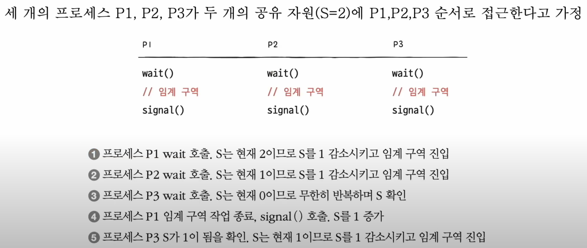
        * 문제점
            * 사용할 수 있는 공유 자원이 없는 경우 프로세스는 무작정 무한히 반복하며 S를 확인해야 함

* 개선 후 단순한 형태
    * wait 함수
        1. 만일 사용할 수 있는 자원이 없을 경우 해당 프로세스 상태를 대기 상태로 만들고
        2. 그 프로세스의 PCB를 세마포를 위한 대기 큐에 집어넣음
        3. 그리고 다른 프로세스가 임계 구역에서의 작업이 끝나고 signal 함수를 호출하면
        4. signal 함수는 대기 중인 프로세스를 대기 큐에서 제거하고
        5. 프로세스 상태를 준비 상태로 변경한 뒤 준비 큐로 옮김
        ```
        wait () {
            S--;
            if ( S < 0 ) {
                add this process to Queue; /* 1 */
                sleep();                   /* 2 */
            }
        }
        ```
        1. 해당 프로세스 PCB를 대기 큐에 삽입한다.
        2. 대기 상태로 접어든다.
        ```
        signal () {
            S++;
            if ( S <= 0 ) {
                remove a process p from Queue; /* 1 */
                wakeup(p);                     /* 2 */
            }
        }
        ```
        1. 대기 큐에 있는 프로세스 p를 제거한다.
        2. 프로세스 p를 대기 상태에서 준비 상태로 만든다.

### 모니터(Monitor)
* 최근에 등장한 동기화 도구
* 세마포에 비하면 사용자가 사용하기에 훨씬 편리한 도구

* 공유 자원과 공유 자원에 접근하기 위한 인터페이스(통로)를 묶어 관리
* 프로세스는 반드시 인터페이스를 통해서만 공유 자원에 접근할 수 있음

* 모니터를 통해 공유 자원에 접근하고자 하는 프로세스를 큐에 삽입
* 큐에 삽입된 순서대로 하나씩 공유 자원을 이용하도록 함

* 모니터
    * 공유 자원을 다루는 인터페이스에 접근하기 위한 큐(모니터에 진입하기 위한 큐)를 만들고,
    * 모니터 안에 항상 하나의 프로세스만 들어오도록 하여 상호 배제를 위한 동기화를 제공
    * 실행 순서 제어를 위한 동기화도 제공

* 조건 변수
    * 특정 조건을 바탕으로 프로세스를 실행하고 일시 중단하기 위해 사용
    * 프로세스나 스레드의 실행 순서를 제어하기 위해 사용하는 특별한 변수
    * wait 연산
        * 호출한 프로세스의 상태를 대기 상태로 전환하고 일시적으로 조건 변수에 대한 대기 큐에 삽입하는 연산
    * signal 연산
        * wait를 호출하여 큐에 삽입된 프로세스의 실행을 재개하는 연산

# Chapter 13 교착 상태

## 1. 교착 상태란

### 식사하는 철학자 문제
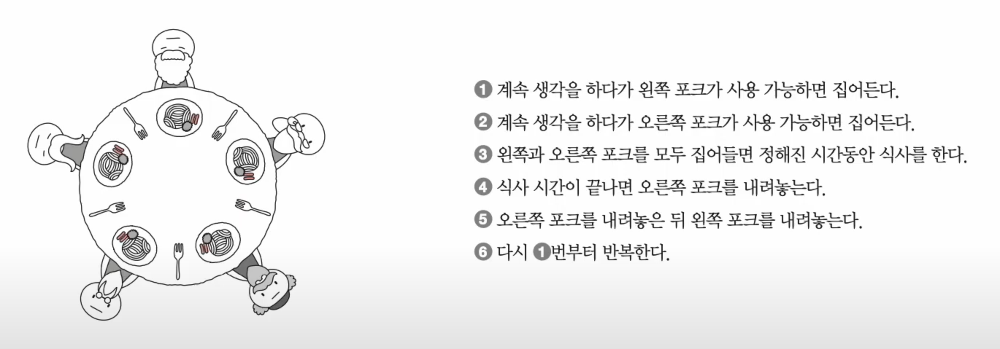
* 교착 상태: 일어나지 않을 사건을 기다리며 진행이 멈춰 버리는 현상
    * 모든 철학자가 동시에 포크를 집어 식사를 하면 어떤 철학자도 식사를 할 수 없고 영원히 생각만 하는 상황이 발생할 수 있음
        * 모든 철학자가 왼쪽 포크를 집어들면 모두가 오른쪽 포크를 집어들 수 없기 때문
        * 모든 철학자는 다른 철학자가 포크를 내려놓을 때까지 기다림
    * 철학자는 프로세스 혹은 스레드, 포크는 자원, 생각하는 행위는 자원을 기다리는 것에 빗대어 볼 수 있음
        * 포크는 한 번에 하나의 프로세스 혹은 스레드만 접근할 수 있으니 임계 구역이라고 볼 수 있음
* 교착 상태를 해결하기 위한 방법
    1. 교착 상태가 발생했을 때의 상황을 정확히 표현해야 함
    2. 교착 상태가 일어나는 근본적인 이유에 대해 알아야 함

### 자원 할당 그래프
* 자원 할당 그래프: 어떤 프로세스가 어떤 자원을 사용하고 있고, 또 어떤 프로세스가 어떤 자원을 기다리고 있는지를 표현하는 간단한 그래프

* 자원 할당 그래프 규칙
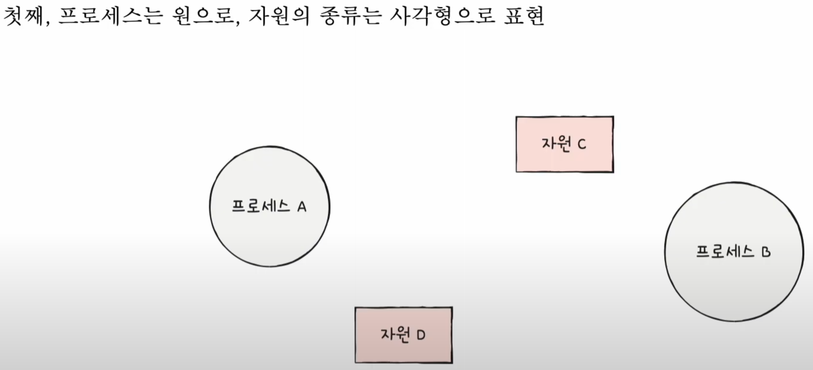
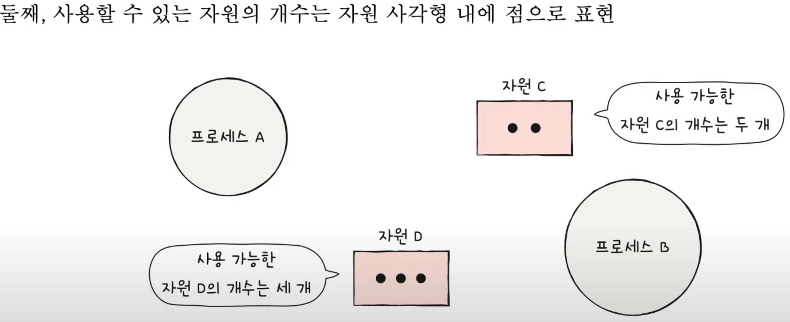
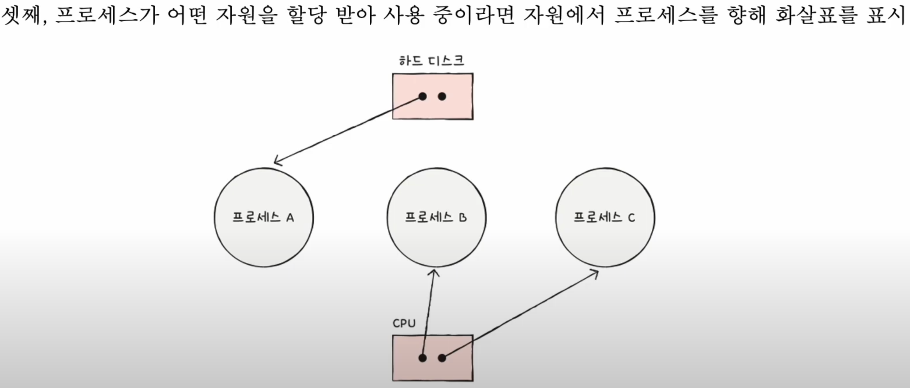
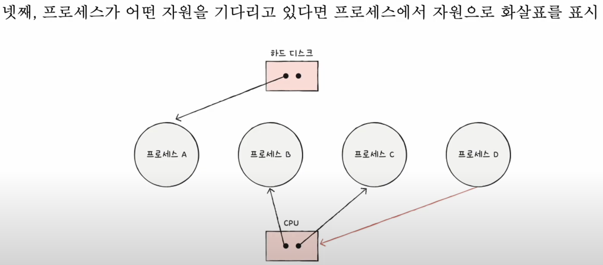

* 자원 할당 그래프 예시
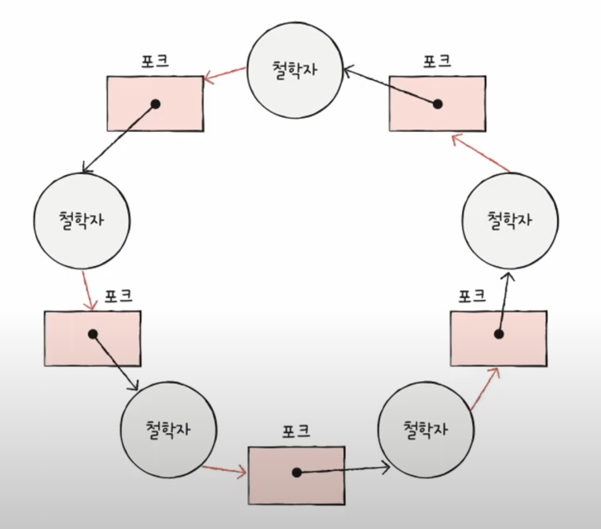
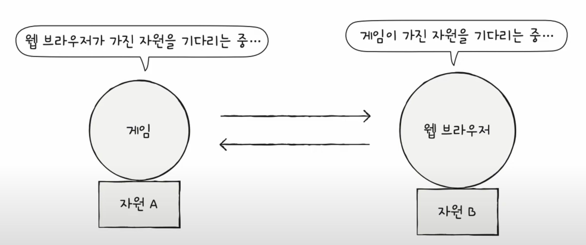
    * 두 예시 전부 교착 상태를 나타냄
    * 교착 상태가 발생한 상황은 자원 할당 그래프가 원의 형태를 띄고 있음

### 교착 상태 발생 조건
* 상호 배제
    * 한 프로세스가 사용하는 자원을 다른 프로세스가 사용할 수 없을 때

* 점유와 대기
    * 어떠한 자원을 할당받은 상태에서 다른 자원을 할당받기를 기다리는 상태

* 비선점
    * 어떤 프로세스도 다른 프로세스의 자원을 강제로 빼앗지 못했기 때문에 발생

* 원형 대기
    * 프로세스들이 원의 형태로 자원을 대기하는 것

## 1. 교착 상태 해결 방법

### 교착 상태 예방
* 상호 배제 없애기
* 점유와 대기 없애기
* 비선점 조건 없애기
* 원형 대기 없애기

### 교착 상태 회피
* 교착 상태 회피: 교착 상태가 발생하지 않을 정도로만 조심히 자원을 할당하는 방식
    * 교착 상태를 한정된 자원의 무분별한 할당으로 인해 발생하는 문제로 간주

* 안전 상태: 교착 상태가 발생하지 않고 모든 프로세스가 정상적으로 자원을 할당받고 종료될 수 있는 상태
* 불안전 상태: 교착 상태가 발생할 수도 있는 상황
* 안전 순서열: 교착 상태 없이 안전하게 프로세스들에 자원을 할당할 수 있는 순서

### 교착 상태 검출 후 회복
* 교착 상태 검출 후 회복: 교착 상태 발생을 인정하고 사후에 조치하는 방식

* 선점을 통한 회복
    * 교착 상태가 해결될 때까지 한 프로세스씩 자원을 몰아주는 방식

* 프로세스 강제 종료를 통한 회복

* 타조 알고리즘
    * 교착 상태를 아예 무시하는 방법

# Chapter 14 가상 메모리

## 1. 연속 메모리 할당

* 연속 메모리 할당
    * 프로세스를 메모리에 올릴 때 주소 공간을 여러개로 분할하지 않고 물리적 메모리의 한 곳에 연속적으로 적재하는 방식
    * 단점
        * 물리 메모리보다 큰 프로세스를 적재할 수 없음
        * 외부 단편화라는 문제를 내포
            * 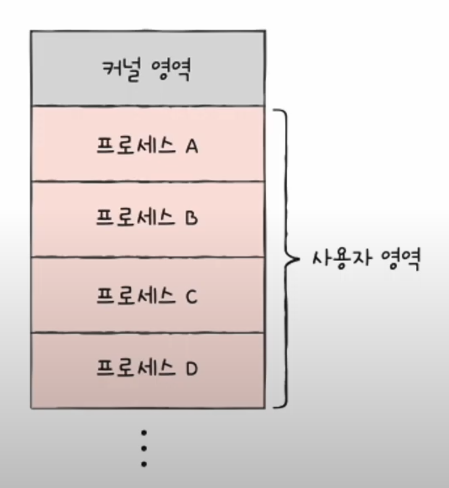

### 스와핑
* 스와핑
    * 메모리에 적재된 프로세스들 중 현재 실행되지 않는 프로세스들을 임시로 보조기억장치 일부 영역으로 쫓아내고, 그렇게 해서 생긴 메모리상의 빈 공간에 또 다른 프로세스를 적재하여 실행하는 방식
        * 현재 실행되지 않는 프로세스
            * 입출력 작업의 요구로 대기 상태가 된 프로세스, 오랫동안 사용되지 않은 프로세스 등
    * 스왑 아웃 되었던 프로세스가 다시 스왑 인될 때는 스왑 아웃되기 전의 물리 주소와는 다른 주소에 적재될 수 있음
    * 스와핑을 이용하면 프로세스들이 요구하는 메모리 주소 공간의 크기가 실제 메모리 크기보다 큰 경우에도 프로세스들을 동시 실행할 수 있음
        * 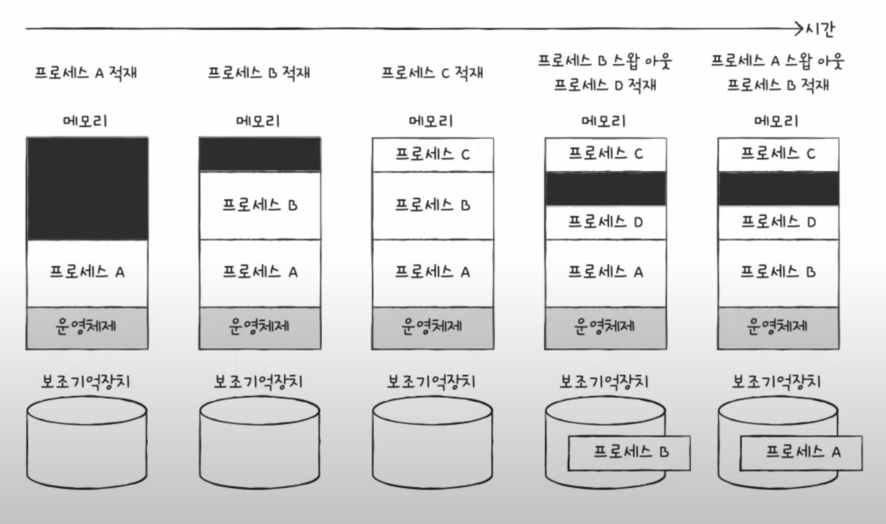

* 스왑 영역
    * 프로세스들이 쫒겨나는 보조기억장치의 일부 영역

* 스왑 아웃
    * 현재 실행되지 않는 프로세스가 메모리에서 스왑 영역으로 옮겨지는 것

* 스왑 인
    * 스왑 영역에 있던 프로세스가 다시 메모리로 옮겨오는 것

### 메모리 할당
* 메모리 내에 빈 공간이 여러 개 있다면 프로세스를 어디에 배치해야 할까?
    * 최초 적합
        * 운영체제가 메모리 내의 빈 공간을 순서대로 검색하다가 적재할 수 있는 공간을 발견하면 그 공간에 프로세스를 배치하는 방식
            * 프로세스가 적재될 수 있는 공간을 발견하는 즉시 메모리를 할당하는 방식
                * 검색을 최소화할 수 있음
                * 결과적으로 빠른 할당이 가능

    * 최적 적합
        * 운영체제가 빈 공간을 모두 검색해 본 후, 프로세스가 적재될 수 있는 공간 중 가장 작은 공간에 프로세스를 배치하는 방식
    
    * 최악 적합
        * 운영체제가 빈 공간을 모두 검색해 본 후, 프로세스가 적재될 수 있는 공간 중 가장 큰 공간에 프로세스를 배치하는 방식

    * 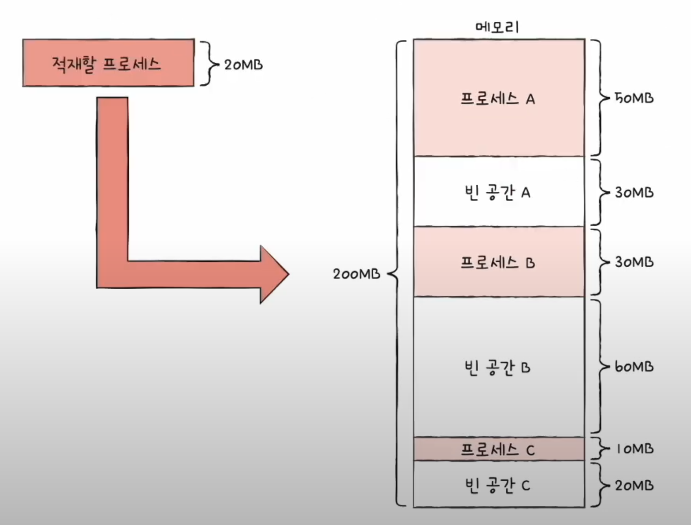
        * 최초 적합: 운영체제가 빈 공간 A -> 빈 공간 B -> 빈 공간 C 순으로 빈 공간을 검색했다면 프로세스는 빈 공간 A에 적재
        * 최적 적합: 프로세스가 적재될 수 있는 빈 공간 중 가장 작은 공간은 빈 공간 C
        * 최악 적합: 프로세스가 적재될 수 있는 빈 공간 중 가장 큰 공간은 빈 공간 B

### 외부 단편화
* 외부 단편화(external fragmentation)
    * 프로세스를 할당하기 어려울 만큼 작은 메모리 공간들로 인해 메모리가 낭비되는 현상

* 외부 단편화가 일어나는 과정 및 결과
    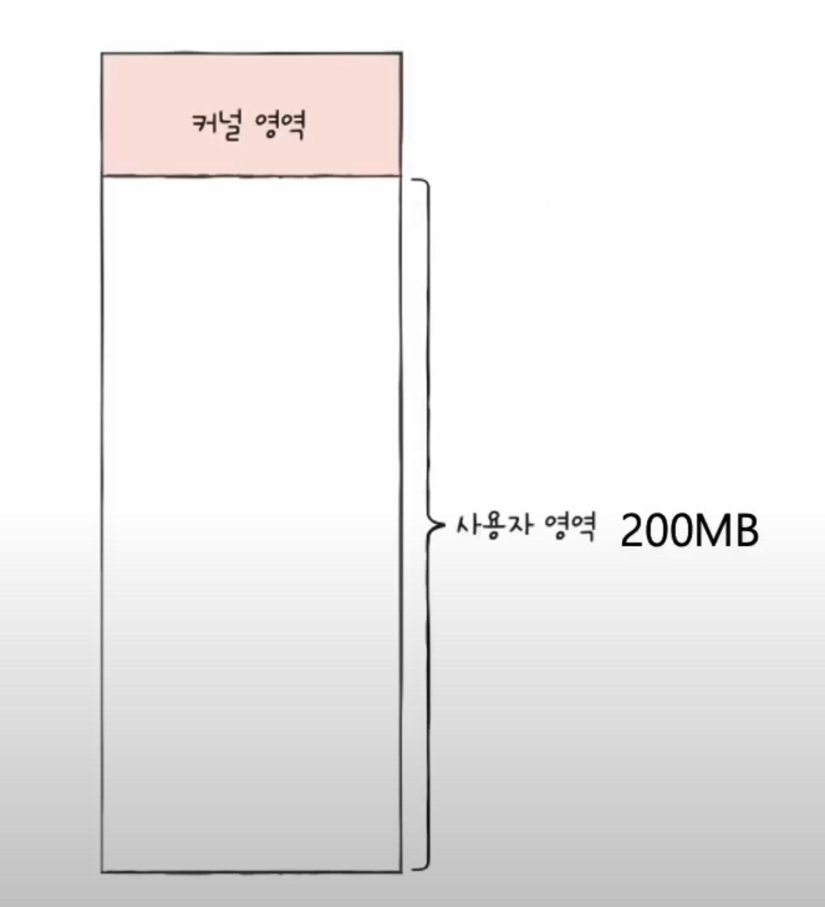 | 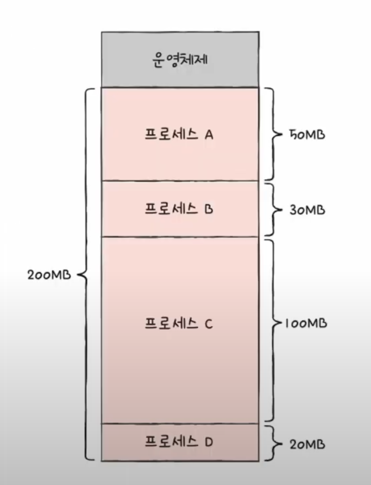 | 
    ---|---|---|
    * 과정
        1. 아무런 프로세스도 적재되지 않은 상태의 메모리 전체
        2. 사용자 영역에 프로세스들을 차례대로 적재
        3. 실행이 끝난 프로세스 B, D를 메모리에서 해제
    * 결과
        * 메모리에 남아 있는 빈 공간의 총합: 50MB
        * 이후 50MB 크기의 프로세스를 적재할 수 있는가: 불가
            * 빈 공간의 총합은 50MB일지라도 어느 빈 공간에도 50MB 크기의 프로세스가 적재될 수 없기 때문
        * 연속 메모리 할당에서는 위와 같이 프로세스들이 실행되고 종료되기를 반복하며 메모리 사이 사이에 빈 공간들이 생김
        * 프로세스 바깥에 생기는 이러한 빈 공간들은 분명 빈 공간이지만 그 공간보다 큰 프로세스를 적재하기 어려운 상황을 초래하고, 결국 메모리 낭비로 이어짐

* 외부 단편화를 해결할 수 있는 방안
    1. 압축(compaction)
        * 메모리 내에 저장된 프로세스를 적당히 재배치시켜 여기저기 흩어져 있는 작은 빈 공간들을 하나의 큰 빈 공간으로 만드는 방법
        * 단점
            1. 작은 빈 공간들을 하나로 모으는 동안 시스템은 하던 일을 중지해야 함
            2. 메모리에 있는 내용을 옮기는 작업은 많은 오버헤드를 야기함
            3. 어떤 프로세스를 어떻게 움직여야 오버헤드를 최소화하며 압축할 수 있는지에 대한 명확한 방법을 결정하기 어려움
        * 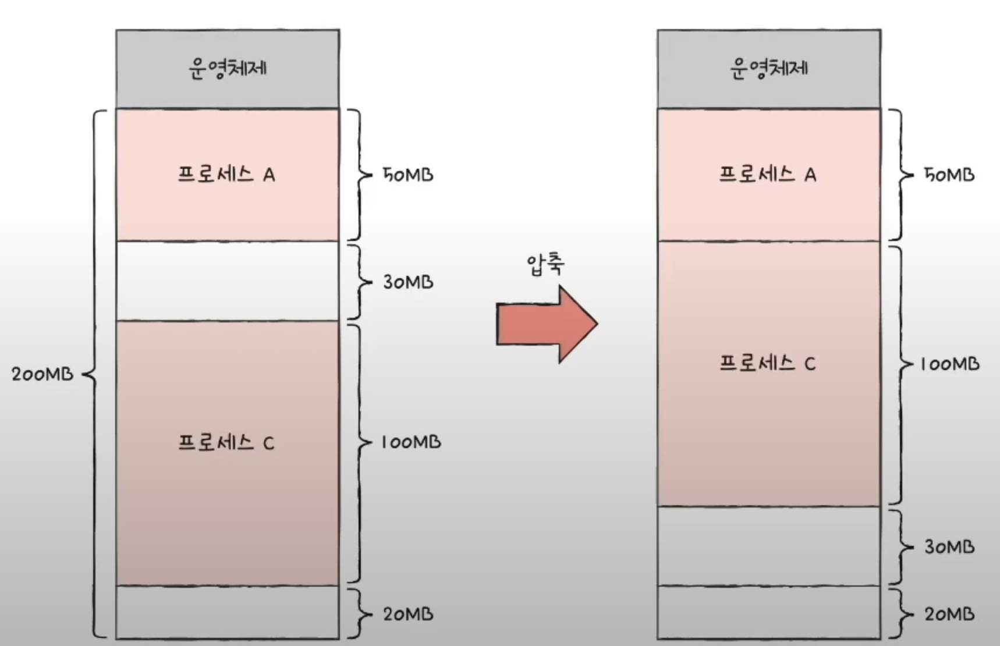
    2. 페이징(paging)

## 2. 페이징을 통한 가상 메모리 관리

* 가상 메모리(virtual memory)
    * 실행하고자 하는 프로그램을 일부만 메모리에 적재하여 실제 물리 메모리 크기보다 더 큰 프로세스를 실행할 수 있게 하는 기술
        * 페이징, 세그멘테이션

### 페이징이란
* 페이징
    * 프로세스의 논리 주소 공간을 페이지(page)라는 일정한 단위로 자르고, 메모리 물리 주소 공간을 프레임(frame)이라는 페이지와 동일한 크기의 일정한 단위로 자른 뒤 페이지를 프레임에 할당하는 **가상 메모리 관리 기법**

* 페이징에서 스와핑을 사용하는 예시
    * 프로세스 전체가 스왑 아웃/스왑 인되는 것이 아닌 페이지 단위로 스왑 아웃/스왑 인됨
        * 메모리에 적재될 필요가 없는 페이지들은 보조기억장치로 스왑 아웃
        * 실행에 필요한 페이지들은 메모리로 스왑 인
    
    * 페이지 아웃(page out)
        * 페이징 시스템에서의 스왑 아웃
    
    * 페이지 인(page in)
        * 페이징 시스템에서의 스왑 인
    
    * 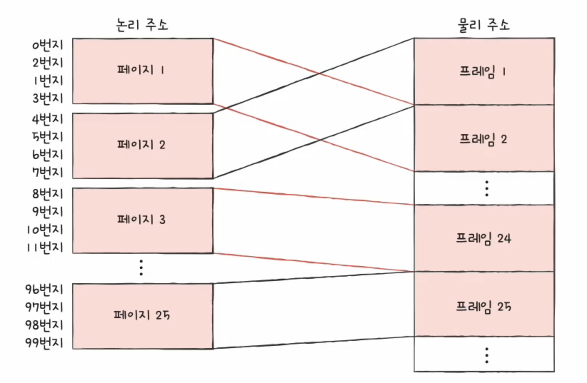